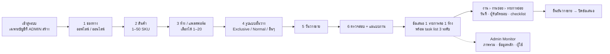
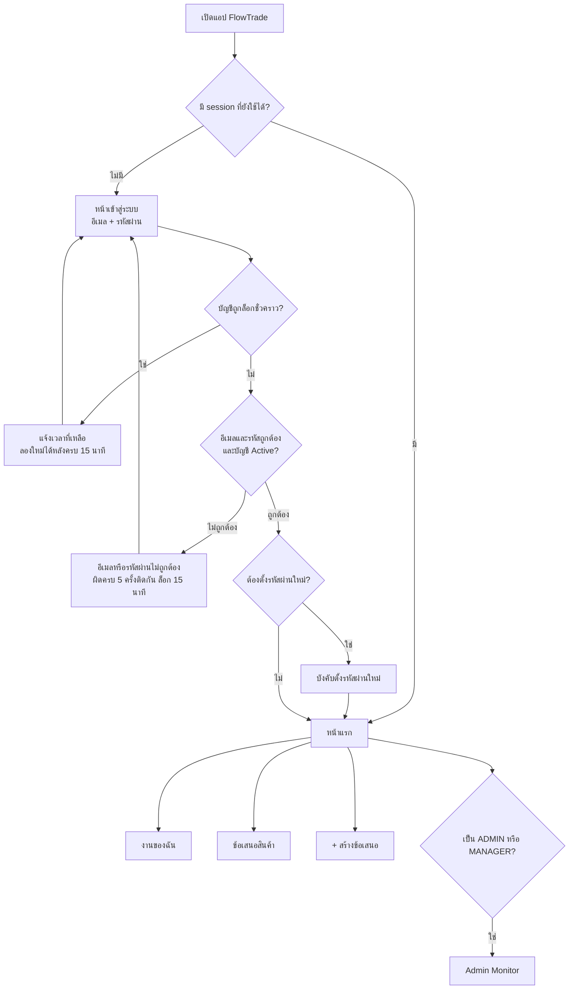
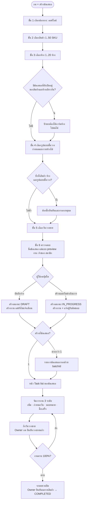
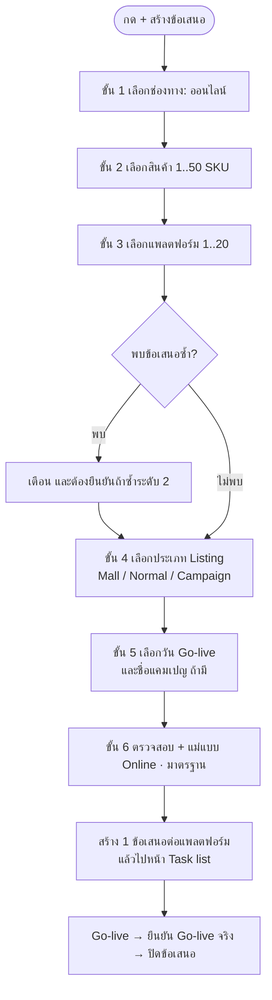
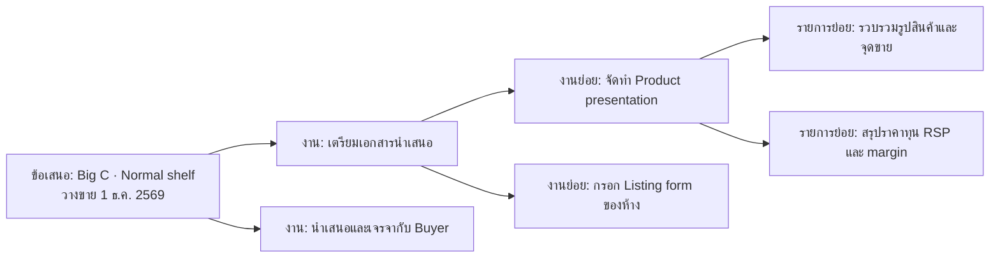
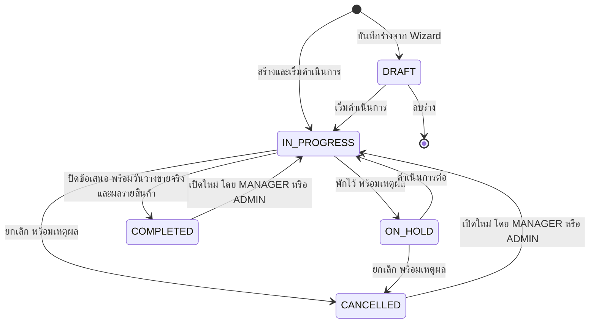
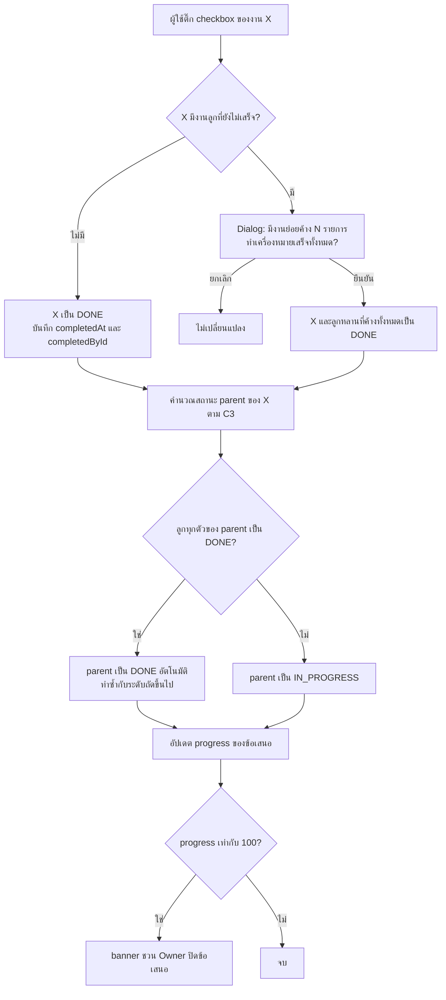

# 01 · Requirements & Flow — FlowTrade

> **เวอร์ชัน:** 1.1 (ฉบับรวมหลัง review) · **วันที่:** 1 ต.ค. 2569 (2026-10-01)
> **ผู้อ่าน:** ทีม Trade (ลูกค้า), ทีม dev ทั้ง frontend และ backend, QA
> **เอกสารที่เกี่ยวข้อง:** [README.md](README.md) · [02-architecture.md](02-architecture.md) · [03-database.md](03-database.md) · [schema.prisma](schema.prisma) · [04-api.md](04-api.md) · [05-frontend-ux.md](05-frontend-ux.md) · [06-roadmap.md](06-roadmap.md)

**กติกาของเอกสาร**

- เอกสารนี้เป็นแหล่งความจริงของ **กติกาธุรกิจ** (flow, lifecycle, กติกางาน 3 ระดับ, สูตร KPI และเนื้อหาแม่แบบงานตั้งต้น)
- ชื่อ entity, field และ enum ใช้ตาม [03-database.md](03-database.md) และ [schema.prisma](schema.prisma) ส่วน permission key และ contract ของ API ใช้ตาม [04-api.md](04-api.md) ถ้าเอกสารนี้ขัดกับสองไฟล์นั้นในเรื่องชื่อ ให้ยึดสองไฟล์นั้น
- ข้อความ **(ควรยืนยันกับทีม Trade)** คือจุดที่ทีมออกแบบตัดสินใจไว้ก่อนเพื่อให้งานเดินต่อได้ รายการรวมพร้อมค่าเริ่มต้นที่แนะนำอยู่ใน [06-roadmap.md §5](06-roadmap.md) และอ้างด้วยรหัส Q
- **MoSCoW:** **Must** = ต้องมีใน MVP · **Should** = อยู่ใน MVP ถ้าเวลาพอ (ไม่ทำให้เลื่อน go-live) · **Could** = Phase 2 · **Won't** = ไม่ทำในรอบนี้ (ดูขอบเขตเต็มใน [06-roadmap.md](06-roadmap.md))
- ในตารางแม่แบบงาน **D0** คือวันวางขาย (`targetDate`) และ D−60 คือ 60 วันก่อนวันวางขาย บนหน้าจอแสดงเป็น T−60 ซึ่งมีความหมายเดียวกัน

---

## 1. สรุปความเข้าใจ

**เข้าใจ flow แล้ว** FlowTrade เป็นเว็บแอปภายในของฝ่าย Trade ใช้วางแผนและติดตามการนำเสนอสินค้าเข้าห้าง (product listing) ทั้งสองช่องทาง

- **ออฟไลน์ (OFFLINE):** ห้าง modern trade เช่น Big C, Watsons, 7-Eleven, Lotus's, CJ และ Eve and Boy
- **ออนไลน์ (ONLINE):** marketplace หรือเว็บของห้าง เช่น Shopee, Lazada, TikTok Shop

ภาพรวมการทำงาน

1. ระบบไม่มีหน้าสมัครสมาชิก คนที่ ADMIN เพิ่มรายชื่อไว้เท่านั้นจึงเข้าระบบได้
2. ผู้ใช้สร้าง **"ข้อเสนอสินค้า" (Proposal)** ผ่าน wizard 6 ขั้น: เลือกช่องทาง → เลือกสินค้า → เลือกห้าง (เลือกได้หลายห้าง) → เลือกรูปแบบชั้นวาง (Exclusive shelf, Normal shelf หรือแบบที่ ADMIN/MANAGER เพิ่มเอง) → เลือกวันวางขาย → ตรวจสอบ
3. ระบบสร้าง **task list 3 ระดับ (งาน → งานย่อย → รายการย่อย)** จากแม่แบบงานให้อัตโนมัติ โดยคำนวณวันที่ถอยหลังจากวันวางขาย
4. ทุกระดับกำหนดช่วงเวลา (วันเริ่ม–วันครบกำหนด) และผู้รับผิดชอบได้ ติ๊ก checklist ได้ว่าข้อไหนเสร็จแล้ว และระบบคำนวณความคืบหน้าให้เอง
5. เมื่อสินค้าวางขายจริง Owner กด **"ยืนยันวางขายแล้ว"** และปิดข้อเสนอพร้อมบันทึกผลรายสินค้า (ผ่าน/ไม่ผ่าน)
6. **Admin Monitor** ให้ ADMIN และ MANAGER เห็นว่าข้อเสนอไหนเสี่ยงหรือล่าช้า งานค้างอยู่ที่ใคร และใช้จัดการข้อมูลหลัก (ห้าง/แพลตฟอร์ม, รูปแบบชั้นวาง, สินค้า, แม่แบบงาน) รวมถึงผู้ใช้และสิทธิ์ (ADMIN / MANAGER / USER)

**เป้าหมายทางธุรกิจ:** สินค้าวางขายได้ตรงวันที่รับปากกับห้าง และหัวหน้าเห็นปัญหาก่อนถึงวันวางขาย

### 1.1 โมดูลของระบบ

| โมดูล | หน้าที่ | Entity หลัก | ขอบเขต |
|---|---|---|---|
| `auth` | เข้าสู่ระบบ ออกจากระบบ เปลี่ยนรหัสผ่าน ล็อกบัญชีชั่วคราว จัดการ session | User, Session | MVP |
| `users` | ผู้ใช้ บทบาท เปิด/ปิดบัญชี โอนงานเมื่อปิดบัญชี | User | MVP |
| `master-data` | ห้าง/แพลตฟอร์ม, รูปแบบชั้นวาง/ประเภท Listing, สินค้า (รวมนำเข้า xlsx) | Store, ShelfType, Product | MVP |
| `templates` | แม่แบบงาน 3 ระดับพร้อม offset วัน | TaskTemplate, TaskTemplateItem | MVP |
| `proposals` | wizard, ตรวจข้อเสนอซ้ำ, lifecycle, สมาชิก, สินค้าในข้อเสนอ | Proposal, ProposalProduct, ProposalMember | MVP |
| `tasks` | งาน 3 ระดับ วันที่ ผู้รับผิดชอบ checklist progress | Task, TaskAssignee | MVP |
| `collaboration` | ความคิดเห็น (plain text) ไฟล์แนบ ลิงก์ | Comment, Attachment | MVP (@mention เป็น Phase 2) |
| `notifications` | แจ้งเตือนในแอป และงานตามเวลา 08:00 (ใกล้ครบกำหนด/เกินกำหนด) | Notification | MVP ในแอป · อีเมลเป็น Phase 2 |
| `dashboard` | KPI ภาพรวม, ภาระงาน, รายการงานทั้งฝ่าย | (อ่านจากทุก entity) | MVP เฉพาะ K1–K5 · ส่วนผลลัพธ์เป็น Phase 2 |
| `audit` | ประวัติการเปลี่ยนแปลงทั้งหมด (append-only) | ActivityLog | MVP |
| `settings` | ค่าระบบ เช่น จำนวนวัน "ใกล้ครบกำหนด" และรูปแบบปีเริ่มต้น | AppSetting | ค่า seed ใน MVP · หน้าแก้เป็น Phase 2 |

---

## 2. Actors & Roles

### 2.1 บทบาทระดับระบบ (`Role`)

| Role | ชื่อบน UI | ใครใช้ | ความรับผิดชอบหลัก |
|---|---|---|---|
| `ADMIN` | ผู้ดูแลระบบ | IT หรือหัวหน้าฝ่าย Trade ที่ได้รับมอบหมาย (แนะนำ **อย่างน้อย 2 คน**, Q29) | สร้าง/ปิดบัญชีผู้ใช้และกำหนดบทบาท จัดการข้อมูลหลักทั้งหมดรวมถึงการลบ ดู audit log ทั้งระบบ ตั้งค่าระบบ และทำทุกอย่างที่ MANAGER ทำได้ |
| `MANAGER` | ผู้จัดการ | ผู้จัดการฝ่าย Trade, หัวหน้าทีม KAM | ติดตามทุกข้อเสนอ ดู Dashboard โอนงาน ปิดแบบ force / ยกเลิก / เปิดข้อเสนอใหม่ ดูแลสินค้า แม่แบบงาน ห้าง และรูปแบบชั้นวาง (ยกเว้นการลบ) |
| `USER` | ผู้ใช้งาน | เจ้าหน้าที่ Trade, KAM, Trade Marketing และผู้ประสานงานฝ่ายอื่นที่ได้รับงาน | สร้างข้อเสนอของตนเอง จัดการ task list ทำงานที่ได้รับมอบหมายและติ๊กเสร็จ |

### 2.2 Permission matrix ระดับระบบ

คอลัมน์ "Permission key" อ้างถึง canonical matrix ใน [04-api.md §4](04-api.md) ซึ่งเป็นชุดเดียวที่ทั้ง API guard และ route guard ฝั่งเว็บใช้

| ความสามารถ | ADMIN | MANAGER | USER | Permission key |
|---|:-:|:-:|:-:|---|
| เข้าระบบ หน้าแรก งานของฉัน การแจ้งเตือน โปรไฟล์ | ✓ | ✓ | ✓ | `dashboard.view.own`, `profile.update.self` |
| สร้างข้อเสนอ | ✓ | ✓ | ✓ (ตนเองเป็น Owner) | `proposal.create` |
| กำหนด Owner เป็นคนอื่นตอนสร้าง | ✓ | ✓ | ✗ | `proposal.create.assignOwner` |
| ดูข้อเสนอ | ทั้งหมด | ทั้งหมด | เฉพาะที่ตนเป็น Owner หรือ Member | `proposal.read.all` / `proposal.read.own` |
| แก้ข้อเสนอและงานในข้อเสนอใดก็ได้ (เท่า Owner) | ✓ | ✓ | ตามสิทธิ์ในข้อเสนอ (2.3) | `proposal.update.all` / `proposal.update.own` |
| Force complete | ✓ | ✓ | ✗ | `proposal.forceComplete` |
| เปิดข้อเสนอที่ปิดแล้วใหม่ (Reopen) | ✓ | ✓ | ✗ | `proposal.reopen` |
| โอนงานข้ามข้อเสนอ | ✓ | ✓ | ✗ | `task.transfer.bulk` |
| Admin Monitor: Dashboard และงานทั้งฝ่าย | ✓ | ✓ | ✗ | `dashboard.view.all` |
| ห้าง, รูปแบบชั้นวาง, สินค้า, แม่แบบงาน: สร้าง แก้ ปิดใช้ เรียงลำดับ นำเข้า | ✓ | ✓ | ✗ (ค้นหาและเลือกได้) | `master.manage` (อ่าน: `master.read`) |
| ลบข้อมูลหลักที่ยังไม่ถูกอ้างอิง | ✓ | ✗ | ✗ | `master.delete` |
| แจ้งขอเพิ่มห้าง | ✓ | ✓ | ✓ | `store.request` |
| ผู้ใช้และบทบาท | ✓ | ✗ | ✗ | `user.manage` |
| เห็นรายชื่อผู้ใช้ Active (เพื่อมอบหมายงาน) | ✓ | ✓ | ✓ | `user.read.directory` |
| Audit log ทั้งระบบ | ✓ | ✗ (เห็นประวัติในข้อเสนอ) | ✗ (เห็นประวัติในข้อเสนอที่ตนเห็น) | `audit.read.all` / `audit.read.proposal` |
| ตั้งค่าระบบ (AppSetting) | ✓ | ✗ | ✗ | `setting.manage` |
| ลบความคิดเห็นของคนอื่น | ✓ | ✗ | ✗ | `comment.moderate` |
| กู้คืนข้อมูลที่ถูกลบ (MVP: กู้คืนข้อมูลหลักจาก dialog "รหัสนี้เคยใช้กับรายการที่ถูกลบ" · หน้าถังขยะและกู้คืนงานภายใน 30 วันเป็น Phase 2) | ✓ | ✗ | ✗ | `trash.restore` |
| Export Excel (Phase 2) | ✓ | ✓ | ✗ | `report.export` |

### 2.3 สิทธิ์ระดับข้อเสนอ

ระบบหาความสัมพันธ์ของผู้ใช้กับข้อเสนอตามลำดับ: **PRIVILEGED** (ADMIN/MANAGER ที่มี `proposal.update.all`) → **OWNER** (`Proposal.ownerId`) → **EDITOR** / **VIEWER** (`ProposalMember.memberRole`) PRIVILEGED มีสิทธิ์เท่า Owner และทำ force complete / reopen ได้เพิ่ม ผู้ที่ได้รับมอบหมายงานจะถูกเพิ่มเป็น VIEWER อัตโนมัติ และได้สิทธิ์ **ASSIGNEE** ในงานของตน

"เปิดอยู่" หมายถึงสถานะ DRAFT, IN_PROGRESS หรือ ON_HOLD

| การกระทำ | Owner | Editor | Viewer | Assignee (เฉพาะ subtree ของงานที่ตนรับผิดชอบ) |
|---|:-:|:-:|:-:|---|
| ดูข้อเสนอ งานทั้งหมด ไฟล์ และประวัติ | ✓ | ✓ | ✓ | ✓ (เป็น Viewer อัตโนมัติ) |
| แก้ชื่อ รายละเอียด `campaignName` และรายการสินค้า | ✓ | ✓ | ✗ | ✗ |
| เปลี่ยนวันวางขาย, รูปแบบชั้นวาง, ยืนยันวางขายแล้ว (`actualLaunchDate`) | ✓ | ✗ | ✗ | ✗ |
| เปลี่ยนห้าง (เฉพาะ DRAFT) | ✓ | ✗ | ✗ | ✗ |
| เปลี่ยนสถานะ (เริ่ม/พัก/ดำเนินต่อ/ปิด/ยกเลิก) | ✓ | ✗ | ✗ | ✗ |
| เพิ่ม/ถอดสมาชิก เปลี่ยนสิทธิ์ โอน Owner | ✓ | ✗ | ✗ | ✗ |
| เพิ่ม แก้ ลบ ย้าย และมอบหมายงานทุกระดับ | ✓ | ✓ | ✗ | เพิ่มงานลูกใต้งานของตนได้ · แก้/มอบหมายได้เฉพาะรายการที่ตนสร้าง · **ลบหรือย้ายได้เฉพาะเมื่อตนสร้างรายการนั้นและงานลูกหลานทุกรายการเอง** |
| ติ๊กเสร็จ / เปลี่ยนสถานะงาน | ✓ | ✓ | ✗ | ✓ งานของตนและงานลูกหลานทั้งหมด |
| แสดงความคิดเห็น | ✓ | ✓ | ✓ | ✓ |
| แนบไฟล์/ลิงก์ | ✓ | ✓ | ✗ | ✓ (ที่งานใน subtree ของตน) |
| ลบไฟล์แนบ | ✓ | ผู้แนบเท่านั้น | ผู้แนบเท่านั้น | ผู้แนบเท่านั้น |
| ลบข้อเสนอ (เฉพาะ DRAFT) | ✓ | ✗ | ✗ | ✗ |

การตีความเรื่องสิทธิ์ของ Assignee ข้างบน **(ควรยืนยันกับทีม Trade, Q25)**

### 2.4 กติกาสิทธิ์

1. **R-AUTH-1:** USER เห็นข้อเสนอเมื่อเป็น Owner หรือ Member เท่านั้น การมอบหมายงานให้คนที่ยังไม่เป็นสมาชิกจะเพิ่มคนนั้นเป็น `VIEWER` อัตโนมัติ กติกาเดียวนี้จึงครอบคลุมทุกกรณี **(ควรยืนยันกับทีม Trade, Q3)**
2. **R-AUTH-2:** MANAGER เห็นข้อเสนอทั้งฝ่าย Phase 1 ยังไม่แบ่งทีม **(ควรยืนยันกับทีม Trade, Q4)**
3. **R-AUTH-3:** ต้องมี ADMIN ที่ Active อย่างน้อย 1 คนเสมอ ADMIN เปลี่ยนบทบาทหรือปิดบัญชีของตนเองไม่ได้ และแนะนำให้มี ADMIN ที่ Active อย่างน้อย 2 คนตั้งแต่ go-live เพื่อให้ปลดล็อกบัญชีกันเองได้ **(ควรยืนยันกับทีม Trade, Q29)**
4. **R-AUTH-4:** server ตรวจสิทธิ์ทุก request ทั้งระดับ role และระดับข้อเสนอ ข้อเสนอที่ผู้ใช้มองไม่เห็นตอบ 404 ไม่ใช่ 403 ฝั่ง UI ซ่อนปุ่มที่ role นั้นไม่มีทางทำได้ และ disable ปุ่มที่ทำไม่ได้เฉพาะตอนนี้พร้อม tooltip บอกเหตุผล เช่น "เฉพาะเจ้าของข้อเสนอเปลี่ยนวันวางขายได้"
5. **R-AUTH-5:** UI ไม่คำนวณสิทธิ์เอง ข้อเสนอและงานทุกรายการที่ API ส่งมามี object `can` ที่ server คำนวณแล้ว (ชื่อ field ดู [04-api.md §4.4](04-api.md))

---

## 3. End-to-end flow

### 3.1 เข้าสู่ระบบและการนำทาง

- ไม่มีหน้าสมัครสมาชิกและไม่มี "จดจำฉัน" ลืมรหัสผ่านให้ติดต่อ ADMIN (self-service เป็น Phase 2)
- การล็อกเป็นแบบชั่วคราวเท่านั้น (ผิด 5 ครั้งติดกัน ล็อก 15 นาที) ไม่มีการล็อกถาวร เพื่อกันไม่ให้คนภายนอกล็อก ADMIN คนเดียวของระบบได้
- รหัสผ่านชั่วคราวที่ ADMIN ออกให้ใช้ได้ภายใน 72 ชั่วโมง ถ้าหมดอายุ ผู้ใช้เห็น "รหัสชั่วคราวหมดอายุ ติดต่อผู้ดูแลระบบ"

### 3.2 ขอบเขตของ 1 ข้อเสนอ

**ตัดสินใจ: 1 Proposal = 1 Store × 1 ShelfType × 1 `targetDate` × สินค้า 1..n รายการ** **(ควรยืนยันกับทีม Trade, Q20)**

เหตุผล:

1. แต่ละห้างมี buyer เงื่อนไขการค้า listing form และไทม์ไลน์ของตัวเอง task list จึงต้องแยกตามห้างถึงจะติดตามได้จริง
2. รูปแบบชั้นวางทำให้ชุดงานต่างกันมาก เช่น Exclusive shelf มีงานออกแบบ ผลิต และติดตั้ง fixture แม่แบบงานจึงผูกกับ ShelfType
3. buyer มักพิจารณาหลาย SKU ในการประชุมครั้งเดียว และงานส่วนใหญ่ทำครั้งเดียวทั้งชุด จึงไม่แยกข้อเสนอต่อ SKU ผลพิจารณารายสินค้าเก็บที่ `ProposalProduct.status`
4. Dashboard นับผลแบบ "ข้อเสนอต่อห้าง" ได้ตรงไปตรงมา

ถ้าห้างเดียวกันมีบาง SKU เป็น Exclusive และบาง SKU เป็น Normal ให้สร้างเป็น 2 ข้อเสนอ

**ตัดสินใจ: wizard เลือกได้หลายห้างในครั้งเดียว และระบบสร้าง 1 ข้อเสนอต่อ 1 ห้าง**

- กรณี "ปล่อยสินค้าใหม่เข้า 5 ห้างพร้อมกัน" เกิดบ่อย การเลือกหลายห้างทำให้ไม่ต้องกรอกซ้ำ
- ขั้น 4–5 กำหนดรูปแบบชั้นวางและวันวางขายแยกรายห้างได้
- ข้อเสนอที่สร้างพร้อมกันมี `batchId` เดียวกัน ดูรวมได้ที่ `/proposals?batchId=…` หลังสร้างแล้วแต่ละข้อเสนอเป็นอิสระต่อกัน
- `batchId` สร้างโดย wizard ครั้งเดียวต่อ 1 รอบการกรอก และใช้เป็น idempotency key: ถ้ากดซ้ำหรือเน็ตหลุดแล้วส่งใหม่ ระบบคืนข้อเสนอชุดเดิม ไม่สร้างซ้ำ (DB บังคับความไม่ซ้ำ ดู [03-database.md](03-database.md))
- สร้างแบบ all-or-nothing ใน transaction เดียว ไม่เกิน 20 ห้างต่อครั้ง

**ตัดสินใจ: ลำดับ wizard คือ สินค้า → ห้าง** เพราะตรงกับวิธีคิด "เสนอสินค้าเข้าห้าง" และเมื่อรู้สินค้าก่อน ระบบเตือนข้อเสนอซ้ำได้ทันทีตอนเลือกห้าง

### 3.3 OFFLINE listing flow

| ขั้น | สิ่งที่ผู้ใช้ทำ | กติกาและสิ่งที่ระบบทำ |
|---|---|---|
| 0 หน้าแรก | เห็นงานเกินกำหนด/วันนี้/สัปดาห์นี้ ข้อเสนอของฉัน และปุ่มเด่น "+ สร้างข้อเสนอ" | — |
| 1 ช่องทาง | เลือกการ์ดใหญ่ "ออฟไลน์ (ห้างร้าน)" หรือ "ออนไลน์ (แพลตฟอร์ม)" | ถ้าย้อนมาเปลี่ยนช่องทาง ระบบถามยืนยันแล้วล้างค่าขั้น 3–5 (สินค้าที่เลือกยังอยู่) |
| 2 สินค้า | ค้นหาด้วย SKU ชื่อ หรือบาร์โค้ด (รองรับเครื่องสแกน) แล้วเลือกหลายรายการ | 1–50 รายการ แสดงเฉพาะสินค้า Active ไม่ให้เลือกซ้ำ MANAGER/ADMIN เพิ่มสินค้าใหม่ได้จากขั้นนี้ ส่วน USER เห็นข้อความ "ติดต่อผู้จัดการหรือผู้ดูแลระบบเพื่อเพิ่มสินค้า" (Q26) |
| 3 ห้าง | เลือกจาก grid การ์ดโลโก้ ได้หลายห้าง | แสดงเฉพาะ Store ของช่องทางนั้นที่ Active เรียงตาม `sortOrder` เตือนข้อเสนอซ้ำระดับ 1 ทันที (BR-04) MANAGER/ADMIN เห็นการ์ด "+ เพิ่มห้างใหม่" ส่วน USER เห็นลิงก์ "ไม่พบห้างที่ต้องการ? แจ้งผู้ดูแล" |
| 4 รูปแบบชั้นวาง | เลือก radio card เช่น Exclusive shelf, Normal shelf หรือแบบที่เพิ่มเอง ถ้าเลือกหลายห้างมีตาราง "กำหนดแยกรายห้าง" | ค่าที่เลือกด้านบนใช้กับทุกห้างและ override รายแถวได้ ข้อเสนอซ้ำระดับ 2 ต้องติ๊กยืนยันและกรอกเหตุผล ≥ 5 ตัวอักษร |
| 5 วันวางขาย | date picker แสดงปีตามที่ผู้ใช้ตั้ง (พ.ศ./ค.ศ.) ปุ่มลัด +30/+60/+90 วัน กำหนดแยกรายห้างได้ | ถ้าเวลาน้อยกว่าที่แม่แบบต้องการ เตือนสีเหลืองพร้อมตัวเลข (BR-12) ถ้าเป็นวันในอดีต เตือนสีแดงแต่ยังบันทึกได้ (BR-11) |
| 6 ตรวจสอบ | การ์ดต่อข้อเสนอ: ห้าง รูปแบบ วันวางขาย สินค้า ชื่อข้อเสนอ (สร้างให้และแก้ได้) แม่แบบงาน (เปลี่ยนได้หรือ "เริ่มจากรายการว่าง") preview งานพร้อมวันที่ Owner และสมาชิก | เลือกแม่แบบเริ่มต้นตาม 6.2.4 USER เป็น Owner เสมอ MANAGER/ADMIN เลือก Owner คนอื่นได้ ปุ่มรอง "บันทึกร่าง" และปุ่มหลัก "สร้างและเริ่มดำเนินการ" · การติ๊กตัดงานบางข้อออกจากแม่แบบใน preview เป็น Should (API รองรับแล้ว) ถ้ายังไม่ทำ ผู้ใช้ลบงานหลังสร้างได้และมีเลิกทำ 10 วินาที |
| 7 ผลลัพธ์ | สร้าง 1 ข้อเสนอ → เปิดหน้า Task list · หลายข้อเสนอ → รายการข้อเสนอที่กรองด้วย `batchId` | toast เช่น "สร้าง 3 ข้อเสนอเรียบร้อย" ถ้ามีงานถูกเลื่อนวัน หน้ารายละเอียดแสดง banner BR-12 |
| 8 จัดการงาน | เพิ่มงาน งานย่อย รายการย่อย ตั้งวันที่ มอบหมาย ติ๊กเสร็จ คอมเมนต์ แนบไฟล์ | กติกาในหัวข้อ 5 |
| 9 ยืนยันวางขาย | ตั้งแต่วันวางขายเป็นต้นไป header มี banner "ถึงวันวางขายแล้ว ยืนยันวางขายจริงหรือยัง?" Owner กด "ยืนยันวางขายแล้ว" แล้วเลือกวันที่ (ค่าเริ่มต้นวันนี้) | บันทึก `actualLaunchDate` สุขภาพของข้อเสนอเลิกนับว่า "ล่าช้า" แม้ยังมีงานหลังวางขายค้างอยู่ (5.7) |
| 10 ปิดข้อเสนอ | เมื่อครบ 100% มี banner "งานครบแล้ว ปิดข้อเสนอนี้?" ผู้ใช้ยืนยันผลรายสินค้าและวันวางขายจริง | สถานะเป็น COMPLETED บันทึก `completedAt` |

- **ชื่อข้อเสนออัตโนมัติ:** `{store.name} · {shelfType.name} · {ชื่อสินค้าแรก}` ต่อท้าย ` (+{n-1})` เมื่อมีหลายสินค้า เช่น "Big C · Normal shelf · เซรั่มวิตามินซี 30 ml (+2)" แก้ได้ ยาวไม่เกิน 200 ตัวอักษร
- **Wizard autosave:** เก็บสถานะ wizard (รวม `batchId`) ไว้ในเบราว์เซอร์ 7 วัน ครั้งหน้าระบบถาม "มีข้อเสนอที่ทำค้างไว้ ทำต่อหรือไม่?"

### 3.4 ONLINE listing flow

ลูกค้ายังไม่ได้ให้รายละเอียดช่องทางออนไลน์ ทีมออกแบบจึง **ใช้ flow และ entity ชุดเดียวกับออฟไลน์** ต่างกันเฉพาะข้อมูลหลัก label และแม่แบบงาน ทั้งหมดปรับได้จาก Admin Monitor ต้นทุนของการตัดสินใจนี้ต่ำ ถ้าภายหลังพบว่าออนไลน์ต้องการข้อมูลเพิ่มก็ขยายได้โดยไม่รื้อ **(ควรยืนยันกับทีม Trade ใน workshop ก่อนเริ่ม sprint wizard, Q6, Q7)**

| แนวคิด | ออฟไลน์ | ออนไลน์ |
|---|---|---|
| Store (`channel`) | ห้าง เช่น Big C, Watsons | แพลตฟอร์ม เช่น Shopee, Lazada, TikTok Shop |
| ShelfType (`channel`) | รูปแบบชั้นวาง: Exclusive shelf, Normal shelf | ประเภท Listing: Mall listing, Normal listing, Campaign slot |
| `targetDate` | วันวางขาย (On-shelf date) | วัน Go-live |
| `actualLaunchDate` | วันวางขายจริง | วัน Go-live จริง |
| ฟิลด์เพิ่ม | — | `campaignName` (ไม่บังคับ) เช่น "11.11" |
| แม่แบบงานเริ่มต้น | Offline · มาตรฐาน / Offline · Exclusive shelf | Online · มาตรฐาน |

### 3.5 ตัวอย่างโครงสร้างงาน 3 ระดับ

### 3.6 รายการหน้าจอ

| # | หน้าจอ | ผู้เข้าถึง | เนื้อหาหลัก | ขอบเขต |
|---|---|---|---|---|
| 1 | เข้าสู่ระบบ / ตั้งรหัสผ่านใหม่ | ทุกคน | อีเมล รหัสผ่าน "ลืมรหัสผ่าน? ติดต่อผู้ดูแลระบบ" | MVP |
| 2 | หน้าแรก | ทุกคน | งานของฉัน (เกินกำหนด/วันนี้/สัปดาห์นี้) การ์ดข้อเสนอของฉัน วางขายใน 30 วัน · MANAGER/ADMIN เห็นแถบภาพรวมฝ่าย (เสี่ยง/ล่าช้า/งานเกินกำหนด) | MVP |
| 3 | งานของฉัน | ทุกคน | งานทุกข้อเสนอที่ตนรับผิดชอบ จัดกลุ่ม เกินกำหนด / วันนี้ / สัปดาห์นี้ / ภายหลัง / ไม่มีกำหนด / พักไว้ ติ๊กเสร็จได้ทันที | MVP |
| 4 | รายการข้อเสนอ | ทุกคน (ขอบเขตตามสิทธิ์) | ตาราง แท็บสถานะ ตัวกรอง (ช่องทาง ห้าง รูปแบบ Owner ช่วงวันวางขาย สุขภาพ `batchId`) ค้นหารหัสหรือชื่อ ค่าเริ่มต้นของ USER คือ "ของฉัน" ของ MANAGER/ADMIN คือ "ทั้งหมด" | MVP · มุมมองคอลัมน์สถานะและปฏิทินเป็น Phase 2 |
| 5 | Wizard สร้างข้อเสนอ | ทุกคน | stepper 6 ขั้น (3.3) | MVP |
| 6 | รายละเอียดข้อเสนอ | ตามสิทธิ์ | header (โลโก้ห้าง รูปแบบ วันวางขายพร้อมนับถอยหลัง วันวางขายจริง สถานะ สุขภาพ progress ปุ่มเปลี่ยนสถานะ) และแท็บ งาน (ค่าเริ่มต้น) / สินค้า / สมาชิก / ไฟล์และความคิดเห็น / ประวัติ | MVP |
| 7 | Drawer รายละเอียดงาน | ตามสิทธิ์ | ชื่อ รายละเอียด สถานะ วันที่ ระยะเวลา ผู้รับผิดชอบ ความสำคัญ งานลูก ความคิดเห็น ไฟล์ ประวัติ | MVP |
| 8 | การแจ้งเตือน | ทุกคน | dropdown ที่กระดิ่ง และหน้ารวม | MVP |
| 9 | โปรไฟล์ | ทุกคน | ชื่อเล่น รูป รูปแบบปี พ.ศ./ค.ศ. เปลี่ยนรหัสผ่าน | MVP (สวิตช์อีเมลสรุปเป็น Phase 2) |
| 10 | Admin Monitor: ภาพรวม | ADMIN, MANAGER | หัวข้อ 6.1 | MVP บางส่วน |
| 11 | Admin: งานทั้งฝ่าย | ADMIN, MANAGER | งานทุกข้อเสนอ กรองผู้รับผิดชอบ เกินกำหนด/สัปดาห์นี้ ยังไม่มีผู้รับผิดชอบ ห้าง · ปลายทางของตัวเลข K4, K5, W5 | MVP |
| 12 | Admin: ห้าง/แพลตฟอร์ม | ADMIN, MANAGER | แท็บ OFFLINE / ONLINE | MVP |
| 13 | Admin: รูปแบบชั้นวาง / ประเภท Listing | ADMIN, MANAGER | แท็บ OFFLINE / ONLINE | MVP |
| 14 | Admin: สินค้า | ADMIN, MANAGER | ตาราง ค้นหา นำเข้า xlsx จากไฟล์แม่แบบ | MVP |
| 15 | Admin: แม่แบบงาน | ADMIN, MANAGER | tree editor 3 ระดับ พร้อม offset วันและ preview | MVP |
| 16 | Admin: ผู้ใช้และสิทธิ์ | ADMIN | หัวข้อ 6.3 | MVP |
| 17 | Admin: ประวัติการใช้งาน | ADMIN | ค้นหาและกรอง audit log ทั้งระบบ | MVP (export เป็น Phase 2) |
| 18 | Admin: ตั้งค่าระบบ | ADMIN | ค่า `AppSetting` | Phase 2 (MVP ใช้ค่า seed) |
| 19 | ปฏิทินส่วนตัว | ทุกคน | วันวางขายและงานของฉันที่ครบกำหนด | Phase 2 |

---

## 4. Proposal lifecycle

"ยืนยันวางขายแล้ว" ไม่ใช่การเปลี่ยนสถานะ เป็นการบันทึก `actualLaunchDate` ระหว่างที่ข้อเสนอยัง IN_PROGRESS หรือ ON_HOLD

### 4.1 ตาราง transition

| จาก | ไป | ปุ่มบน UI | ใครทำได้ | เงื่อนไข | ผลข้างเคียง |
|---|---|---|---|---|---|
| — | DRAFT | "บันทึกร่าง" ใน wizard | ทุก role | ผ่าน validation ของ wizard | สร้างงานจากแม่แบบ ไม่ส่งแจ้งเตือน ไม่นับใน KPI ยกเว้นตัวเลข "ร่าง" |
| — | IN_PROGRESS | "สร้างและเริ่มดำเนินการ" | ทุก role | เหมือนข้างบน | สร้างงาน ตั้ง `startedAt` · งานจากแม่แบบมอบให้ Owner จึงแจ้งเฉพาะเมื่อ Owner ไม่ใช่ผู้สร้าง ด้วย `PROPOSAL_OWNER_CHANGED` รายการเดียวที่รวมจำนวนงาน (แทน `TASK_ASSIGNED` รายงาน) และแจ้งสมาชิกที่เพิ่มด้วย `PROPOSAL_MEMBER_ADDED` ([04-api.md](04-api.md) §5.1) |
| DRAFT | IN_PROGRESS | "เริ่มดำเนินการ" | Owner, MANAGER, ADMIN | Store, ShelfType และสินค้าทุกรายการต้อง Active (BR-09) มีสินค้าอย่างน้อย 1 รายการ ถ้ายังไม่มีงานเลยต้องกดยืนยัน | ตั้ง `startedAt` ส่ง `TASK_ASSIGNED` รวบเป็นรายการเดียวต่อคน |
| DRAFT | (ลบ) | "ลบร่าง" | Owner, MANAGER, ADMIN | — | soft delete รหัส `code` ไม่ถูกนำกลับมาใช้ |
| IN_PROGRESS | ON_HOLD | "พักไว้" | Owner, MANAGER, ADMIN | กรอก `statusReason` | หยุดคำนวณ overdue หยุดส่ง reminder |
| ON_HOLD | IN_PROGRESS | "ดำเนินการต่อ" | Owner, MANAGER, ADMIN | — | ถ้าวันวางขายผ่านไปแล้วและยังไม่ยืนยันวางขาย dialog ชวนให้เลื่อนวัน (BR-03) |
| IN_PROGRESS, ON_HOLD | (ไม่เปลี่ยน) | "ยืนยันวางขายแล้ว" | Owner, MANAGER, ADMIN | วันที่ต้องไม่เป็นวันในอนาคต | บันทึก `actualLaunchDate` แก้ไขได้ภายหลังขณะข้อเสนอยังเปิดอยู่ |
| IN_PROGRESS | COMPLETED | "ปิดข้อเสนอ" | Owner, MANAGER, ADMIN | งาน leaf ต้อง DONE ครบ ถ้ายังไม่ครบต้องเป็น MANAGER/ADMIN และกรอกเหตุผล (force complete) · ต้องมี `actualLaunchDate` (dialog มีช่องวันที่ ค่าเริ่มต้น = `actualLaunchDate` ที่บันทึกไว้ หรือวันนี้) | dialog ยืนยันผลรายสินค้า สินค้าที่ `PENDING` ตั้งค่าเริ่มต้นเป็น `ACCEPTED` ตั้ง `completedAt` ข้อเสนอเป็นอ่านอย่างเดียว |
| IN_PROGRESS, ON_HOLD | CANCELLED | "ยกเลิกข้อเสนอ" | Owner, MANAGER, ADMIN | เลือก `cancelReason` ถ้าเลือก `OTHER` ต้องกรอก `statusReason` | ถ้าเหตุผลเป็น `BUYER_REJECTED` สินค้า `PENDING` ทั้งหมดเป็น `REJECTED` ตั้ง `cancelledAt` ข้อเสนอเป็นอ่านอย่างเดียว |
| COMPLETED, CANCELLED | IN_PROGRESS | "เปิดใหม่" | MANAGER, ADMIN | กรอก `statusReason` · ถ้า Owner ถูกปิดบัญชีแล้ว ต้องเลือก Owner ใหม่ที่ Active ใน dialog เดียวกัน | ล้าง `completedAt`, `cancelledAt`, `cancelReason` คงสถานะงาน ผลรายสินค้า และ `actualLaunchDate` |

### 4.2 พฤติกรรมในแต่ละสถานะ

| สถานะ | Label UI | แก้ไขงานได้ | แจ้งเตือน / Overdue | นับใน Dashboard | หมายเหตุ |
|---|---|---|---|---|---|
| `DRAFT` | ร่าง | ✓ | ✗ | เฉพาะตัวเลข "ร่าง" | เปลี่ยนห้างได้เฉพาะสถานะนี้ |
| `IN_PROGRESS` | กำลังดำเนินการ | ✓ | ✓ | ✓ | — |
| `ON_HOLD` | พักไว้ | ✓ | ✗ | นับแยกเป็น "พักไว้" ไม่นับใน K3–K5 | ติ๊กงานได้ แต่ไม่นับว่าล่าช้า |
| `COMPLETED` | สำเร็จ (วางขายแล้ว) | ✗ อ่านอย่างเดียว | ✗ | ใช้คำนวณ KPI ผลลัพธ์ (Phase 2) | ยังคอมเมนต์และแนบไฟล์ได้ เช่น รูปหน้าร้าน |
| `CANCELLED` | ยกเลิก | ✗ อ่านอย่างเดียว | ✗ | ใช้คำนวณ KPI ผลลัพธ์ (Phase 2) | ยังคอมเมนต์ได้ |

**ตัดสินใจ:** ข้อเสนอ **ไม่ปิดเองอัตโนมัติ** เมื่องานครบ 100% เพราะ "สินค้าขึ้นชั้นจริง" เป็นเหตุการณ์ทางธุรกิจที่คนต้องยืนยัน ระบบแสดง banner ชวนให้ปิดแทน

**ตัดสินใจ (ควรยืนยันกับทีม Trade, Q21):** แยก "วันวางขายจริง" (`actualLaunchDate`) ออกจาก "วันปิดข้อเสนอ" (`completedAt`) เพราะแม่แบบงานมีงานหลังวางขาย (เช่น ตรวจหน้าร้าน D+1 ถึง D+7) ถ้าไม่แยก ข้อเสนอที่วางขายตรงเวลาจะกลายเป็น "ล่าช้า" ทันทีหลังวันวางขาย และ KPI วางขายตรงเวลา (K6) จะเป็น 0%

---

## 5. Task hierarchy rules

### 5.1 ระดับของงาน (ตายตัว 3 ระดับ)

| `level` | ชื่อบน UI | Parent | มีงานลูกได้ | ตัวอย่าง |
|---|---|---|---|---|
| 1 | งาน (Task) | ข้อเสนอ (`parentId = null`) | ✓ | นำเสนอและเจรจากับ Buyer |
| 2 | งานย่อย (Sub-task) | งานระดับ 1 | ✓ | นัดประชุม Buyer |
| 3 | รายการย่อย (Mini-task) | งานระดับ 2 | ✗ | ขอ barcode จากฝ่าย QA |

- `level = parent.level + 1` ระบบคำนวณเอง ผู้ใช้ไม่ได้กรอก
- งานระดับ 3 ไม่มีปุ่ม "+ เพิ่มงานย่อย" ถ้า API ได้รับคำขอสร้างระดับ 4 ตอบ `422 TASK_DEPTH_EXCEEDED`

### 5.2 ฟิลด์ของงานทุกระดับ

ทุกระดับมีฟิลด์เหมือนกัน: `title`, `description`, `status`, `priority`, `startDate`, `dueDate`, `durationDays` (คำนวณ), ผู้รับผิดชอบ (`TaskAssignee`), `sortOrder`, `completedAt`, `completedById` และงานที่มาจากแม่แบบมีข้อมูลประกอบ `responsibleFunction` (ฝ่ายที่แนะนำ), `isMilestone`, `requiresAttachment` ทุกงานมีความคิดเห็นและไฟล์แนบของตัวเองได้ รายละเอียดชนิดข้อมูลดู [03-database.md](03-database.md)

### 5.3 วันที่และระยะเวลา

| กติกา | การตัดสินใจ |
|---|---|
| การเก็บวันที่ | `startDate` และ `dueDate` เป็นชนิด `date` ไม่มีเวลา ไม่บังคับทั้งคู่ แต่งานที่สร้างจากแม่แบบมีวันที่ครบ |
| ระยะเวลา | `durationDays = dueDate − startDate + 1` นับวันปฏิทิน รวมวันแรกและวันสุดท้าย เช่น 1–5 ต.ค. 2569 = 5 วัน ถ้าขาดวันใดวันหนึ่งไม่แสดง **(ควรยืนยันกับทีม Trade ว่าต้องนับวันทำการหรือไม่, Q12)** |
| การกรอก | เลือกช่วงวันที่ หรือกรอก "วันเริ่ม + จำนวนวัน" แล้วระบบคำนวณ `dueDate` ให้ |
| `startDate > dueDate` | **Block** ข้อความ "วันเริ่มต้องไม่หลังวันครบกำหนด" |
| วันที่ของงานลูกอยู่นอกช่วงของงานแม่ | **เตือนแต่ไม่ block:** ไอคอนสีเหลือง "อยู่นอกช่วงของงานแม่" และปุ่ม "ขยายช่วงงานแม่ให้ครอบคลุม" เพราะงานจริงเลื่อนบ่อย ถ้า block ผู้ใช้ต้องแก้ทีละชั้น |
| งานครบกำหนดหลังวันวางขาย | อนุญาตและไม่เตือน มีงานหลังวางขายจริง เช่น ตรวจหน้าร้าน |
| ค่าเริ่มต้นของงานลูกที่สร้างเอง | `dueDate` = `dueDate` ของงานแม่ `startDate` ว่าง |
| วันที่ของงานแม่ | ไม่ roll-up อัตโนมัติจากงานลูก ใช้คำเตือนตามแถวข้างบน |

### 5.4 ผู้รับผิดชอบ

**ตัดสินใจ: งานหนึ่งมีผู้รับผิดชอบได้ 0..20 คน เมื่อมีตั้งแต่ 1 คน ต้องมี "ผู้รับผิดชอบหลัก" (`isPrimary = true`) 1 คนพอดี** เพราะงาน Trade มักทำร่วมกัน เช่น KAM กับ Trade Marketing แต่ต้องชัดว่าใครเป็นคนตอบ

- คนแรกที่ถูกมอบหมายเป็นผู้รับผิดชอบหลักอัตโนมัติ UI แสดงคนหลักเป็นคนแรกพร้อม badge "หลัก" ถ้าถอดคนหลักออก ระบบเลื่อนคนที่ถูกมอบหมายก่อนสุดขึ้นแทน
- **มอบหมายได้เฉพาะผู้ใช้ Active** และระบบตรวจเงื่อนไขนี้ทุกเส้นทาง ได้แก่ การมอบหมายตรง สร้างงาน wizard โอนงาน ปิดบัญชี และการเพิ่มงานจากแม่แบบ (BR-31)
- ถ้าผู้ถูกมอบหมายยังไม่เป็นสมาชิกข้อเสนอ ระบบเพิ่มเป็น `VIEWER` อัตโนมัติ
- งานลูกที่สร้างใหม่เติมผู้รับผิดชอบหลักของงานแม่ไว้ให้ (แก้ได้) ถ้าคนนั้นถูกปิดบัญชีแล้วระบบข้ามไป ถ้าภายหลังเปลี่ยนผู้รับผิดชอบงานแม่ ระบบ **ไม่** cascade ลงงานลูก
- งานที่สร้างจากแม่แบบตั้งต้นทุกงานมอบให้ Owner ของข้อเสนอเป็นค่าเริ่มต้น (`assignToOwner = true`) แล้ว Owner กระจายต่อ และแต่ละงานแสดงคำแนะนำ "แนะนำฝ่าย MKT" จาก `responsibleFunction` **(ควรยืนยันกับทีม Trade, Q22)**
- งานที่ยังไม่เสร็จและไม่มีผู้รับผิดชอบแสดงป้าย "ยังไม่มีผู้รับผิดชอบ" และนับใน K5
- เมื่อมอบหมาย ระบบส่ง `TASK_ASSIGNED` ยกเว้นข้อเสนอที่ยังเป็น DRAFT (ส่งตอนเริ่มดำเนินการ) และไม่แจ้งผู้ที่มอบหมายงานให้ตัวเอง

### 5.5 Checklist และกติกาความสำเร็จ

| รหัส | กติกา |
|---|---|
| C1 | ติ๊กงาน leaf (งานที่ไม่มีลูก) แล้วสถานะเป็น `DONE` บันทึก `completedAt` และ `completedById` เอาติ๊กออกแล้วกลับเป็น `TODO` และล้างสองค่านั้น |
| C2 | งาน leaf ตั้งเป็น `IN_PROGRESS` ได้จาก chip สถานะ ส่วน checkbox บอกแค่เสร็จหรือไม่เสร็จ |
| C3 | **สถานะของงานแม่คำนวณจากงานลูก (ลูกที่ยังไม่ถูกลบ):** ลูกทุกตัว `DONE` → `DONE` · มีลูก `DONE` หรือ `IN_PROGRESS` อย่างน้อย 1 ตัว **หรือ** งานแม่เคยเป็น `DONE` อยู่ก่อน → `IN_PROGRESS` · นอกนั้น → `TODO` · **ถ้าไม่เหลือลูกเลย งานนั้นกลายเป็น leaf และคงสถานะเดิมไว้** (ไม่ตั้งเป็น DONE ใหม่) ผู้ใช้ตั้งสถานะงานแม่ตรงๆ ไม่ได้ ยกเว้นผ่าน C5 หรือ C7 |
| C4 | เมื่องานลูกครบ งานแม่เป็น `DONE` อัตโนมัติและไล่ขึ้นทีละระดับ (รายการย่อย → งานย่อย → งาน) |
| C5 | **ติ๊กงานแม่ที่ยังมีลูกค้าง:** dialog "มีงานย่อยที่ยังไม่เสร็จ N รายการ ทำเครื่องหมายเสร็จทั้งหมดหรือไม่? ระบบจะแจ้ง [ชื่อ]" ถ้ายืนยัน ลูกหลานที่ค้างทั้งหมดเป็น `DONE` (cascade) บันทึก ActivityLog และแจ้งผู้รับผิดชอบงานเหล่านั้น ถ้ากดยกเลิกไม่มีอะไรเปลี่ยน **Phase 1 ไม่มีปุ่ม "เลิกทำ" สำหรับ cascade** เพราะ dialog ที่บอกจำนวนชัดเจนเพียงพอแล้ว และการคืนสถานะเดิมของหลายงานให้ถูกต้อง (รวม `IN_PROGRESS` และเวลาเสร็จเดิม) ต้องมี endpoint เฉพาะ ซึ่งวางไว้ Phase 2 (Q31) |
| C6 | เอาติ๊กออกจากงานลูกของงานแม่ที่ `DONE` แล้ว งานแม่กลับเป็น `IN_PROGRESS` (ตาม C3 เพราะเคยเสร็จแล้ว) และไล่คำนวณขึ้นไป |
| C7 | เอาติ๊กออกจากงานแม่ที่ `DONE` แล้ว dialog "เปิดงานนี้และงานย่อยทั้งหมด N รายการใหม่? ประวัติการเสร็จเดิมยังเก็บไว้" ถ้ายืนยัน ทั้ง subtree เป็น `TODO` (Phase 1 ไม่มีเลิกทำเช่นเดียวกับ C5) |
| C8 | เพิ่มงานลูกใต้งานที่ `DONE` แล้ว (ทั้งงานแม่หรืองาน leaf) งานนั้นกลับเป็น `IN_PROGRESS` และไล่คำนวณขึ้นไป |
| C9 | ลบงานลูกที่ค้างอยู่ตัวสุดท้าย ระบบคำนวณงานแม่ใหม่ ถ้าลูกที่เหลือ `DONE` ทั้งหมด งานแม่เป็น `DONE` ถ้าไม่เหลือลูกเลย คงสถานะเดิม (C3) |
| C10 | สิทธิ์ cascade: ผู้ทำต้องมีสิทธิ์ติ๊กทุกงานที่ได้รับผล คือเป็น Owner, Editor, MANAGER, ADMIN หรือผู้รับผิดชอบงานแม่นั้น (กติกา subtree ใน 2.3) |
| C11 | ข้อเสนอไม่ปิดเองเมื่อครบ 100% (4.2) |
| C12 | API รับสถานะปลายทางแบบระบุชัด (`status: DONE`) ไม่ใช่คำสั่ง "toggle" และไม่ใช้ `version` สำหรับการเปลี่ยนสถานะ จึงไม่ชนกันเมื่อกดซ้ำหรือสองคนกดพร้อมกัน |
| C13 | **เลิกทำที่มีใน Phase 1:** ติ๊กงาน leaf จากหน้า "งานของฉัน" หรือเมื่อเปิด "ซ่อนงานที่เสร็จแล้ว" (แถวหายไป) และการลบงาน ทั้งสองแบบมี toast "เลิกทำ" 10 วินาที ซึ่งส่งสถานะเดิมกลับไปแบบระบุชัด |

### 5.6 Progress % (นับจากงาน leaf)

- งาน leaf แต่ละข้อมีน้ำหนัก 1 เท่ากันทุกข้อ
- progress ของงานใดๆ = leaf ที่ `DONE` ใน subtree ÷ leaf ทั้งหมดใน subtree ถ้างานนั้นเป็น leaf เองได้ 0% หรือ 100%
- progress ของข้อเสนอ = leaf ที่ `DONE` ทั้งข้อเสนอ ÷ leaf ทั้งหมด × 100 แล้ว **ปัดลง** (`Math.floor`) เพื่อให้แสดง 100% เฉพาะเมื่อเสร็จทุกข้อจริง ถ้ายังไม่มีงานได้ 0% และแสดง "ยังไม่มีงาน"
- ตัวอย่าง: งาน A มีงานย่อย A1 (รายการย่อย 3 ข้อ เสร็จ 2) และ A2 (leaf, เสร็จ) งาน B เป็น leaf ที่ยังไม่เสร็จ → leaf 5 ข้อ เสร็จ 3 ข้อ ข้อเสนอได้ **60%** งาน A ได้ 3/4 = **75%**
- แถวงานแม่แสดง "3/4" ต่อท้ายชื่อ header ของข้อเสนอแสดง progress ใหญ่
- เก็บค่า cache ที่ `Proposal.progressPercent`, `leafTaskCount`, `doneLeafTaskCount` คำนวณใหม่ทั้งหมดใน transaction เดียวกับการแก้งาน
- การถ่วงน้ำหนักตามระยะเวลาเป็น Won't ในรอบนี้

### 5.7 สถานะกำหนดส่ง (Due state) และสุขภาพของข้อเสนอ

ระบบคำนวณทุกครั้งที่แสดงผล "วันนี้" ใช้วันที่ตามเวลา **Asia/Bangkok** เสมอ

| `TaskDueState` | เงื่อนไข | สี / ข้อความ |
|---|---|---|
| `NONE` | ไม่มี `dueDate` หรืองาน `DONE` หรือข้อเสนอไม่ได้อยู่ในสถานะ `IN_PROGRESS` | ไม่แสดง |
| `OVERDUE` | `dueDate < วันนี้` | แดง "เกินกำหนด N วัน" |
| `DUE_TODAY` | `dueDate = วันนี้` | ส้ม "ครบกำหนดวันนี้" |
| `DUE_SOON` | `วันนี้ < dueDate ≤ วันนี้ + dueSoonDays` (ค่าเริ่มต้น 3) | เหลืองอำพัน "อีก N วัน" |
| `ON_TRACK` | กรณีอื่น | สีกลาง แสดงวันที่ |

- คำนวณได้ทุกระดับ งานแม่แสดงสถานะของตัวเอง และมี badge "มีงานย่อยเกินกำหนด N รายการ"
- KPI "งานเกินกำหนด" นับเฉพาะงาน leaf เพื่อไม่นับซ้ำ
- สีต้องมีข้อความหรือไอคอนกำกับเสมอ

**สุขภาพของข้อเสนอ (`ProposalHealth`)** คำนวณเฉพาะข้อเสนอ `IN_PROGRESS` สถานะอื่นเป็น `null`

| ค่า | เงื่อนไข (ตรวจตามลำดับ) |
|---|---|
| `LATE` (ล่าช้า) | `วันนี้ > targetDate` **และ** ยังไม่มี `actualLaunchDate` |
| `AT_RISK` (เสี่ยง) | มีงาน leaf ที่ `OVERDUE` อย่างน้อย 1 ข้อ **หรือ** (ยังไม่มี `actualLaunchDate` และ `targetDate − วันนี้ ≤ atRiskDaysBeforeTarget` และ progress < `atRiskProgressThreshold`) |
| `ON_TRACK` (ตามแผน) | กรณีอื่น |

ค่าเริ่มต้น `atRiskDaysBeforeTarget = 7` และ `atRiskProgressThreshold = 80` เก็บใน AppSetting **(ควรยืนยันกับทีม Trade, Q21)** เมื่อยืนยันวางขายแล้ว ข้อเสนอจะไม่ "ล่าช้า" อีก แต่ยังเป็น "เสี่ยง" ได้ถ้างานหลังวางขายเกินกำหนด

### 5.8 ลำดับ การย้าย และการลบงาน

- พี่น้องในระดับเดียวกันเรียงตาม `sortOrder`
- **MVP:** ย้ายผ่านเมนู "ย้ายขึ้น / ย้ายลง / ย้ายไปไว้ใต้…" และขณะพิมพ์ในช่องเพิ่มงาน กด `Tab` เพื่อทำเป็นงานลูกของแถวก่อนหน้า `Shift+Tab` เพื่อเลื่อนขึ้นหนึ่งระดับ **Phase 2:** ลากวาง (drag & drop) และคีย์ลัดชุดเต็ม
- **ความลึกหลังย้ายต้องไม่เกิน 3 ระดับ** เช่น งานย่อยที่มีรายการย่อยอยู่ย้ายไปเป็นรายการย่อยไม่ได้ การตรวจนับรวมงานลูกหลานที่ถูกลบแต่ยังกู้คืนได้ด้วย (BR-32)
- ย้ายได้เฉพาะภายในข้อเสนอเดียวกัน วันที่ไม่เปลี่ยน และระบบคำนวณสถานะของงานแม่ทั้งเดิมและใหม่ (C3)
- ระบุตำแหน่งปลายทางด้วยงานที่อยู่ก่อนหน้า (`afterId`) หรือถัดไป (`beforeId`) อย่างใดอย่างหนึ่งก็ได้ ถ้าไม่ระบุทั้งคู่ ต่อท้ายกลุ่ม
- **การลบ** เป็น soft delete ทั้ง subtree dialog บอกจำนวน เช่น "ลบงานนี้และงานย่อย 5 รายการ (เสร็จแล้ว 2)?" (งาน leaf ที่ไม่มีความคิดเห็นและไฟล์ลบทันทีโดยไม่ถาม) หลังลบมี toast "เลิกทำ" 10 วินาที ส่วน ADMIN กู้คืนภายใน 30 วันเป็น Phase 2

### 5.9 หน้าจอ Task list

- **Tree table** คอลัมน์: ☐ | ชื่องาน | ผู้รับผิดชอบ | ช่วงวันที่ | ระยะเวลา | กำหนดส่ง/สถานะ | ความคืบหน้า (รายละเอียดตามความกว้างจอใน [05-frontend-ux.md](05-frontend-ux.md))
- **เพิ่มเร็ว:** แถว "+ เพิ่มงาน" ท้ายรายการ พิมพ์แล้วกด `Enter` เพื่อเพิ่มรายการถัดไป `Tab` ทำเป็นงานย่อย ทุกแถวระดับ 1–2 มีปุ่ม "+" เพิ่มงานลูก
- คลิกชื่อเพื่อแก้ inline คลิกส่วนอื่นของแถวเพื่อเปิด drawer ด้านขวา ตำแหน่งในหน้าไม่หาย
- **ตัวกรองด่วน:** ทั้งหมด / ของฉัน / ยังไม่เสร็จ / เกินกำหนด · "ซ่อนงานที่เสร็จแล้ว" · "ขยาย/ยุบทั้งหมด"
- **Phase 2:** bulk action (มอบหมาย เลื่อนวัน เปลี่ยนความสำคัญ ลบ) ทำสำเนางาน และมุมมอง Timeline/Gantt · การทำเครื่องหมายเสร็จหลายงานพร้อมกันใช้การติ๊กงานแม่ (C5) แทน เพราะการตั้งสถานะค่าเดียวทั้งชุดทำให้สถานะเดิมหายเมื่อต้องย้อน

---

## 6. Admin Monitor

### 6.1 Dashboard

ADMIN และ MANAGER เข้าถึงได้ (`dashboard.view.all`) ตัวกรองร่วม: ช่วงเวลา (เดือนนี้ / ไตรมาสนี้ / ปีนี้ / กำหนดเอง) ช่องทาง ห้าง รูปแบบชั้นวาง Owner ข้อมูลรีเฟรชเมื่อโหลดหน้าและทุก 5 นาที ทุกตัวเลขคลิกไปยังรายการที่กรองไว้แล้ว

| KPI | นิยาม / สูตร | ขอบเขต |
|---|---|---|
| K1 ข้อเสนอกำลังดำเนินการ | จำนวน `status = IN_PROGRESS` แยกออฟไลน์/ออนไลน์ | MVP |
| K2 จะวางขายใน 30 วัน | `IN_PROGRESS` และ `targetDate` อยู่ในช่วงวันนี้ถึงวันนี้ + 30 | MVP |
| K3 ข้อเสนอเสี่ยง / ล่าช้า | จำนวนที่ `ProposalHealth` เป็น `AT_RISK` / `LATE` (5.7) | MVP |
| K4 งานเกินกำหนด | งาน leaf ที่ `OVERDUE` ในข้อเสนอ `IN_PROGRESS` | MVP |
| K5 งานยังไม่มีผู้รับผิดชอบ | งาน leaf ที่ยังไม่ `DONE` ไม่มี TaskAssignee และอยู่ในข้อเสนอ `IN_PROGRESS` | MVP |
| K6 อัตราวางขายตรงเวลา | ข้อเสนอ COMPLETED ในช่วงเวลา ที่ `coalesce(actualLaunchDate, วันของ completedAt ตามเวลาไทย) ≤ targetDate` ÷ ข้อเสนอ COMPLETED ทั้งหมดในช่วงเวลา | Phase 2 |
| K7 อัตราสินค้าผ่านการพิจารณา | ProposalProduct ที่ `ACCEPTED` ÷ (`ACCEPTED` + `REJECTED`) ของข้อเสนอที่ปิดในช่วงเวลา | Phase 2 |
| K8 Lead time เฉลี่ย | ค่าเฉลี่ยของ `coalesce(actualLaunchDate, วันของ completedAt) − วันของ startedAt` (วัน) แยกตามรูปแบบชั้นวางและห้าง | Phase 2 |
| K9 ข้อเสนอที่ยกเลิก | จำนวนตาม `cancelReason` | Phase 2 |

| Widget | เนื้อหา | ขอบเขต |
|---|---|---|
| W1 การ์ด KPI | K1–K5 เรียงเป็นแถวบนสุด | MVP |
| W2 สถานะตามห้าง | stacked bar ต่อห้าง แบ่งตามสถานะ | MVP |
| W4 ข้อเสนอเสี่ยง/ล่าช้า | ตาราง: รหัส ห้าง รูปแบบ วันวางขาย เหลือกี่วัน progress Owner จำนวนงานเกินกำหนด | MVP |
| W5 ภาระงานรายบุคคล | ผู้ใช้ งานค้าง เกินกำหนด ครบกำหนดสัปดาห์นี้ (นับงานทุกระดับ ชุดเดียวกับหน้างานของฉัน, Q33) คลิกเพื่อดูงานของคนนั้นที่หน้า "งานทั้งฝ่าย" | MVP |
| W3 ปฏิทินวันวางขาย 90 วัน | แถวละ 1 ห้าง จุดละ 1 ข้อเสนอ สีและรูปทรงตามสุขภาพ | Phase 2 |
| W6 ผลลัพธ์ | K6–K9 ตามช่วงเวลา | Phase 2 |
| W7 กิจกรรมล่าสุด | 20 รายการล่าสุดจาก ActivityLog | Phase 2 |

หน้า **"งานทั้งฝ่าย"** (MVP) แสดงงานทุกข้อเสนอ กรองตามผู้รับผิดชอบ เกินกำหนด/ครบกำหนดสัปดาห์นี้ ยังไม่มีผู้รับผิดชอบ และห้าง เมื่อกรอง "เกินกำหนด" หรือ "ยังไม่มีผู้รับผิดชอบ" นับเฉพาะ leaf ให้ตรงกับ K4/K5 MANAGER เลือกงานแล้ว "โอนงาน" ให้คนอื่นได้ (US-M05) Export Excel เป็น Phase 2

### 6.2 การจัดการข้อมูลหลัก

| ข้อมูล | ผู้จัดการได้ | ฟีเจอร์ | กติกาการลบ |
|---|---|---|---|
| ห้าง/แพลตฟอร์ม (Store) | ADMIN, MANAGER (ลบได้เฉพาะ ADMIN) | แท็บ OFFLINE/ONLINE อัปโหลดโลโก้ (png/jpg/webp) สีประจำห้าง เรียงลำดับ (ลำดับเดียวกับใน wizard) ค้นหา | ลบได้เมื่อไม่มีข้อเสนอหรือแม่แบบอ้างอิง ถ้ามีให้ปิดใช้งาน (BR-01) · ชื่อห้ามซ้ำภายในช่องทางเดียวกันโดยไม่สนตัวพิมพ์เล็ก/ใหญ่และช่องว่างหัวท้าย (BR-34) |
| รูปแบบชั้นวาง / ประเภท Listing (ShelfType) | ADMIN, MANAGER (ลบได้เฉพาะ ADMIN) | แท็บ OFFLINE/ONLINE คำอธิบาย สี ลำดับ แสดงว่ามีแม่แบบเริ่มต้นหรือไม่ | เหมือน Store |
| สินค้า (Product) | ADMIN, MANAGER (ลบได้เฉพาะ ADMIN) | ตาราง ค้นหาด้วย SKU/ชื่อ/บาร์โค้ด รูปสินค้า **นำเข้า xlsx จากไฟล์แม่แบบตายตัว** พร้อม preview แถวที่ผิด | เหมือน Store · SKU ห้ามซ้ำถาวร (กู้คืนแทนการสร้างใหม่) · บาร์โค้ดห้ามซ้ำเฉพาะในสินค้าที่ยังไม่ถูกลบ (BR-34) |
| แม่แบบงาน (TaskTemplate) | ADMIN, MANAGER (ลบได้เฉพาะ ADMIN) | tree editor 3 ระดับ offset "D−60 ถึง D−46" preview ด้วยวันวางขายตัวอย่าง ทำสำเนา ตั้งเป็นค่าเริ่มต้นของ (ช่องทาง, รูปแบบ) | soft delete ได้แม้ถูกใช้แล้ว เพราะงานที่สร้างแล้วเป็นสำเนา (BR-19, Q34) ถ้าเป็นแม่แบบเริ่มต้น ระบบปลดค่าเริ่มต้นให้ (BR-33) |
| ผู้ใช้และสิทธิ์ | ADMIN | 6.3 | ไม่มีการลบ ใช้การปิดบัญชี |
| Audit log | ADMIN (อ่านอย่างเดียว) | กรองตามผู้ใช้ entity การกระทำ ช่วงเวลา | ลบไม่ได้ |
| ตั้งค่าระบบ (AppSetting) | ADMIN | `dueSoonDays`, `atRiskDaysBeforeTarget`, `atRiskProgressThreshold`, `defaultDateEra`, `digestTime`, `maxUploadMb` | MVP ใช้ค่า seed หน้าแก้เป็น Phase 2 |

#### 6.2.1 ข้อมูลตั้งต้น: ห้าง (OFFLINE)

| `code` | `name` | `nameTh` |
|---|---|---|
| `BIGC` | Big C | บิ๊กซี |
| `WATSONS` | Watsons | วัตสัน |
| `SEVEN_ELEVEN` | 7-Eleven | เซเว่น อีเลฟเว่น |
| `LOTUSS` | Lotus's | โลตัส |
| `CJ` | CJ (CJ More / CJ Express) | ซีเจ |
| `EVEANDBOY` | Eve and Boy | อีฟแอนด์บอย |

คำว่า "และอื่นๆ" ในความต้องการ ตีความว่า ADMIN/MANAGER เพิ่มห้างเองได้ ไม่ใช่ตัวเลือกชื่อ "อื่นๆ" แบบกรอกอิสระ **(ควรยืนยันกับทีม Trade และขอรายชื่อห้างเพิ่ม เช่น Tops, Makro, Boots, FamilyMart, Q6)**

#### 6.2.2 ข้อมูลตั้งต้น: แพลตฟอร์ม (ONLINE)

รายการต่อไปนี้เป็นร่าง ทีม Trade ยืนยันใน workshop ก่อนเริ่ม sprint wizard **ถ้ายังไม่ได้ยืนยัน ให้ seed เฉพาะ 3 แพลตฟอร์มหลักที่ทำเครื่องหมาย ✓** ที่เหลือให้ ADMIN เพิ่มเองหลังยืนยัน (Q6)

| `code` | `name` | seed ทันที |
|---|---|:-:|
| `SHOPEE` | Shopee | ✓ |
| `LAZADA` | Lazada | ✓ |
| `TIKTOK_SHOP` | TikTok Shop | ✓ |
| `SHOPPING24` | 24Shopping | หลังยืนยัน |
| `LOTUSS_ONLINE` | Lotus's Online | หลังยืนยัน |
| `BIGC_ONLINE` | Big C Online | หลังยืนยัน |
| `WATSONS_ONLINE` | Watsons Online | หลังยืนยัน |
| `KONVY` | Konvy | หลังยืนยัน |
| `BRAND_SITE` | เว็บไซต์แบรนด์ | หลังยืนยัน |

#### 6.2.3 ข้อมูลตั้งต้น: ShelfType

| `code` | `channel` | `name` | `nameTh` |
|---|---|---|---|
| `EXCLUSIVE_SHELF` | OFFLINE | Exclusive shelf | ชั้นวางเฉพาะแบรนด์ |
| `NORMAL_SHELF` | OFFLINE | Normal shelf | ชั้นวางปกติ |
| `MALL_LISTING` | ONLINE | Mall / Official store listing | ร้าน Mall / Official |
| `NORMAL_LISTING` | ONLINE | Normal listing | Listing ปกติ |
| `CAMPAIGN` | ONLINE | Campaign slot | ช่องแคมเปญ (เช่น 11.11) |

ประเภท Listing ออนไลน์ **ควรยืนยันกับทีม Trade (Q7)** ตัวอย่างรูปแบบที่ ADMIN/MANAGER อาจเพิ่มภายหลัง: หัวกอนโดลา (End cap), ดิสเพลย์ตั้งพื้น (Floor display), ชั้นหน้าแคชเชียร์ (Checkout), แผงแขวน (Clip strip) รูปแบบใหม่ทุกแบบปรากฏใน wizard ของช่องทางนั้นทันที และได้แม่แบบ "Offline · มาตรฐาน" อัตโนมัติจนกว่าจะสร้างแม่แบบเฉพาะ

#### 6.2.4 การเลือกแม่แบบงานเริ่มต้นใน wizard

1. ใช้แม่แบบ Active ที่ `channel` ตรงกัน `shelfTypeId` ตรงกับที่เลือก และ `isDefault = true`
2. ถ้าไม่มี ใช้แม่แบบ Active ที่ `channel` ตรงกัน `shelfTypeId = null` และ `isDefault = true`
3. ถ้าไม่มีอีก ตั้งเป็น "เริ่มจากรายการว่าง"

แต่ละ (ช่องทาง, รูปแบบ) มีแม่แบบเริ่มต้นได้ 1 แม่แบบ (BR-20) ผู้ใช้เปลี่ยนเป็นแม่แบบ Active อื่นของช่องทางเดียวกันได้ ถ้าแม่แบบนั้นมี `shelfTypeId` เป็น null หรือตรงกับรูปแบบที่เลือก แม่แบบรายห้างเป็น Phase 2

**การคำนวณวันที่:** `startDate = targetDate + startOffsetDays` และ `dueDate = targetDate + dueOffsetDays`

- ถ้าวันวางขายยังไม่ผ่าน แต่วันที่ที่คำนวณได้ตกก่อนวันนี้ ระบบเลื่อนวันนั้นเป็นวันนี้ และแสดง banner "มี N งานถูกปรับวันเพราะเวลาไม่พอตามแม่แบบ" (BR-12)
- ถ้าวันวางขายอยู่ในอดีต (บันทึกย้อนหลัง) ระบบ **ไม่** เลื่อนวันใดเลย (BR-11)
- lead time ของแม่แบบ = −(ค่า `startOffsetDays` ที่น้อยที่สุด) เช่น แม่แบบเริ่ม D−60 มี lead time 60 วัน

#### 6.2.5 แม่แบบงานตั้งต้น 3 ชุด (seed เป็นค่าเริ่มต้นใน MVP)

**ตัดสินใจ:** MVP ใช้แม่แบบกระชับ 3 ชุด ไม่ใช้แม่แบบละเอียด 80+ งาน เพราะ

- แม่แบบละเอียดมี lead time 120–150 วัน ข้อเสนอที่สร้างล่วงหน้าน้อยกว่านั้นจะมีงานหลายสิบงานถูกเลื่อนเป็นวันนี้ และขึ้นสีแดงตั้งแต่วันแรก
- งานติดตามผลถึง D+90 ทำให้ปิดข้อเสนอไม่ได้ 3 เดือน
- task list แรกที่แน่นเกินไปขัดกับเป้าหมาย "ใช้งานง่าย"

ทุก item ในแม่แบบทั้ง 3 ชุดตั้ง `assignToOwner = true` จบไม่เกิน D+7 milestone (M) ตั้ง `priority = HIGH` นอกนั้น `MEDIUM` เนื้อหาและ lead time ทั้งหมด **ควรยืนยันกับทีม Trade (Q14, Q24)** แล้ว ADMIN/MANAGER ปรับต่อได้ใน tree editor ตารางในหัวข้อนี้เป็นแหล่งความจริงของเนื้อหาแม่แบบที่ seed ใน [03-database.md](03-database.md)

**รหัสฝ่ายที่แนะนำ (`responsibleFunction`)** ใช้แสดงคำแนะนำเท่านั้น ไม่ใช่การมอบหมาย

| รหัส | ฝ่าย |
|---|---|
| TRD | Trade / KAM |
| MKT | Marketing / Brand |
| SCM | Supply chain / Logistics (รวม master data และบาร์โค้ด) |
| QA | QA / Regulatory |
| FIN | Finance |
| ART | Design / Artwork |
| MGR | ผู้จัดการ (ผู้อนุมัติ) |

**สัญลักษณ์:** (M) = milestone (`isMilestone`) · (ไฟล์) = ควรแนบหลักฐาน (`requiresAttachment`) Phase 1 แสดงเป็นไอคอนเท่านั้น ยังไม่บังคับก่อนติ๊กเสร็จ (Q23) · **วัน** = เริ่ม → ครบกำหนด นับรวมทั้งสองวัน

##### แม่แบบ 1: `OFFLINE_NORMAL_BASIC` — "Offline · มาตรฐาน (Normal shelf และรูปแบบอื่น)"

scope: `channel = OFFLINE`, `shelfTypeId = null`, `isDefault = true` → ใช้กับ Normal shelf และทุกรูปแบบที่เพิ่มภายหลังที่ยังไม่มีแม่แบบเฉพาะ · 21 รายการ · leaf 15 · lead time 60 วัน

| รหัส | ระดับ | งาน | เริ่ม | ครบกำหนด | วัน | ฝ่าย | หมายเหตุ |
|---|:-:|---|---|---|--:|---|---|
| N1 | 1 | **เตรียมเอกสารนำเสนอ (Listing kit)** | D−60 | D−46 | 15 | TRD | |
| N1.1 | 2 | จัดทำ Product presentation | D−60 | D−53 | 8 | MKT | |
| N1.1.1 | 3 | รวบรวมรูปสินค้าและจุดขาย | D−60 | D−56 | 5 | ART | |
| N1.1.2 | 3 | สรุปราคาทุน, RSP และ margin | D−58 | D−53 | 6 | FIN | |
| N1.2 | 2 | กรอก New item / Listing form ของห้าง | D−55 | D−48 | 8 | TRD | (ไฟล์) |
| N1.3 | 2 | เตรียมตัวอย่างสินค้า (Sample) | D−52 | D−46 | 7 | SCM | |
| N2 | 1 | **นำเสนอและเจรจากับ Buyer** | D−45 | D−31 | 15 | TRD | |
| N2.1 | 2 | นัดประชุม Buyer | D−45 | D−40 | 6 | TRD | |
| N2.2 | 2 | เจรจาเงื่อนไข (ค่าแรกเข้า, GP, โปรเปิดตัว) | D−40 | D−33 | 8 | TRD | |
| N2.3 | 2 | ได้รับผลอนุมัติ | D−33 | D−31 | 3 | TRD | (M)(ไฟล์) |
| N3 | 1 | **ตั้งรหัสสินค้าในระบบห้าง** | D−30 | D−22 | 9 | TRD | |
| N3.1 | 2 | ได้รับรหัสสินค้าห้าง (Article code) | D−30 | D−25 | 6 | TRD | (M) |
| N3.2 | 2 | ตรวจราคาและข้อมูลในระบบห้าง | D−25 | D−22 | 4 | TRD | |
| N4 | 1 | **ผลิตและส่งสินค้าเข้า DC** | D−21 | D−5 | 17 | SCM | |
| N4.1 | 2 | รับ PO แรก | D−21 | D−18 | 4 | TRD | (M) |
| N4.2 | 2 | วางแผนผลิต/จัดสรรสต็อก | D−18 | D−10 | 9 | SCM | |
| N4.3 | 2 | ส่งสินค้าเข้า DC ตามนัด | D−9 | D−5 | 5 | SCM | |
| N5 | 1 | **วางขายและติดตามหน้าร้าน** | D−4 | D+7 | 12 | TRD | |
| N5.1 | 2 | เตรียมสื่อ ณ จุดขาย (POP) / Planogram | D−4 | D−1 | 4 | MKT | |
| N5.2 | 2 | สินค้าวางขาย (On-shelf) | D0 | D0 | 1 | TRD | (M) |
| N5.3 | 2 | ตรวจหน้าร้านและถ่ายรูปยืนยัน | D+1 | D+7 | 7 | TRD | (ไฟล์) |

ตัวอย่าง: ถ้าวันวางขายคือ 1 ธ.ค. 2569 งาน N1 เริ่ม 2 ต.ค. 2569 (D−60) และครบกำหนด 16 ต.ค. 2569 (D−46)

##### แม่แบบ 2: `OFFLINE_EXCLUSIVE_BASIC` — "Offline · Exclusive shelf"

scope: `channel = OFFLINE`, `shelfTypeId = EXCLUSIVE_SHELF`, `isDefault = true` · เนื้อหาเหมือนแม่แบบ 1 ทุกรายการ และ **เพิ่มงานระดับ 1 "ออกแบบและติดตั้ง Shelf/Fixture" เป็นลำดับที่ 3** (ต่อจาก "นำเสนอและเจรจากับ Buyer") · 27 รายการ (21 + 6) · leaf 20 · lead time 60 วัน

| รหัส | ระดับ | งาน | เริ่ม | ครบกำหนด | วัน | ฝ่าย | หมายเหตุ |
|---|:-:|---|---|---|--:|---|---|
| N1–N2 | | (เหมือนแม่แบบ 1: N1, N1.1, N1.1.1, N1.1.2, N1.2, N1.3, N2, N2.1, N2.2, N2.3) | | | | | |
| X1 | 1 | **ออกแบบและติดตั้ง Shelf/Fixture** | D−45 | D−2 | 44 | MKT | |
| X1.1 | 2 | ออกแบบ shelf ร่วมกับห้าง | D−45 | D−36 | 10 | ART | |
| X1.2 | 2 | อนุมัติแบบและค่าเช่าพื้นที่ | D−35 | D−31 | 5 | MGR | (M)(ไฟล์) |
| X1.3 | 2 | คัดเลือกสาขา | D−35 | D−31 | 5 | TRD | |
| X1.4 | 2 | ผลิต fixture | D−30 | D−8 | 23 | MKT | |
| X1.5 | 2 | ติดตั้ง fixture | D−7 | D−2 | 6 | MKT | |
| N3–N5 | | (เหมือนแม่แบบ 1: N3 ถึง N5.3) | | | | | |

ความเสี่ยงที่ควรรู้: ข้อมูลธุรกิจของทีมออกแบบชี้ว่า Exclusive shelf มักต้องเริ่มเร็วกว่านี้ (ประมาณ D−150) และการผลิต fixture มักใช้ 4–6 สัปดาห์ (แม่แบบนี้ให้ 23 วัน) ถ้าทีม Trade ยืนยันว่าต้องใช้เวลานานกว่า ให้ขยาย offset ของ X1 และ N1–N2 ใน tree editor **(ควรยืนยันกับทีม Trade, Q24)**

##### แม่แบบ 3: `ONLINE_BASIC` — "Online · มาตรฐาน"

scope: `channel = ONLINE`, `shelfTypeId = null`, `isDefault = true` · ใช้กับทุกประเภท Listing · 4 งาน (ทุกงานเป็น leaf) · lead time 30 วัน ตั้งใจให้สั้นเพราะรายละเอียดฝั่งออนไลน์ยังรอยืนยัน (Q6, Q7) ทีมเพิ่มงานย่อยเองได้ใน tree editor หลัง workshop

| รหัส | ระดับ | งาน | เริ่ม | ครบกำหนด | วัน | ฝ่าย | หมายเหตุ |
|---|:-:|---|---|---|--:|---|---|
| O1 | 1 | **เตรียม content** | D−30 | D−15 | 16 | MKT | |
| O2 | 1 | **สร้าง listing ใน Seller Center หรือสมัครแคมเปญ** | D−14 | D−7 | 8 | TRD | |
| O3 | 1 | **เตรียมสต็อก/ส่งเข้าคลัง fulfilment** | D−14 | D−3 | 12 | SCM | |
| O4 | 1 | **Go-live และติดตามยอดสัปดาห์แรก** | D0 | D+7 | 8 | TRD | (M) |

งานย่อยที่ทีมมักเพิ่มเองหลัง workshop: ภาพสินค้าและ infographic, ตรวจ claim ตามกฎ อย., ตรวจ price parity กับช่องทาง offline, จองคิว inbound ถ้ายังไม่มีร้าน Official/Mall บนแพลตฟอร์มนั้น ต้องเผื่อเวลาสมัครร้านเพิ่มประมาณ 30 วันก่อนเริ่มแม่แบบนี้ (ควรยืนยันกับทีม Trade)

##### แม่แบบละเอียดและแม่แบบติดตามผล (เปิดใช้หลังทีม Trade ยืนยัน)

แม่แบบละเอียดจากข้อมูลธุรกิจของทีมออกแบบ (Offline มาตรฐาน, Offline Exclusive, Online Marketplace, เว็บ/แอปของห้าง) และแม่แบบ "ติดตามผลหลังวางขาย" แยกต่างหาก เตรียมไว้ในไฟล์ seed แต่จะลงฐานข้อมูลเฉพาะเมื่อทีม Trade ยืนยันเนื้อหาแล้ว เป็น `isDefault = false` ชื่อลงท้าย "(ละเอียด)" งานติดตามผลระยะยาว (เช่น review 30/60/90 วัน) อยู่ในแม่แบบติดตามผลที่เพิ่มเข้าข้อเสนอด้วยปุ่ม "เพิ่มงานจากแม่แบบ" หลังวางขาย ข้อเสนอจึงปิดได้ภายในประมาณ D+7 ถึง D+14 ไม่ต้องค้างไว้ 3 เดือน รายการและจำนวนอยู่ใน [03-database.md §13.4](03-database.md)

### 6.3 ผู้ใช้และสิทธิ์ (ADMIN เท่านั้น)

- **สร้างผู้ใช้:** อีเมล ชื่อ-นามสกุล ชื่อเล่น ตำแหน่ง เบอร์โทร บทบาท ระบบสร้างรหัสผ่านชั่วคราว 16 ตัว แสดง **ครั้งเดียว** พร้อมปุ่มคัดลอก ใช้ได้ภายใน 72 ชั่วโมง และตั้ง `mustChangePassword = true` (การส่งอีเมลเชิญเป็น Phase 2)
- **ตารางผู้ใช้:** ชื่อ ชื่อเล่น อีเมล บทบาท สถานะ (ใช้งาน / ปิดใช้งาน / ล็อกอยู่ถึงเวลา…) เข้าระบบล่าสุด กรองตามบทบาทและสถานะได้
- **เปลี่ยนบทบาท:** มีผลทันที ระบบ revoke session เดิมทั้งหมดของผู้ใช้นั้น และบันทึก `ROLE_CHANGE`
- **รีเซ็ตรหัสผ่าน:** ได้รหัสชั่วคราวใหม่ (72 ชม.) ระบบ revoke session เดิมทั้งหมด และปลดล็อกบัญชี
- **ปลดล็อกบัญชี:** ล้างการล็อกชั่วคราวทันที
- **ปิดบัญชี:** dialog 3 ขั้นตาม BR-02 แล้ว revoke session ทันที เปิดบัญชีคืนได้ภายหลัง (BR-35)
- **แผงสิทธิ์ของแต่ละบทบาท:** แสดง matrix 2.2 แบบอ่านอย่างเดียว การแก้ matrix เองเป็น Phase 3
- นำเข้าผู้ใช้จาก CSV และหน้าดู session รายอุปกรณ์เป็น Phase 2

---

## 7. User stories และ Acceptance criteria

### 7.1 ทุกบทบาท

**US-C01 · Must · เข้าสู่ระบบ** — ในฐานะผู้ใช้ที่ได้รับเพิ่มชื่อ ฉันต้องการเข้าสู่ระบบด้วยอีเมลและรหัสผ่าน เพื่อเริ่มทำงาน
- AC1: เข้าได้เฉพาะบัญชีที่มีอยู่และ `isActive = true` ไม่มีหน้าสมัครสมาชิก
- AC2: ถ้าข้อมูลผิด แสดงข้อความกลางๆ "อีเมลหรือรหัสผ่านไม่ถูกต้อง" ไม่บอกว่าผิดช่องไหน และอีเมลที่ไม่มีในระบบใช้เวลาตอบเท่ากับบัญชีจริง
- AC3: ผิดครบ 5 ครั้งติดกัน บัญชีถูกล็อก 15 นาที และแสดงเวลาที่เหลือ ไม่มีการล็อกถาวร
- AC4: ถ้า `mustChangePassword = true` ระบบบังคับไปหน้าตั้งรหัสใหม่ก่อนใช้งานส่วนอื่น
- AC5: ถ้ามีอักษรไทยในช่องอีเมลหรือรหัสผ่าน แสดงคำเตือน "แป้นพิมพ์เป็นภาษาไทยอยู่ สลับเป็น EN ก่อนพิมพ์"

**US-C02 · Must · งานของฉัน** — ในฐานะผู้ใช้ ฉันต้องการเห็นงานทุกข้อเสนอที่ฉันรับผิดชอบในหน้าเดียว เพื่อรู้ว่าวันนี้ต้องทำอะไร
- AC1: แสดงงานทุกระดับที่ยังไม่ `DONE` ในข้อเสนอ `IN_PROGRESS` จัดกลุ่ม เกินกำหนด / วันนี้ / สัปดาห์นี้ (จันทร์–อาทิตย์) / ภายหลัง / ไม่มีกำหนด และงานในข้อเสนอ `ON_HOLD` อยู่ในกลุ่ม **"พักไว้"** แยกท้ายรายการแบบยุบไว้ ไม่ระบายสีเกินกำหนด (BR-23, Q32)
- AC2: แต่ละแถวแสดงชื่องาน path (ข้อเสนอ › งาน › งานย่อย) ห้าง และวันครบกำหนด
- AC3: ติ๊กเสร็จจากหน้านี้ได้ แถวหายไปพร้อม toast "เลิกทำ" 10 วินาที

**US-C03 · Must · การแจ้งเตือนในแอป**
- AC1: กระดิ่งแสดงจำนวนที่ยังไม่อ่าน (อัปเดตทุก 60 วินาที) คลิกรายการแล้วไปยังงานหรือข้อเสนอที่เกี่ยวข้อง และทำเครื่องหมายว่าอ่านแล้ว
- AC2: มีปุ่ม "อ่านทั้งหมด" ระบบไม่แจ้งการกระทำของตัวเอง

**US-C04 · Must (AC1) / Should (AC2–AC3) · ตั้งค่าส่วนตัว**
- AC1: เปลี่ยนรหัสผ่านได้ โดยต้องกรอกรหัสเดิม (ยกเว้นหน้าตั้งรหัสครั้งแรกที่บังคับหลัง login)
- AC2: เปลี่ยนชื่อเล่นและรูปโปรไฟล์ได้
- AC3: เลือกแสดงปีเป็น พ.ศ. หรือ ค.ศ. ได้ และมีผลทุกหน้า รวมถึง date picker และป้ายวันที่ในทุกรายการ

**US-C05 · Could · อีเมลสรุปประจำวัน** (Phase 2)
- AC1: 08:00 ตามเวลาไทย ส่งอีเมลสรุปงานเกินกำหนดและงานครบกำหนดใน `dueSoonDays` วัน ถ้าไม่มีงานไม่ส่ง
- AC2: ผู้ใช้ปิดการรับอีเมลสรุปได้

### 7.2 USER

**US-U01 · Must · สร้างข้อเสนอออฟไลน์ผ่าน wizard**
- AC1: wizard มี 6 ขั้นตาม 3.3 มี stepper และย้อนกลับได้โดยค่าที่กรอกไม่หาย
- AC2: ไปขั้นถัดไปไม่ได้ถ้าข้อมูลบังคับยังไม่ครบ ปุ่มถัดไป disabled และมีข้อความบอกสิ่งที่ขาด
- AC3: กด "สร้างและเริ่มดำเนินการ" แล้วได้ข้อเสนอ `IN_PROGRESS` ที่มีรหัส `PRP-YYYY-NNNN` และงานจากแม่แบบพร้อมวันที่ แล้วเปิดหน้า Task list
- AC4: ฉันเป็น Owner อัตโนมัติ
- AC5: กดสร้างซ้ำหรือส่งใหม่หลังเน็ตหลุด ไม่เกิดข้อเสนอซ้ำ (idempotent ด้วย `batchId`)

**US-U02 · Must · สร้างข้อเสนอออนไลน์**
- AC1: เมื่อเลือกออนไลน์ ขั้น 3–5 เปลี่ยน label เป็น "แพลตฟอร์ม", "ประเภท Listing", "วัน Go-live" และแสดงเฉพาะข้อมูลหลักของช่องทาง ONLINE
- AC2: กรอก `campaignName` ได้ (ไม่บังคับ ไม่เกิน 100 ตัวอักษร)

**US-U03 · Must · เลือกหลายห้างในครั้งเดียว**
- AC1: เลือกได้ไม่เกิน 20 ห้าง ระบบสร้าง 1 ข้อเสนอต่อห้าง ทุกข้อเสนอมี `batchId` เดียวกัน
- AC2: ขั้น 4–5 กำหนดรูปแบบและวันวางขายแยกรายห้างได้
- AC3: ถ้ามีแถวใดผิด ไม่มีข้อเสนอใดถูกสร้างเลย และระบบชี้แถวที่ต้องแก้

**US-U04 · Must · เตือนข้อเสนอซ้ำ**
- AC1: ถ้าเลือกสินค้าและห้างที่มีข้อเสนอเปิดอยู่แล้ว แสดงป้ายเตือนพร้อมรหัส Owner และสถานะของข้อเสนอเดิม
- AC2: ถ้าตรงทั้งสินค้า ห้าง และรูปแบบชั้นวาง ต้องติ๊ก "ยืนยันว่าไม่ใช่ข้อเสนอซ้ำ" และกรอกเหตุผลก่อนไปต่อ ระบบบันทึก `DUPLICATE_OVERRIDE`

**US-U05 · Must · เลือกแม่แบบและดูตัวอย่างงาน**
- AC1: ระบบเลือกแม่แบบเริ่มต้นตาม 6.2.4 และฉันเปลี่ยนแม่แบบหรือเลือก "เริ่มจากรายการว่าง" ได้
- AC2: preview แสดงต้นไม้งานพร้อมวันที่จริง และเตือนเมื่อเวลาไม่พอตามแม่แบบ
- AC3 (Should): ติ๊กตัดงานบางข้อออกจากแม่แบบก่อนสร้าง ถ้าตัดงานแม่ งานลูกถูกตัดตาม และสรุป "จะสร้าง 19 จาก 21 งาน"

**US-U06 · Must · จัดการงาน 3 ระดับ**
- AC1: เพิ่มงาน งานย่อย และรายการย่อยได้ สร้างระดับที่ 4 ไม่ได้
- AC2: พิมพ์ชื่อแล้วกด `Enter` เพื่อเพิ่มรายการถัดไป และ `Tab` เพื่อทำเป็นงานลูก
- AC3: แก้ชื่อแบบ inline ได้ และเปิด drawer เพื่อแก้รายละเอียดทั้งหมด

**US-U07 · Must · กำหนดช่วงเวลา**
- AC1: ตั้ง `startDate`/`dueDate` ได้ทุกระดับ แสดง "N วัน"
- AC2: ถ้าวันเริ่มหลังวันครบกำหนด ระบบไม่ให้บันทึก
- AC3: ถ้าช่วงวันของงานลูกอยู่นอกช่วงของงานแม่ แสดงคำเตือนและปุ่ม "ขยายช่วงงานแม่"

**US-U08 · Must · มอบหมายผู้รับผิดชอบ**
- AC1: เลือกผู้ใช้ Active ได้หลายคน ค้นหาด้วยชื่อหรือชื่อเล่น คนแรกเป็นผู้รับผิดชอบหลักและเปลี่ยนได้
- AC2: ผู้ถูกมอบหมายได้ `TASK_ASSIGNED` และถ้ายังไม่เป็นสมาชิก ระบบเพิ่มเป็น Viewer
- AC3: มีทางลัด "มอบหมายให้ฉัน"

**US-U09 · Must · ติ๊ก checklist และดูความคืบหน้า**
- AC1: กติกา C1–C13 ทำงานถูกต้อง
- AC2: progress ของงานแม่และของข้อเสนออัปเดตทันทีโดยไม่ต้อง reload
- AC3: งานที่เสร็จแล้วมีขีดฆ่าและแสดง "เสร็จโดย [ชื่อเล่น] · [วันที่]"

**US-U10 · Must · รายการข้อเสนอของฉัน**
- AC1: เห็นเฉพาะข้อเสนอที่ฉันเป็น Owner หรือ Member กรองตามสถานะ ช่องทาง ห้าง วันวางขาย และค้นหาด้วยรหัสหรือชื่อได้
- AC2: แต่ละรายการแสดงโลโก้ห้าง รูปแบบ วันวางขายพร้อมนับถอยหลัง progress และป้ายสุขภาพ

**US-U11 · Must (ส่วน AC1–AC2) / Could (ส่วน AC3) · ความคิดเห็น**
- AC1: คอมเมนต์ได้ทั้งที่ข้อเสนอและที่งาน เป็น plain text ไม่เกิน 5,000 ตัวอักษร ผู้รับผิดชอบงานและ Owner ได้ `COMMENT_ADDED`
- AC2: ลบคอมเมนต์ของตัวเองได้ (แสดง "ข้อความถูกลบ")
- AC3 (Phase 2): พิมพ์ @ แล้วเลือกผู้ใช้ คนที่ถูก mention ได้ `COMMENT_MENTION` และแก้คอมเมนต์ได้พร้อมป้าย "(แก้ไขแล้ว)"

**US-U12 · Must · ไฟล์แนบและลิงก์**
- AC1: แนบไฟล์ได้ไม่เกิน 20 MB ต่อไฟล์ ชนิด pdf, xlsx, csv, docx, pptx, jpg, png, webp (ไม่รับ .xls เพราะตรวจ macro ไม่ได้ ให้แปลงเป็น .xlsx ก่อน, Q30)
- AC2: แนบลิงก์ได้ เช่น Google Drive หรือ SharePoint (ต้องเป็น https) ทั้งไฟล์และลิงก์มีชื่อแสดงผล
- AC3: บนมือถือมีปุ่ม "ถ่ายรูปหน้าร้าน"

**US-U13 · Must · เลื่อนวันวางขาย**
- AC1: Owner เปลี่ยน `targetDate` ได้ ระบบถาม "เลื่อนงานที่ยังไม่เสร็จ ±N วันด้วยหรือไม่" ค่าเริ่มต้นคือเลื่อน
- AC2: ถ้าข้อเสนอเป็น `IN_PROGRESS` ต้องกรอกเหตุผล ระบบบันทึก `DATE_SHIFT` และแจ้งผู้รับผิดชอบรวบเป็นรายการเดียวต่อคน

**US-U14 · Must · พัก ปิด หรือยกเลิกข้อเสนอของฉัน**
- AC1: ปุ่มที่แสดงตรงกับ transition ที่ทำได้ใน 4.1 เท่านั้น
- AC2: การพักและการยกเลิกต้องกรอกเหตุผล การปิดต้องยืนยันวันวางขายจริงและผลรายสินค้า

**US-U15 · Must · จัดการสมาชิกข้อเสนอ**
- AC1: Owner เพิ่มสมาชิกเป็น Editor หรือ Viewer และโอน Owner ได้ เมื่อโอน Owner เดิมเป็น Editor
- AC2: ถอดสมาชิกที่ยังรับผิดชอบงานที่ยังไม่เสร็จไม่ได้ ระบบแจ้ง "ยังรับผิดชอบ N งาน โปรดโอนงานก่อน"

**US-U16 · Must · แจ้งขอเพิ่มห้าง**
- AC1: กด "ไม่พบห้างที่ต้องการ? แจ้งผู้ดูแล" แล้วกรอกชื่อห้าง ADMIN และ MANAGER ที่ Active ทุกคนได้ `STORE_REQUEST` ซึ่งลิงก์ไปหน้าเพิ่มห้างที่กรอกชื่อไว้ให้

**US-U17 · Must (ย้ายผ่านเมนู) / Could (ลากวาง) · เรียงและย้ายงาน**
- AC1: ย้ายขึ้น ย้ายลง และ "ย้ายไปไว้ใต้…" ได้จากเมนูของแถว ภายใต้กติกา 5.8
- AC2 (Phase 2): ลากวางเพื่อเรียงงานในกลุ่มพี่น้องได้

**US-U18 · Could · มุมมอง Timeline (Gantt)** — แสดงแถบงานตามช่วงวัน พร้อมเส้นแนวตั้งที่วันวางขายและวันนี้

**US-U19 · Could · ทำสำเนาข้อเสนอไปห้างอื่น** — คัดลอกสินค้าและโครงสร้างงาน ไม่คัดลอกสถานะเสร็จ คอมเมนต์ หรือไฟล์

**US-U20 · Must · ยืนยันวางขายแล้ว**
- AC1: ตั้งแต่วันวางขายเป็นต้นไป ถ้ายังไม่มี `actualLaunchDate` header แสดง banner "ถึงวันวางขายแล้ว ยืนยันวางขายจริงหรือยัง?"
- AC2: Owner/MANAGER/ADMIN กด "ยืนยันวางขายแล้ว" เลือกวันที่ได้ (ค่าเริ่มต้นวันนี้ ห้ามวันในอนาคต) header แสดง "วางขายจริง {วันที่}"
- AC3: หลังยืนยัน ข้อเสนอไม่แสดงเป็น "ล่าช้า" อีก

### 7.3 MANAGER

**US-M01 · Must · ดูทุกข้อเสนอ**
- AC1: รายการข้อเสนอแสดงทั้งฝ่ายเป็นค่าเริ่มต้น และกรองตาม Owner ได้
- AC2: แก้ไขได้ทุกข้อเสนอด้วยสิทธิ์เท่า Owner

**US-M02 · Must (K1–K5, W1, W2, W4, W5) / Could (K6–K9, W3, W6, W7) · Dashboard**
- AC1: ตัวเลขตรงกับนิยามใน 6.1
- AC2: คลิกตัวเลขแล้วไปยังรายการที่กรองตามเงื่อนไขนั้น รวมหน้า "งานทั้งฝ่าย"

**US-M03 · Must · ปิดทั้งที่ยังไม่ครบ เปิดใหม่ ยกเลิก**
- AC1: force complete ทำได้เมื่อ progress < 100% และต้องกรอกเหตุผล
- AC2: เปิดข้อเสนอที่ COMPLETED/CANCELLED ใหม่ได้ ต้องกรอกเหตุผล และระบบบันทึก ActivityLog ถ้า Owner ถูกปิดบัญชีแล้ว ต้องเลือก Owner ใหม่

**US-M04 · Must · จัดการแม่แบบงาน**
- AC1: สร้างแม่แบบ 3 ระดับ กำหนด offset เป็นจำนวนวันเทียบกับวันวางขาย (ค่าลบคือก่อนวันวางขาย) พิมพ์ได้ทั้ง "-60", "D-60" และ "T-60"
- AC2: preview ด้วยวันวางขายตัวอย่างได้ และตั้งเป็นค่าเริ่มต้นได้ 1 แม่แบบต่อ (ช่องทาง, รูปแบบชั้นวาง)
- AC3: การแก้แม่แบบไม่กระทบข้อเสนอที่สร้างไปแล้ว

**US-M05 · Should · โอนงาน** — ในหน้า "งานทั้งฝ่าย" หรือ W5 เลือกผู้ใช้แล้วโอนงานค้างทั้งหมดหรือบางส่วนให้คนอื่น (ผู้รับต้อง Active)

**US-M06 · Must · จัดการสินค้า ห้าง และรูปแบบชั้นวาง**
- AC1: สร้าง แก้ไข และปิดใช้งานได้ แต่ไม่มีปุ่มลบ
- AC2: เพิ่มห้างหรือสินค้าใหม่จากใน wizard ได้ทันทีและใช้ได้เลย

**US-M07 · Could · Export Excel** — export รายการข้อเสนอและงานตามตัวกรองปัจจุบัน วันที่ในไฟล์ใช้รูปแบบปีตามที่ผู้ใช้ตั้งไว้ และการ export ถูกบันทึกใน audit log

### 7.4 ADMIN

**US-A01 · Must · สร้างบัญชีผู้ใช้**
- AC1: อีเมลต้องไม่ซ้ำ (ไม่สนตัวพิมพ์เล็ก/ใหญ่)
- AC2: ระบบแสดงรหัสผ่านชั่วคราวครั้งเดียว อายุ 72 ชั่วโมง ผู้ใช้ต้องเปลี่ยนรหัสเมื่อเข้าระบบครั้งแรก
- AC3 (Could): ส่งอีเมลเชิญพร้อมลิงก์ตั้งรหัสผ่าน (Phase 2)

**US-A02 · Must · จัดการบทบาทและปิดบัญชี**
- AC1: เปลี่ยนบทบาทได้ ยกเว้นของตัวเอง และต้องเหลือ ADMIN ที่ Active อย่างน้อย 1 คน
- AC2: ก่อนปิดบัญชี ต้องเลือก Owner ใหม่ให้ข้อเสนอที่ยังเปิดอยู่ทุกข้อ และเลือกโอนหรือถอดงานค้าง (BR-02)
- AC3: ผู้ใช้ที่ถูกปิดบัญชีหรือเปลี่ยนบทบาทถูกออกจากระบบทันที (เมื่อมีลิงก์ตั้งรหัสผ่านทางอีเมลใน Phase 2 ลิงก์ที่ยังไม่ใช้ถูกยกเลิกด้วย)

**US-A03 · Must · รีเซ็ตรหัสผ่านและปลดล็อก**
- AC1: ได้รหัสชั่วคราวใหม่ ระบบ revoke session เดิมทั้งหมด และบันทึก `PASSWORD_RESET`
- AC2: ปลดล็อกบัญชีที่ถูกล็อกชั่วคราวได้

**US-A04 · Must · จัดการห้างและแพลตฟอร์ม**
- AC1: CRUD แยกตามแท็บช่องทาง อัปโหลดโลโก้และเรียงลำดับได้
- AC2: ถ้าห้างถูกอ้างอิงอยู่ ปุ่มลบ disabled พร้อมบอกจำนวนข้อเสนอที่อ้างอิง และแนะนำให้ปิดใช้งาน

**US-A05 · Must · จัดการรูปแบบชั้นวางและประเภท Listing**
- AC1: สร้างรูปแบบใหม่นอกจาก Exclusive/Normal ได้ และรูปแบบใหม่ปรากฏใน wizard ของช่องทางนั้นทันที

**US-A06 · Must · จัดการสินค้า**
- AC1: CRUD ได้ SKU ห้ามซ้ำ บาร์โค้ดห้ามซ้ำถ้ากรอก (ตรวจ check digit ของ GTIN)
- AC2: นำเข้า xlsx จากไฟล์แม่แบบตายตัวได้ พร้อม preview และรายงานแถวที่ผิดก่อนยืนยัน (ไม่เกิน 5,000 แถวต่อไฟล์)

**US-A07 · Must · Audit log**
- AC1: ค้นหาตามผู้ใช้ entity การกระทำ และช่วงวันได้ แต่ละรายการแสดงค่าก่อนและหลัง
- AC2: ไม่มีใครแก้หรือลบ log ได้

**US-A08 · Could · ตั้งค่าระบบ** — ปรับค่า AppSetting ได้ และมีผลภายใน 1 นาที (Phase 2)

### 7.5 Won't (ไม่ทำในรอบนี้)

- เชื่อมต่อพอร์ทัลของห้าง (B2B portal) หรือ API ของ marketplace
- แอป mobile native (ใช้ responsive web แทน)
- ขั้นตอนให้หัวหน้าอนุมัติข้อเสนอก่อนเริ่ม (Q10)
- ติดตามรายสาขา
- เงื่อนไขการค้าแบบมีโครงสร้าง เช่น listing fee, GP, rebate (Phase 3 · ระหว่างนี้แนบเป็นไฟล์)
- มุมมอง Board ของงาน
- Dependency ระหว่างงาน
- ย้ายงานข้ามข้อเสนอ
- การถ่วงน้ำหนัก progress ตามระยะเวลา

---

## 8. การแจ้งเตือน

ชื่อ enum และ field ทั้งหมดดู [03-database.md](03-database.md) ส่วนนี้กำหนดว่าใครได้รับเมื่อไร

| `NotificationType` | ผู้รับ | ส่งเมื่อ | ขอบเขต |
|---|---|---|---|
| `TASK_ASSIGNED` | ผู้ถูกมอบหมาย | ทันที (ข้อเสนอ DRAFT ส่งตอนเริ่มดำเนินการ) รวบเป็นรายการเดียวต่อคนต่อการกระทำ | MVP |
| `TASK_DUE_SOON` | ผู้รับผิดชอบงานที่ยังไม่เสร็จ | 08:00 ของ 1 วันก่อนครบกำหนด รวบ 1 รายการต่อคนต่อวัน | MVP |
| `TASK_OVERDUE` | ผู้รับผิดชอบงาน (ทุกระดับ) และ Owner (นับ leaf) | 08:00 ทุกวันจนกว่างานจะเสร็จ รวบ 1 รายการต่อคนต่อวัน | MVP |
| `TASK_COMPLETED` | Owner และผู้รับผิดชอบงานที่ถูก cascade (BR-30) | ทันที | MVP |
| `TASK_REOPENED`, `TASK_DATES_SHIFTED` | ผู้รับผิดชอบงาน | ทันที รวบเป็นรายการเดียวต่อคน | MVP |
| `COMMENT_ADDED` | ผู้รับผิดชอบงานนั้นและ Owner (ยกเว้นคนที่ได้ mention แล้ว) | ทันที | MVP |
| `COMMENT_MENTION` | คนที่ถูก mention | ทันที | Phase 2 |
| `PROPOSAL_STATUS_CHANGED` | Owner สมาชิก และผู้รับผิดชอบงานที่ยังไม่เสร็จ | ทันที | MVP |
| `PROPOSAL_MEMBER_ADDED`, `PROPOSAL_OWNER_CHANGED` | คนที่ถูกเพิ่ม / Owner ใหม่ | ทันที | MVP |
| `STORE_REQUEST` | ADMIN และ MANAGER ที่ Active ทุกคน | ทันที | MVP |

- ไม่แจ้งการกระทำของตัวเองทุกกรณี ไม่ส่ง reminder สำหรับข้อเสนอที่ไม่ได้ `IN_PROGRESS`
- ลิงก์ในการแจ้งเตือนเป็น path ภายในแอปเท่านั้น เช่น `/proposals/{id}?task={taskId}`
- MVP แจ้งเตือนในแอปเท่านั้น อีเมลทันที (`TASK_ASSIGNED`, `COMMENT_MENTION`, `STORE_REQUEST`) และอีเมลสรุป 08:00 เป็น Phase 2 ส่วน LINE OA ขึ้นกับงบ (Q13)
- การแจ้งเตือนที่อ่านแล้วถูกลบอัตโนมัติหลัง 180 วัน

---

## 9. Assumptions

1. ระบบใช้กับบริษัทเดียวและฝ่าย Trade ฝ่ายเดียว ไม่เป็น multi-tenant
2. ผู้ใช้ 50–200 คน ใช้พร้อมกันสูงสุดประมาณ 50 คน ประมาณ 3,000 ข้อเสนอและ 150,000 งานต่อปี
3. แก้คำพิมพ์ผิดในความต้องการ: "เลือกหน้า" = "เลือกห้าง", "ห้ามที่มีอยู่" = "ห้างที่มีอยู่", "นไำเสนอ" = "นำเสนอ", "เสรจ" = "เสร็จ", "ระยยะเวลา" = "ระยะเวลา", "shel" = "shelf"
4. ข้อเสนอทำระดับสำนักงานใหญ่หรือ chain ของห้าง ไม่ติดตามรายสาขา
5. สินค้าเป็น SKU ของบริษัทเอง ดูแลข้อมูลหลักในแอปและนำเข้าจาก xlsx ได้ ยังไม่เชื่อม ERP **ก่อน go-live ต้องนำเข้าสินค้าที่ใช้อยู่ทั้งหมด** ไม่เช่นนั้น USER จะสร้างข้อเสนอไม่ได้
6. "และอื่นๆ" หมายถึง ADMIN/MANAGER เพิ่มห้างเองได้
7. "ระยะเวลา" ของงานหมายถึงวันเริ่ม + วันครบกำหนด นับวันปฏิทิน
8. "checklist แสดงรายการไหนที่แก้ไขแล้ว" ตีความว่า "รายการไหนทำเสร็จแล้ว" ส่วนประวัติว่าใครแก้อะไรดูได้จากแท็บประวัติ
9. Flow ออนไลน์ใช้โครงสร้างเดียวกับออฟไลน์
10. ข้อเสนอหนึ่งรายการใช้รูปแบบชั้นวางเดียว
11. UI ภาษาไทย ออกแบบสำหรับ desktop เป็นหลัก และ responsive ถึง tablet/มือถือ
12. ระบบเป็นเว็บแอปบน VM ที่บริษัทจัดหา เข้าผ่าน HTTPS (เข้าจากนอกออฟฟิศได้หรือไม่ขึ้นกับนโยบาย IT)
13. Phase 1 แจ้งเตือนในแอปอย่างเดียว ไม่ต้องรอ SMTP
14. ไม่เชื่อมต่อระบบของห้างหรือ marketplace ในรอบนี้

คำถามที่ต้องให้ลูกค้าตัดสินใจทั้งหมด พร้อมค่าเริ่มต้นที่แนะนำและกำหนดเวลาที่ต้องได้คำตอบ อยู่ใน [06-roadmap.md §5](06-roadmap.md)

---

## 10. Business rules และ Edge cases

| รหัส | สถานการณ์ | กติกา |
|---|---|---|
| BR-01 | ลบห้าง รูปแบบชั้นวาง หรือสินค้าที่ถูกอ้างอิงอยู่ | ลบไม่ได้ ทำได้แค่ปิดใช้งาน (`isActive = false`) รายการนั้นหายจาก wizard แต่ข้อเสนอเดิมยังแสดงชื่อพร้อมป้าย "(ปิดใช้งาน)" ถ้ามีข้อเสนอที่ยังเปิดอยู่ ระบบเตือน "มีข้อเสนอที่ยังดำเนินการ N รายการ" ก่อนยืนยัน ลบได้เฉพาะ ADMIN และเฉพาะรายการที่ไม่มีการอ้างอิงเลย (แม่แบบงานเป็นข้อยกเว้น ดู BR-19) |
| BR-02 | ปิดบัญชีผู้ใช้ที่ยังมีงานค้าง | หน้าจอปิดบัญชีแสดง (1) ข้อเสนอที่เป็น Owner และยังเปิดอยู่ ต้องเลือก Owner ใหม่ที่ Active ทุกข้อ (2) งานที่ยังไม่เสร็จ เลือกโอนทั้งหมดให้คนเดียว (ต้อง Active และไม่ใช่คนที่ถูกปิด) หรือถอดออกแล้วงานขึ้นป้าย "ยังไม่มีผู้รับผิดชอบ" (3) สมาชิกภาพในข้อเสนอถูกถอดอัตโนมัติ ทุกอย่างทำใน transaction เดียว ประวัติยังแสดงชื่อพร้อม "(ปิดใช้งาน)" |
| BR-03 | เปลี่ยนวันวางขายหลังมีงานแล้ว | ทำได้เฉพาะ Owner, MANAGER, ADMIN ระบบถาม "เลื่อนงานที่ยังไม่เสร็จ ±N วัน?" (ค่าเริ่มต้นคือเลื่อน) งาน `DONE` ไม่ถูกเลื่อน ถ้าข้อเสนอเป็น `IN_PROGRESS` ต้องกรอกเหตุผล ระบบบันทึก `DATE_SHIFT` และแจ้งผู้รับผิดชอบรวบเป็นรายการเดียวต่อคน การเลื่อนไม่ปรับวันที่ตกไปในอดีตเป็นวันนี้ (คงระยะห่างตามแผน) แต่แสดงคำเตือนจำนวนงานที่ตกไปในอดีต |
| BR-04 | ข้อเสนอซ้ำ (สินค้าและห้างเดียวกัน) | ข้อเสนอ "ที่เปิดอยู่" คือ DRAFT, IN_PROGRESS หรือ ON_HOLD **ระดับ 1:** สินค้าและห้างซ้ำแต่รูปแบบต่างกัน เตือนสีเหลืองและไปต่อได้ **ระดับ 2:** สินค้า ห้าง และรูปแบบซ้ำทั้งหมด ต้องติ๊กยืนยันและกรอกเหตุผล ระบบบันทึก `DUPLICATE_OVERRIDE` ถ้า USER ไม่มีสิทธิ์เห็นข้อเสนอเดิม แสดงเฉพาะรหัส ชื่อ Owner และสถานะ |
| BR-05 | ถอดสินค้าออกจากข้อเสนอ | ทำได้ในสถานะ DRAFT, IN_PROGRESS, ON_HOLD ถอดสินค้ารายการสุดท้ายไม่ได้ (ให้ยกเลิกข้อเสนอแทน) ถ้า buyer ไม่รับบาง SKU แนะนำให้ตั้งเป็น `REJECTED` แทนการถอด เพื่อให้ K7 ถูกต้อง |
| BR-06 | ลบงานแม่ | soft delete ทั้ง subtree ด้วยเวลาลบเดียวกัน แสดงจำนวนรายการที่จะถูกลบ (รวมที่เสร็จแล้ว) ก่อนยืนยัน คำนวณ progress และสถานะของงานแม่ใหม่ มีเลิกทำ 10 วินาที คอมเมนต์และไฟล์ของงานถูกซ่อนตามไปด้วยและกลับมาเมื่อกู้คืน ADMIN กู้คืนภายใน 30 วันเป็น Phase 2 |
| BR-07 | เปลี่ยนรูปแบบชั้นวางหลังสร้าง | Owner, MANAGER, ADMIN ทำได้ขณะข้อเสนอยังเปิดอยู่ งานเดิมไม่เปลี่ยน ระบบเสนอปุ่ม "เพิ่มงานจากแม่แบบของรูปแบบใหม่" ซึ่งต่องานท้ายรายการโดยไม่ลบงานเดิม |
| BR-08 | เปลี่ยนห้างหลังสร้าง | ทำได้เฉพาะตอน DRAFT หลังจากนั้นให้สร้างข้อเสนอใหม่ (หรือทำสำเนาใน Phase 2) แล้วยกเลิกข้อเสนอเดิมด้วยเหตุผล `OTHER` |
| BR-09 | ข้อเสนอ DRAFT ที่ห้าง รูปแบบ หรือสินค้าถูกปิดใช้งาน | เริ่มดำเนินการไม่ได้จนกว่าจะเปลี่ยนเป็นรายการที่ Active ระบบบอกรายการที่ต้องแก้ |
| BR-10 | สินค้าถูกปิดใช้งานระหว่างข้อเสนอดำเนินการอยู่ | ข้อเสนอดำเนินต่อได้ สินค้าแสดงป้าย "(เลิกใช้งาน)" และเพิ่มเข้าข้อเสนอใหม่ไม่ได้ |
| BR-11 | วันวางขายอยู่ในอดีตตอนสร้าง | อนุญาตเพื่อบันทึกย้อนหลัง เตือนสีแดง และคำนวณวันที่ของงานโดยไม่เลื่อนมาเป็นวันนี้ |
| BR-12 | เวลาไม่พอตามแม่แบบ | ถ้าวันที่ที่คำนวณได้อยู่ก่อนวันนี้ (และวันวางขายยังไม่ผ่าน) ระบบเลื่อนมาเป็นวันนี้ และแสดง banner บอกจำนวนงานที่ถูกปรับ |
| BR-13 | สองคนแก้งานเดียวกันพร้อมกัน | optimistic locking ด้วย `version` คนที่บันทึกทีหลังได้ข้อความ "งานนี้ถูกแก้ไขโดย [ชื่อ] เมื่อสักครู่ — โหลดข้อมูลล่าสุด" และค่าที่พิมพ์ค้างไว้ยังอยู่ให้คัดลอก การติ๊กเสร็จใช้การตั้งสถานะแบบระบุชัดตาม C12 จึงไม่ชนกัน |
| BR-14 | มอบหมายงานให้คนที่ไม่ใช่สมาชิก | ระบบเพิ่มเป็น `VIEWER` อัตโนมัติ บันทึก `MEMBER_ADD` โดย `addedById = null` |
| BR-15 | ถอดสมาชิกที่ยังรับผิดชอบงานที่ยังไม่เสร็จ | ไม่ได้ ต้องโอนงานก่อน |
| BR-16 | โอน Owner | Owner ใหม่ต้องเป็นผู้ใช้ Active และถูกถอดออกจากรายชื่อสมาชิก Owner เดิมกลายเป็น `EDITOR` ระบบส่ง `PROPOSAL_OWNER_CHANGED` |
| BR-17 | ลดบทบาท MANAGER เป็น USER | ผู้ใช้ยังเป็น Owner/Member ของข้อเสนอเดิม แต่เห็นเฉพาะข้อเสนอที่ตนเกี่ยวข้อง และ session เดิมถูก revoke |
| BR-18 | ADMIN คนสุดท้าย | ลดบทบาทหรือปิดบัญชีไม่ได้ ADMIN แก้บทบาทหรือสถานะของตัวเองไม่ได้ ระบบ lock แถว ADMIN ระหว่างตรวจ จึงไม่เกิดกรณี ADMIN สองคนลดบทบาทกันเองพร้อมกันจนไม่เหลือใคร |
| BR-19 | แก้หรือลบแม่แบบที่เคยถูกใช้แล้ว | ไม่กระทบข้อเสนอเดิม เพราะงานที่สร้างแล้วเป็นสำเนา ถ้าแม่แบบถูกลบ ข้อเสนอแสดง "(แม่แบบถูกลบ)" |
| BR-20 | ตั้งแม่แบบเริ่มต้นซ้ำ | เมื่อตั้ง `isDefault = true` แม่แบบเริ่มต้นเดิมของ (`channel`, `shelfTypeId`) เดียวกันถูกปลดอัตโนมัติ แม่แบบเริ่มต้นต้อง Active |
| BR-21 | สร้างหลายข้อเสนอพร้อมกันแล้วมีปัญหาบางห้าง | ตรวจทุกแถวก่อนบันทึก ถ้ามีแถวใดผิด ไม่สร้างข้อเสนอใดเลยและไม่ใช้เลขรหัส ชี้แถวที่ต้องแก้ |
| BR-22 | ข้อเสนอที่ COMPLETED หรือ CANCELLED | งานและข้อมูลข้อเสนออ่านอย่างเดียว คอมเมนต์และแนบไฟล์ได้ การแก้ไขต้อง "เปิดใหม่" โดย MANAGER/ADMIN |
| BR-23 | ข้อเสนอ ON_HOLD | ติ๊กหรือแก้งานได้ แต่ไม่คำนวณ overdue ไม่ส่ง reminder ไม่นับใน K3–K5 และงานอยู่ในกลุ่ม "พักไว้" ของหน้างานของฉัน |
| BR-24 | สินค้าซ้ำในข้อเสนอเดียวกัน | ไม่อนุญาต และ UI ไม่ให้เลือกซ้ำ |
| BR-25 | ขีดจำกัด | ข้อเสนอละไม่เกิน 50 สินค้า · ไม่เกิน 20 ห้างต่อการสร้างหนึ่งครั้ง · ผู้รับผิดชอบไม่เกิน 20 คนต่องาน · เตือนเมื่อข้อเสนอมีงานเกิน 500 รายการ (soft limit) · ไฟล์ไม่เกิน 20 MB ต่อไฟล์ · นำเข้าสินค้าไม่เกิน 5,000 แถวต่อไฟล์ |
| BR-26 | การกำหนด "วันนี้" | ทุกการคำนวณวันใช้วันที่ตามเวลา Asia/Bangkok เช่น 00:30 ของ 2 ต.ค. ตามเวลาไทย (ยังเป็น 1 ต.ค. ตาม UTC) ระบบถือว่าวันนี้คือ 2 ต.ค. |
| BR-27 | เลขรหัสข้อเสนอ | สร้างทุกครั้งที่สร้างข้อเสนอ รวมถึง DRAFT รูปแบบ `PRP-{ปี ค.ศ.}-{เลขรัน 4 หลักขึ้นไป}` เลขรันใหม่ทุกปี ค.ศ. ตามวันที่สร้าง (เวลาไทย) ไม่นำเลขของ DRAFT ที่ถูกลบกลับมาใช้ |
| BR-28 | เปลี่ยนชื่อห้าง | ทุกข้อเสนอแสดงชื่อใหม่เพราะอ้างอิงด้วย id ชื่อข้อเสนอที่บันทึกไว้แล้วไม่เปลี่ยน และ ActivityLog เก็บชื่อเดิมไว้ |
| BR-29 | เปิดข้อเสนอที่ COMPLETED ใหม่ | งานยังเป็น DONE ผลรายสินค้าและ `actualLaunchDate` คงเดิม ผู้ใช้เอาติ๊กออกเองได้ |
| BR-30 | ผู้รับผิดชอบงานแม่ติ๊ก cascade ลงงานลูกที่เป็นของคนอื่น | อนุญาตตามกติกา subtree ระบบส่ง `TASK_COMPLETED` บอกผู้รับผิดชอบงานลูกว่า "งานของคุณถูกทำเครื่องหมายเสร็จโดย [ชื่อ]" |
| BR-31 | มอบหมายหรือตั้ง Owner เป็นผู้ใช้ที่ถูกปิดบัญชี | ห้ามทุกเส้นทาง: มอบหมายตรง สร้างงาน (ถ้าผู้รับผิดชอบหลักของงานแม่ถูกปิดบัญชีแล้วระบบข้ามไป) wizard โอนงาน ปิดบัญชี เพิ่มงานจากแม่แบบ (ถ้า Owner ไม่ Active งานจากแม่แบบจะยังไม่มีผู้รับผิดชอบ) และเปิดข้อเสนอใหม่ (ต้องเลือก Owner ใหม่) |
| BR-32 | ย้ายงานที่มีลูกหลานถูกลบ (ยังกู้คืนได้) | ระบบนับความลึกรวมลูกหลานที่ถูกลบด้วย ถ้ารวมแล้วเกิน 3 ระดับ ปฏิเสธพร้อมบอกจำนวนรายการที่ถูกลบ เมื่อย้ายสำเร็จ ระดับ (`level`) ของลูกหลานที่ถูกลบปรับตามด้วย จึงกู้คืนได้ถูกที่ |
| BR-33 | ลบแม่แบบที่เป็นค่าเริ่มต้น | ระบบปลดสถานะค่าเริ่มต้นใน transaction เดียวกับการลบ และแจ้งว่า wizard จะใช้ลำดับถัดไปใน 6.2.4 |
| BR-34 | ค่าซ้ำของข้อมูลหลัก | ชื่อห้างและรูปแบบชั้นวางห้ามซ้ำภายในช่องทาง โดยไม่สนตัวพิมพ์เล็ก/ใหญ่และช่องว่างหัวท้าย ("big c " ถือว่าซ้ำกับ "Big C") · `code` และ SKU ห้ามซ้ำถาวร แม้รายการเดิมถูกลบแล้ว (ให้กู้คืนแทน) · บาร์โค้ดห้ามซ้ำเฉพาะในสินค้าที่ยังไม่ถูกลบ |
| BR-35 | เปิดบัญชีผู้ใช้คืน | สถานะกลับเป็นใช้งาน ล้างวันปิดบัญชี ตัวนับรหัสผิด และการล็อก ADMIN เลือกได้ว่าจะออกรหัสชั่วคราวใหม่ด้วยหรือไม่ |
| BR-36 | รหัสชั่วคราวหมดอายุ | รหัสชั่วคราวใช้ได้ 72 ชั่วโมงหลังสร้างหรือรีเซ็ต ถ้าหมดอายุ login ไม่ผ่าน และแสดง "รหัสชั่วคราวหมดอายุ ติดต่อผู้ดูแลระบบ" |
| BR-37 | ยืนยันวางขายแล้ว | บันทึกได้เมื่อข้อเสนอ IN_PROGRESS หรือ ON_HOLD วันที่ห้ามเป็นอนาคต ปิดข้อเสนอต้องมีค่านี้ ยกเลิกข้อเสนอไม่ต้องมี |

---

## 11. Non-functional requirements

| หมวด | ข้อกำหนด |
|---|---|
| **ภาษา** | UI ภาษาไทยทั้งหมด ข้อความทุกจุดดึงจาก i18n key เพื่อรองรับภาษาอังกฤษภายหลัง ฟอนต์ไทยที่อ่านง่ายในตาราง (เลือกใน [05-frontend-ux.md](05-frontend-ux.md)) เรียงข้อความด้วย collation ไทย ภาษาไทยไม่เว้นวรรคระหว่างคำ การค้นหาจึงเป็นแบบ substring (trigram) ไม่ใช่ full-text ที่ตัดคำด้วยช่องว่าง |
| **การแสดงวันที่** | API และฐานข้อมูลเก็บ ISO ค.ศ. (`2026-10-01`) โหมด พ.ศ. แสดง "1 ต.ค. 2569" โหมด ค.ศ. แสดง "1 ต.ค. 2026" date picker แสดงปีตามโหมด มีรูปแบบสัมพัทธ์ เช่น "อีก 3 วัน", "เกินกำหนด 2 วัน" ค่าเริ่มต้นของระบบคือ พ.ศ. **(Q11)** สัปดาห์เริ่มวันจันทร์ |
| **Timezone** | Asia/Bangkok (UTC+7 ไม่มี DST) สำหรับทุก business logic ฟิลด์ `datetime` เก็บเป็น UTC แสดงเป็นเวลาไทย ฟิลด์ `date` ไม่มี timezone งานตามเวลา (reminder) รันเวลา 08:00 ตามเวลาไทย |
| **Audit trail** | ทุกการสร้าง แก้ไข ลบ เปลี่ยนสถานะ มอบหมาย เปลี่ยนสิทธิ์ และ login สำเร็จ/ล้มเหลว บันทึกใน ActivityLog ใน transaction เดียวกับการเปลี่ยนข้อมูล append-only ไม่มี API แก้หรือลบ เก็บอย่างน้อย 3 ปีและไม่ prune ใน Phase 1 log ของ login ที่ล้มเหลวเก็บ hash ของอีเมลที่พิมพ์ ไม่เก็บอีเมลดิบ เมื่อเปิด export (Phase 2) ต้องบันทึกการ export ด้วย |
| **ความปลอดภัย** | HTTPS ทั้งหมด (TLS 1.2 ขึ้นไป) และ HSTS · รหัสผ่าน hash ด้วย Argon2id · รหัสผ่านยาว 8–128 ตัวอักษร มีทั้งตัวอักษรและตัวเลข ไม่ซ้ำรหัสเดิม ไม่อยู่ในรายการรหัสยอดนิยม **(ควรยืนยันกับทีม IT)** · ล็อกบัญชีชั่วคราว 15 นาทีเมื่อผิด 5 ครั้งติดกัน ไม่มีล็อกถาวร · session ใน cookie httpOnly + Secure + SameSite หมดอายุเมื่อไม่ใช้งาน 8 ชั่วโมงและอายุสูงสุด 7 วัน ไม่มี "จดจำฉัน" · revoke session ทันทีเมื่อปิดบัญชี รีเซ็ตรหัส หรือเปลี่ยนบทบาท · ตรวจสิทธิ์ที่ server ทั้งระดับ role และระดับข้อเสนอ · ป้องกัน CSRF · rate limit login 10 ครั้งต่อนาทีต่อ IP · ตาม OWASP Top 10 · ตรวจชนิดไฟล์จากเนื้อหาจริง · ดาวน์โหลดไฟล์ผ่าน API ที่ตรวจสิทธิ์ทุกครั้ง · secret อยู่ใน environment เท่านั้น · ข้อมูลส่วนบุคคลเก็บเท่าที่จำเป็นตาม PDPA (ชื่อ ชื่อเล่น อีเมล เบอร์โทร) และ anonymize ได้เมื่อมีคำขอ |
| **Performance** | รองรับผู้ใช้ 200 คนและใช้พร้อมกัน 50 คน · API อ่าน p95 ≤ 500 ms · API เขียน p95 ≤ 800 ms · Dashboard โหลดภายใน 2 วินาที · หน้าแรก LCP ≤ 2.5 วินาทีบนเครือข่ายสำนักงาน · Task list 500 รายการแสดงผลภายใน 1 วินาที · ผลการติ๊กแสดงทันทีด้วย optimistic UI · รายการแบ่งหน้า 20/50 แถว |
| **Availability** | 99.5% ในเวลาทำการ (จันทร์–ศุกร์ 08:00–20:00) maintenance นอกเวลาทำการและแจ้งล่วงหน้า |
| **Backup & recovery** | **Phase 1:** สำรองฐานข้อมูลเต็มและไฟล์แนบทุกคืน 01:00 และทุกครั้งก่อน deploy เก็บสำเนาเข้ารหัสไว้นอกเครื่อง (RPO ≤ 24 ชั่วโมง, RTO ≤ 4 ชั่วโมง) ซ้อมกู้คืนลง staging ทุกเดือน **Phase 2:** WAL archiving / point-in-time recovery 7 วัน ให้ได้ RPO ≤ 15 นาที **(ควรยืนยันกับทีม IT ว่า RPO 24 ชั่วโมงรับได้ในช่วงแรก)** |
| **Browser support** | Chrome และ Edge 2 เวอร์ชันล่าสุด, Safari 16 ขึ้นไป (macOS/iOS), Firefox เวอร์ชันล่าสุด ไม่รองรับ Internet Explorer |
| **Responsive** | ≥1280px: layout เต็ม sidebar และ drawer งานด้านขวา · 1024–1279px: sidebar ยุบเป็นไอคอน drawer ลอยทับ · 768–1023px: drawer เต็มจอ ตารางซ่อนคอลัมน์รอง · <768px: รองรับงานหลัก (งานของฉัน ติ๊กเสร็จ ดูข้อเสนอ คอมเมนต์ แนบรูป) ส่วน wizard และหน้า Admin ใช้ได้แต่ออกแบบให้ desktop เป็นหลัก **(Q27)** |
| **Usability** | สร้างข้อเสนอแรกได้ภายใน 2 นาทีโดยไม่ต้องมีคู่มือ · ทุกหน้าที่ยังไม่มีข้อมูลมี empty state พร้อมปุ่มขั้นต่อไป · การกระทำที่ย้อนไม่ได้หรือกระทบหลายรายการต้องมี dialog ที่บอกผลกระทบเป็นตัวเลข · การกระทำที่ย้อนได้ใช้ toast "เลิกทำ" · ข้อความ error ภาษาไทยที่บอกวิธีแก้ · ใช้ keyboard ใน task list ได้ (Enter / Tab / Shift+Tab ขณะพิมพ์ / Space ติ๊ก) |
| **Accessibility** | WCAG 2.1 AA: contrast ≥ 4.5:1 ใช้งานด้วย keyboard ได้ทั้งหมด focus มองเห็นชัด สถานะทุกแบบมีข้อความหรือไอคอนกำกับ form มี label ครบ |
| **Observability** | log ของ server แบบ structured พร้อม request id · health check · Phase 2 เพิ่ม uptime monitor และระบบติดตาม error ที่แจ้งทีม IT เมื่อ error rate หรือ latency เกินเกณฑ์ |
| **Data retention** | ข้อเสนอ งาน และ audit log เก็บถาวร ไม่ลบอัตโนมัติ รายการที่ soft delete ยังอยู่ในฐานข้อมูลเพื่อ audit · การแจ้งเตือนที่อ่านแล้วลบหลัง 180 วัน · session ที่หมดอายุลบหลัง 30 วัน **(Q19)** |
