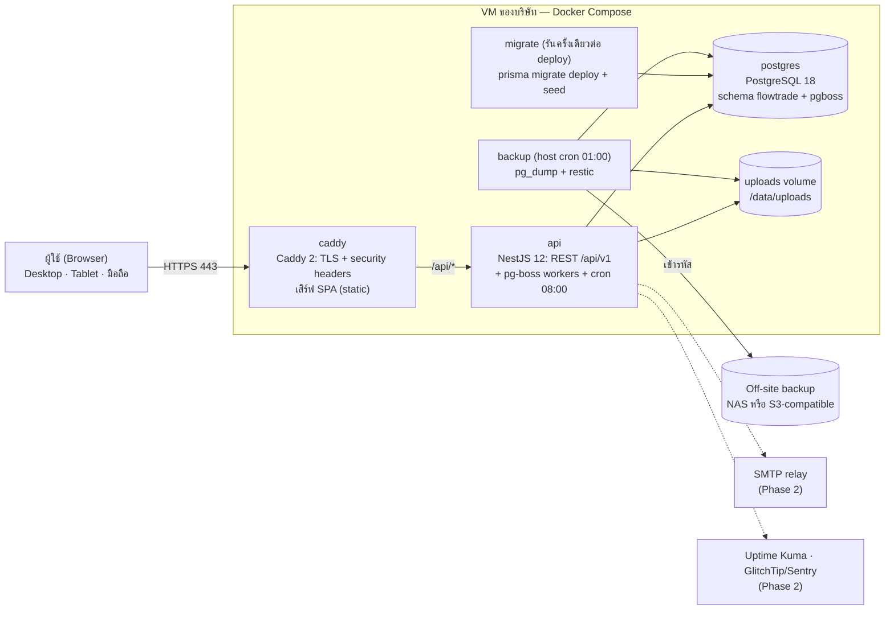
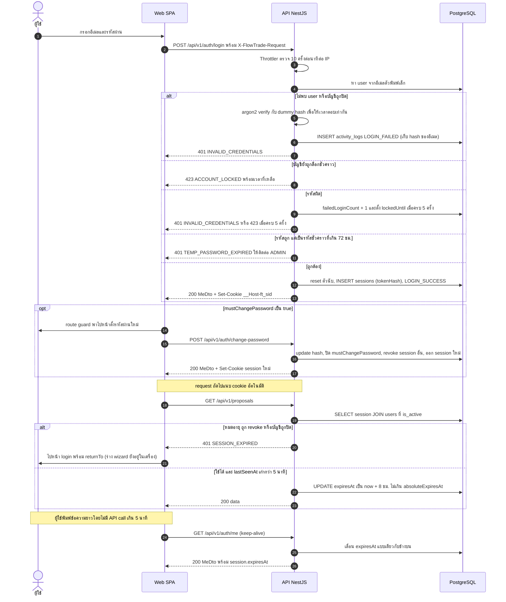

# 02 · Architecture — FlowTrade (Full-stack)

> **เวอร์ชัน:** 1.1 (ฉบับรวมหลัง review) · **วันที่:** 1 ต.ค. 2569 (2026-10-01)
> **ผู้อ่าน:** ทีม dev, ทีม IT ของลูกค้า
> **เอกสารที่เกี่ยวข้อง:** [README.md](README.md) · [01-requirements-flow.md](01-requirements-flow.md) · [03-database.md](03-database.md) · [schema.prisma](schema.prisma) · [04-api.md](04-api.md) · [05-frontend-ux.md](05-frontend-ux.md) · [06-roadmap.md](06-roadmap.md)

**ขอบเขตของเอกสารนี้:** ตัดสินใจเรื่องเทคโนโลยี โครงสร้างระบบ การยืนยันตัวตน ภาพรวมสิทธิ์ งานเบื้องหลัง การ deploy และความปลอดภัย เอกสารนี้ **ไม่** กำหนดชื่อ field, endpoint หรือ permission key ซ้ำ:

| เรื่อง | แหล่งความจริง |
|---|---|
| กติกาธุรกิจ, flow, สูตร KPI, เนื้อหาแม่แบบงาน | [01-requirements-flow.md](01-requirements-flow.md) |
| ชื่อตาราง/field/enum, constraint, query, seed | [03-database.md](03-database.md), [schema.prisma](schema.prisma) |
| Endpoint, DTO, error code, **permission matrix** | [04-api.md](04-api.md) |
| หน้าจอ, route, component, state ฝั่งเว็บ | [05-frontend-ux.md](05-frontend-ux.md) |
| ขอบเขต MVP/Phase, แผน sprint, คำถามที่ต้องยืนยัน | [06-roadmap.md](06-roadmap.md) |

จุดที่ต้องตัดสินใจร่วมกับลูกค้าทำเครื่องหมาย **(ควรยืนยันกับทีม Trade)** หรือ **(ควรยืนยันกับทีม IT)** และอ้างรหัสคำถามใน [06-roadmap.md §5](06-roadmap.md)

---

## 0. สรุปการตัดสินใจหลัก

| เรื่อง | ตัดสินใจ | เหตุผลสั้นๆ |
|---|---|---|
| รูปแบบระบบ | React SPA + REST API (NestJS) + PostgreSQL ใน monorepo เดียว | งานหลักคือ task tree ที่โต้ตอบเยอะ SPA + cache ฝั่ง client ทำ optimistic update ได้ตรงที่สุด และ prototype ที่มีอยู่ใช้แนวนี้แล้ว |
| Monorepo | **npm workspaces** (ตาม prototype) ไม่ย้ายไป pnpm/Turborepo ใน MVP | ย้ายเครื่องมือไม่เพิ่มคุณค่าให้ลูกค้าและกินเวลา 1–2 สัปดาห์ |
| Router ฝั่งเว็บ | **react-router 7** (ตาม prototype) | prototype ทำ route และ guard ไว้แล้ว ใช้ต่อได้ |
| Shared contract | `packages/shared` เก็บ type, zod schema, permission matrix และฟังก์ชัน task tree ที่ใช้ทั้งเว็บและ API | optimistic UI กับ server คำนวณผลเดียวกัน และชื่อผิดเป็น compile error |
| Auth | **server-side session** ใน PostgreSQL + cookie httpOnly ไม่ใช้ JWT | ปิดบัญชีหรือเปลี่ยนบทบาทแล้วมีผลทันทีใน request ถัดไป |
| สิทธิ์ | enum `Role` 3 ค่า → permission key ในโค้ด + สิทธิ์ระดับข้อเสนอ + `can` object ใน DTO | matrix ตายตัวพอสำหรับ Phase 1 และ UI ไม่ต้องคำนวณสิทธิ์เอง |
| งานเบื้องหลัง | **pg-boss** รันใน process ของ API (MVP) | ใช้ PostgreSQL ตัวเดิม ไม่ต้องดูแล Redis และมี API instance เดียว |
| ไฟล์แนบ | local volume + ดาวน์โหลดผ่าน API ที่ตรวจสิทธิ์ (stream) | ง่ายและปลอดภัยพอสำหรับ VM เดียว ย้ายไป S3-compatible ได้ผ่าน interface เดียว |
| Deploy | Docker Compose บน VM เดียว + Caddy (HTTPS อัตโนมัติ) | ทีมเล็กดูแลได้ ค่าใช้จ่ายต่ำ |
| Backup | `pg_dump` + `restic` ทุกคืนและก่อน deploy (RPO 24 ชม.) | พอสำหรับ Phase 1 · WAL/PITR (RPO ≤ 15 นาที) เป็น Phase 2 (ควรยืนยันกับทีม IT, IT5) |

---

## 1. ทางเลือกสถาปัตยกรรม

| เกณฑ์ (น้ำหนัก) | **A.** React SPA (Vite) + NestJS 12 + Prisma 7 + PostgreSQL 18 | **B.** Next.js 16 monolith + Prisma + Better Auth | **C.** Laravel 13 + Inertia + React | **D.** React SPA + Hono 4 + Drizzle |
|---|:-:|:-:|:-:|:-:|
| ความเร็วพัฒนาสำหรับทีมเล็ก (20%) | 4 | 4 | 5 | 4 |
| Maintainability ระยะยาว (15%) | 5 | 3 | 4 | 3 |
| End-to-end type safety (10%) | 4 | 5 | 2 | 5 |
| หาคนในไทย (10%) | 4 | 4 | 5 | 2 |
| Deploy บน VM เดียวด้วย Docker (10%) | 5 | 4 | 4 | 5 |
| ความปลอดภัย Auth/RBAC (15%) | 5 | 3 | 5 | 3 |
| เหมาะกับ task tree ที่โต้ตอบเยอะ + optimistic update (10%) | 5 | 4 | 3 | 5 |
| ต่อยอด prototype ที่มีอยู่ (10%) | 5 | 2 | 1 | 3 |
| **คะแนนถ่วงน้ำหนัก** | **4.60** | 3.60 | 3.85 | 3.70 |

### เลือก A

1. **งานหลักคือ task tree** (เพิ่มงานต่อเนื่อง, indent/outdent, ติ๊ก checklist ที่ roll-up, แก้ inline) SPA ที่ใช้ TanStack Query จัดการ cache และ optimistic update ได้ตรงที่สุด และไม่ต้องรับความซับซ้อนของ server component/caching
2. **NestJS ให้โครงสร้างมาตรฐาน** (module, DI, guard, interceptor, exception filter) คนใหม่อ่านโค้ดได้เร็ว ทำ RBAC ด้วย guard + policy service ได้ชัด เหมาะกับทีม in-house ที่ต้องดูแลระบบหลายปี
3. **NestJS 12 รองรับ Standard Schema** จึงใช้ zod schema ชุดเดียวกับฟอร์มฝั่งเว็บเป็น validation ของ API ได้
4. ทั้ง stack เป็น TypeScript ภาษาเดียว และตลาดงาน React + Node ในไทยมีคนมาก
5. **prototype ใน repo ใช้ stack นี้อยู่แล้ว** (React 19 + Vite 8 + react-router 7 + NestJS 12 + Prisma 7) จึงต่อยอดได้ทันที

**ข้อเสียของ A และวิธีแก้:** boilerplate มากกว่า B/C แก้ด้วย shared schema และ feature template · type ของ response อาจคลาดกับฝั่งเว็บ แก้ด้วย DTO type ใน `packages/shared`, mapper ที่เขียน `satisfies XxxDto` และ contract test ที่ parse response จริงด้วย zod

**ทำไมไม่เลือก B:** Auth.js อยู่ในโหมดดูแลเฉพาะ security patch หลังทีม Better Auth เข้ามาดูแล Server Action ทุกตัวเป็น public endpoint ที่ต้องตรวจสิทธิ์เองทุกจุด และกรณี middleware bypass (CVE-2025-29927) แสดงว่าการพึ่ง middleware ตรวจสิทธิ์มีความเสี่ยง
**ทำไมไม่เลือก C:** ดีมากถ้าทีมถนัด PHP แต่ต้องทิ้ง prototype ทั้งหมด และ type safety ระหว่าง PHP กับ React อ่อนกว่า
**ทำไมไม่เลือก D:** Hono ไม่มี convention ทีมต้องออกแบบโครงเองทั้งหมด และหาคนที่มีประสบการณ์ในไทยยาก
**เงื่อนไขที่ควรเปลี่ยนใจ:** ถ้าทีมที่จะดูแลระยะยาวถนัด PHP/Laravel ทั้งหมดและไม่มีใครเขียน TypeScript ให้เลือก C

---

## 2. Tech stack สุดท้าย

เวอร์ชัน major ตาม `package.json` ของ prototype ณ 1 ต.ค. 2569 ไลบรารีที่ไม่ได้ระบุ major ให้ยึด `package-lock.json` และอัปเดตเป็นรอบผ่าน Renovate

| Layer | Technology | Major | หมายเหตุ |
|---|---|---|---|
| Runtime | Node.js | **24 LTS** | image `node:24-slim` · ตั้ง `engines.node >= 24` ใน production |
| ภาษา | TypeScript | **6** | ESM ทั้ง repo (`"type": "module"`, `moduleResolution: nodenext` ฝั่ง API) relative import ฝั่ง API ลงท้าย `.js` |
| Monorepo | npm workspaces | npm 11 | `apps/web`, `apps/api`, `packages/shared` |
| Build เว็บ | Vite | **8** | dev proxy `/api` → `:3000` |
| UI | React | **19** | |
| Routing | react-router | **7** | ใช้ route loader/guard ตาม [05-frontend-ux.md](05-frontend-ux.md) |
| Server state | TanStack Query | **5** | cache + optimistic update |
| UI kit | Tailwind CSS + shadcn/ui (Radix) | **4** / CLI 4 | component อยู่ใน repo แก้ได้หมด |
| Forms / validation | react-hook-form + @hookform/resolvers + zod | **7** / **5** / **4** | zod schema ชุดเดียวทั้งเว็บและ API |
| วันที่ | **dayjs** + plugin `utc`, `timezone`, `buddhistEra`, `customParseFormat`, locale `th` | **1** | **ถอด date-fns ออก** ใช้ dayjs อย่างเดียว (token `BBBB` แสดงปี พ.ศ.) |
| Date picker | react-day-picker | **10** (ตาม prototype) | custom caption ให้แสดงปี พ.ศ. |
| กราฟ | Recharts (ผ่าน shadcn Chart) | **3** | |
| Toast / icon / command | sonner 2, lucide-react, cmdk | lockfile | toast มีปุ่ม "เลิกทำ" |
| Drag & drop | @dnd-kit/core + sortable | **6** / **10** | มีใน prototype แล้ว เปิดใช้ใน Phase 2 |
| Backend | NestJS (Express adapter) | **12** (≥ 12.1) | |
| ORM | Prisma + `@prisma/adapter-pg` | **7.10.0 (pin แบบ exact)** | ดูหมายเหตุ Prisma ด้านล่าง |
| Database | PostgreSQL | **18** | extension `pg_trgm` สำหรับค้นหาภาษาไทย · ตาราง FlowTrade อยู่ใน schema `flowtrade` (`DB_SCHEMA`) |
| Password hashing | argon2 (node-argon2) | lockfile | argon2id |
| Session | server-side session ใน PostgreSQL (เขียนเอง) | — | หัวข้อ 5 |
| Rate limit | @nestjs/throttler + helmet | major ที่รองรับ Nest 12 | in-memory ได้เพราะมี API instance เดียว |
| Background jobs | **pg-boss** | **12** | queue และ cron (`tz: Asia/Bangkok`) ใน PostgreSQL schema `pgboss` |
| ตรวจชนิดไฟล์ | file-type | lockfile | ตรวจ magic bytes |
| Excel | exceljs | **4** | นำเข้าสินค้า (MVP) และ export (Phase 2) |
| Email (Phase 2) | nodemailer | **7** | SMTP relay ของบริษัท |
| รูปภาพ | sharp | lockfile | re-encode รูปโปรไฟล์ โลโก้ และรูปสินค้าใน request เพื่อลบ EXIF/GPS · thumbnail แบบ async เป็น Phase 2 |
| Logging | pino + nestjs-pino | **10** / **5** | JSON log พร้อม requestId |
| Testing | Vitest **4**, Testing Library **16**, MSW **2**, Playwright **1**, Testcontainers **11**, supertest **7** | | |
| Lint | oxlint (มีใน prototype) + `tsc --noEmit` | lockfile | API เพิ่ม typescript-eslint 8 เฉพาะกฎ `no-floating-promises` |
| Reverse proxy | Caddy | **2** | HTTPS อัตโนมัติ เสิร์ฟ SPA |
| CI/CD | GitHub Actions + GHCR | — | ถ้าบริษัทใช้ GitLab ใช้โครงเดียวกัน (ควรยืนยันกับทีม IT, IT3) |
| Backup | pg_dump (client ของ postgres:18) + restic | — | หัวข้อ 9.6 |

**หมายเหตุเวอร์ชันที่มี breaking change**

- **Prisma 7 (ใช้รุ่นนี้):** generator `prisma-client` ต้องกำหนด `output` · ต้องใช้ driver adapter (`@prisma/adapter-pg`) · datasource URL อยู่ใน `prisma.config.ts` · ไม่โหลด `.env` ให้เอง (`import 'dotenv/config'`) · `migrate dev` ไม่รัน `generate`/`seed` ให้ · `$use` middleware ถูกถอด ใช้ Client Extensions แทน · ใช้ preview feature `partialIndexes` (ต้อง ≥ 7.4)
- **Prisma 8 ยังเป็น RC และเปลี่ยน format ของ schema ทั้งหมด** ขณะที่ dist-tag `latest` บน npm ชี้ไปที่ 8.0.0-rc แล้ว ดังนั้น:
  - pin แบบ exact: `"prisma": "7.10.0"`, `"@prisma/client": "7.10.0"`, `"@prisma/adapter-pg": "7.10.0"` และย้าย `prisma` ไปอยู่ใน `dependencies` เพราะ container `migrate` ต้องเรียกใช้
  - ทุก script เรียก CLI ผ่าน `npm run … -w @flowtrade/api` หรือ `npm exec -w @flowtrade/api -- prisma …` **ห้ามใช้ `npx prisma`** แบบไม่ pin
  - Renovate: `packageRules: [{ matchPackageNames: ["prisma"], matchPackagePrefixes: ["@prisma/"], allowedVersions: "<8" }]`
- **npm ไม่มี supply-chain guard แบบ `minimumReleaseAge` ของ pnpm** จึงตั้งใน Renovate แทน (`minimumReleaseAge: "3 days"`) และใช้ `npm ci` ทุกครั้งใน CI/Docker

---

## 3. Architecture

### 3.1 แผนภาพ (MVP)



| Container | Image | หน้าที่ |
|---|---|---|
| `caddy` | `flowtrade-web:<sha>` (Caddy 2 + `dist/` ของ SPA) | TLS, security headers, เสิร์ฟ SPA พร้อม fallback, proxy `/api/*` |
| `api` | `flowtrade-api:<sha>` → `node dist/main.js` | REST API, ตรวจ session/สิทธิ์, upload/download ไฟล์, pg-boss worker และ cron |
| `migrate` | image เดียวกับ `api` | `prisma migrate deploy` แล้ว seed แบบ idempotent ก่อน `api` เริ่ม |
| `postgres` | `postgres:18` | ข้อมูลแอป (schema `flowtrade`) + queue ของ pg-boss (schema `pgboss` ที่ Prisma ไม่ยุ่ง) |
| `backup` | `flowtrade-backup:<sha>` (profile `ops`) | host cron เรียกทุกคืนและก่อน deploy |

- **Same-origin:** SPA และ API อยู่ใต้โดเมนเดียว (`https://flowtrade.<โดเมนบริษัท>/` และ `/api/v1/*`) จึงไม่ต้องเปิด CORS ใน production และใช้ cookie `__Host-` ได้ (prototype เปิด `enableCors` ไว้ ให้เปิดเฉพาะเมื่อ `NODE_ENV !== 'production'`)
- เปิด port ภายนอกแค่ 80/443 PostgreSQL อยู่ใน network ภายในของ compose เท่านั้น
- ไฟล์แนบทุกไฟล์ดาวน์โหลดผ่าน API ที่ตรวจสิทธิ์ ไม่เสิร์ฟจาก Caddy ตรง
- **ขนาด VM ที่แนะนำ:** production 2 vCPU / 4 GB RAM / SSD 80 GB (Ubuntu 24.04 LTS) · staging 2 vCPU / 2–4 GB (ควรยืนยันกับทีม IT, IT1)

### 3.2 เมื่อไรจะแยก container `worker`

MVP รัน pg-boss ใน process ของ `api` เพราะงานเบื้องหลังมีแค่ reminder วันละครั้งและ cleanup เมื่อถึง Phase 2 ที่มีอีเมล (retry) และการประมวลผลรูปด้วย sharp ให้แยก `worker` (image เดียวกัน คำสั่ง `node dist/worker.js`) เพื่อไม่ให้งานหนักแย่ง CPU กับ request ของผู้ใช้ โค้ด job เขียนเป็น module แยกตั้งแต่ MVP จึงย้ายได้โดยไม่ต้องแก้ logic

---

## 4. โครงสร้าง monorepo

ต่อยอดจาก prototype ที่มีอยู่ รายการที่มี **(เพิ่ม)** คือสิ่งที่ต้องสร้างใหม่ โครงสร้างละเอียดของ `apps/web` อยู่ใน [05-frontend-ux.md](05-frontend-ux.md)

```
flowTrade/
├─ package.json                      # npm workspaces + scripts: dev, build, typecheck, db:*
├─ package-lock.json
├─ apps/
│  ├─ web/                           # React 19 SPA (Vite 8)
│  │  ├─ vite.config.ts              # proxy /api → :3000
│  │  ├─ components.json             # shadcn
│  │  └─ src/
│  │     ├─ main.tsx · App.tsx        # react-router 7 routes + guards
│  │     ├─ api/                     # hooks.ts (TanStack Query), http/http-api.ts, mock/ (dev เท่านั้น)
│  │     ├─ auth/                    # session context, RequireAuth, requirePermission (typed)
│  │     ├─ components/              # ui/ (shadcn), common/, layout/
│  │     ├─ features/                # wizard, task-tree, proposal-detail, proposals-list, my-work,
│  │     │                           # monitor, admin-master, admin-templates, admin-users, admin-activity
│  │     ├─ pages/ · hooks/ · lib/   # lib/dates.ts (dayjs + พ.ศ.), lib/format.ts
│  │     └─ locales/th/ (เพิ่ม)       # i18n
│  └─ api/                           # NestJS 12 (ESM)
│     ├─ prisma.config.ts            # Prisma 7: schema, migrations, datasource url
│     ├─ prisma/
│     │  ├─ schema.prisma            # สำเนาของ docs/schema.prisma
│     │  └─ migrations/              # init + constraints_and_triggers (ดู 03-database.md)
│     ├─ src/
│     │  ├─ main.ts                  # prefix /api/v1, helmet, pino, filters, trust proxy, CORS เฉพาะ dev
│     │  ├─ cli.ts (เพิ่ม)            # break-glass: admin:unlock (ไม่มีทาง HTTP)
│     │  ├─ config.ts                # env schema ด้วย zod (fail fast)
│     │  ├─ auth/                    # controller, session.service, password.ts, guards, decorators
│     │  ├─ common/                  # errors + exception.filter (Problem Details), csrf.middleware,
│     │  │                           # dates.ts (todayBangkok), proposal-access.service, activity.service, zod pipe, mappers
│     │  ├─ prisma/                  # prisma.service (PrismaPg adapter + DB_SCHEMA)
│     │  ├─ jobs/ (เพิ่ม)             # pg-boss module, queues, reminders.job, cleanup jobs
│     │  ├─ storage/ (เพิ่ม)          # StorageDriver, LocalDiskDriver (S3Driver ใน Phase 2)
│     │  ├─ modules/                 # users, stores, shelf-types, products (+ import), templates,
│     │  │                           # proposals, tasks, comments, attachments (เพิ่ม), notifications,
│     │  │                           # dashboard, activity, settings (เพิ่ม)
│     │  ├─ seed/                    # bootstrap.ts (idempotent), reset-empty.ts, data/*.ts (เพิ่ม: แม่แบบ, ห้าง)
│     │  │                           # path ของ prototype ใช้ตรงกับ 03-database.md §1 และ §13
│     │  └─ generated/prisma/        # output ของ prisma generate (gitignored)
│     └─ test/
│        ├─ integration/ (เพิ่ม)      # supertest + Testcontainers (postgres:18)
│        ├─ rbac-matrix.spec.ts (เพิ่ม)
│        └─ idor.spec.ts (เพิ่ม)
├─ packages/
│  └─ shared/                        # ESM, build ด้วย tsc
│     └─ src/
│        ├─ types.ts · api-types.ts   # type เดิมของ prototype (ปรับชื่อตาม 03/04)
│        ├─ dto/ (เพิ่ม)              # TaskDto, ProposalDetailDto, MutationResult, abilities.ts (can)
│        ├─ enums.ts (เพิ่ม) · labels.ts
│        ├─ permissions.ts           # PERMISSIONS + ROLE_PERMISSIONS ตาม 04-api.md §4.1
│        ├─ task-tree.ts             # buildTaskTree, planFromTemplate, deriveParentStatus,
│        │                           # resolveInsertIndex, checkMove, computeProgress, computeDueState, computeHealth
│        ├─ schemas/ (เพิ่ม)          # zod request schema แยกตามโมดูล
│        ├─ dates.ts (เพิ่ม)          # todayIn, addDays, diffDays (pure)
│        └─ error-codes.ts · limits.ts (เพิ่ม)
├─ docker/ (เพิ่ม)                    # api.Dockerfile, web.Dockerfile, Caddyfile, backup/
├─ docker-compose.yml (เพิ่ม)         # dev: postgres
├─ docker-compose.prod.yml (เพิ่ม)
├─ .github/workflows/ (เพิ่ม)         # ci.yml, deploy.yml
├─ renovate.json (เพิ่ม)
└─ docs/                             # เอกสารชุดนี้
```

**แนวทางโค้ดฝั่ง API**

- service ใช้ `PrismaService` ตรงๆ ไม่มี repository layer · query ที่ซับซ้อนแยกไว้ใน `*.queries.ts`
- **ห้าม return entity ของ Prisma ออกไปตรงๆ** ต้องผ่าน mapper ที่เขียน `satisfies XxxDto` เพื่อกัน field อย่าง `passwordHash` หลุด
- **ห้าม raw `INSERT` ลงตารางที่มี uuid PK โดยไม่ส่ง `id`** เพราะ id (uuid v7) สร้างฝั่ง app ไม่มี default ใน DB ให้ใช้ `createMany({ skipDuplicates: true })` แทน
- ฟังก์ชันที่ตัดสินกติกางาน (C1–C13 ใน 01) อยู่ใน `packages/shared/src/task-tree.ts` เป็น pure function ใช้ทั้ง server และ optimistic UI

---

## 5. Auth design

### 5.1 ทำไมใช้ server-side session

| | Server-side session (เลือก) | JWT access + refresh |
|---|---|---|
| ปิดบัญชี / เปลี่ยนบทบาท | มีผลทันทีใน request ถัดไป | ต้องรอ token หมดอายุ หรือทำ denylist |
| ความซับซ้อนฝั่ง SPA | ไม่มี refresh logic ที่ต้องกัน race | ต้องมี interceptor, กัน race, ตรวจ token reuse |
| ต้นทุน | lookup DB 1 ครั้งต่อ request (ไม่มีผลที่ 200 ผู้ใช้) | ไม่อ่าน DB แต่โค้ดมากกว่า |
| ไคลเอนต์ | เว็บ same-origin ตรงกับระบบนี้ | เหมาะกับ mobile app / third-party |

ถ้าอนาคตมี mobile app ให้เพิ่ม token endpoint แยก โดยไม่เปิด CORS บน endpoint ที่ใช้ cookie

### 5.2 วงจรชีวิตบัญชี (ADMIN สร้างให้เท่านั้น)

1. **ADMIN สร้างผู้ใช้** (อีเมล ชื่อ ชื่อเล่น ตำแหน่ง เบอร์ บทบาท) ระบบสร้างรหัสผ่านชั่วคราว 16 ตัวด้วย CSPRNG แสดง **ครั้งเดียว** (response `Cache-Control: no-store` และไม่ลง log) ใช้ได้ **72 ชั่วโมง** และตั้ง `mustChangePassword = true`
2. **Login ครั้งแรก:** `MustChangePasswordGuard` บล็อกทุก endpoint ยกเว้น `/auth/me`, `/auth/change-password`, `/auth/logout` จนกว่าจะตั้งรหัสใหม่
3. **ปิดบัญชี:** `isActive = false` (ไม่ลบแถว) โอนข้อเสนอและงานตาม BR-02 และ revoke ทุก session ใน transaction เดียว (เมื่อมีลิงก์ตั้งรหัสผ่านทางอีเมลใน Phase 2 ให้ยกเลิกลิงก์ที่ยังไม่ใช้ใน transaction เดียวกันด้วย)
4. **เปิดบัญชีคืน:** ตั้ง `isActive = true` พร้อมล้าง `deactivatedAt`, ตัวนับรหัสผิด และ `lockedUntil` (DB บังคับให้ `isActive` สอดคล้องกับ `deactivatedAt`)
5. **ADMIN รีเซ็ตรหัส:** ออกรหัสชั่วคราวใหม่ (72 ชม.) revoke ทุก session ตั้ง `mustChangePassword` ปลดล็อก และบันทึก `PASSWORD_RESET`
6. **ลืมรหัสผ่าน:** MVP ให้ติดต่อ ADMIN · Phase 2 เพิ่มลิงก์ทางอีเมล
7. **ADMIN คนแรก (seed):** อ่าน `SEED_ADMIN_EMAIL`, `SEED_ADMIN_FULL_NAME` และ `SEED_ADMIN_PASSWORD` จาก env สร้างเฉพาะเมื่อยังไม่มี ADMIN ที่ Active ตั้ง `mustChangePassword = true` และหยุดทันทีถ้ารหัสใน env ไม่ผ่านนโยบาย
   - **Production ต้องตั้ง `SEED_ADMIN_PASSWORD`** แล้วลบออกจาก `.env` หลัง ADMIN เข้าระบบครั้งแรก
   - ถ้าไม่ตั้ง (ใช้ได้เฉพาะเครื่อง dev) seed ของ prototype สุ่มรหัสแล้วเขียนลง `apps/api/.admin-initial-password` (gitignored ไม่พิมพ์ลง log) ใน production ห้ามใช้วิธีนี้ เพราะไฟล์อยู่ใน container `migrate` ที่ถูกลบหลังรันเสร็จ

### 5.3 รหัสผ่าน

- **Hash:** argon2id `memoryCost 19456 (19 MiB), timeCost 2, parallelism 1` (ค่าขั้นต่ำตาม OWASP)
- **นโยบาย (ตาม NFR):** ยาว 8–128 ตัวอักษร มีทั้งตัวอักษรและตัวเลข ไม่ซ้ำรหัสปัจจุบัน ไม่ตรงกับอีเมล ไม่อยู่ในรายการรหัสยอดนิยม (list อยู่ใน `packages/shared`) ไม่บังคับเปลี่ยนตามรอบเวลา · zod schema ชุดเดียวใช้ทั้งหน้าเปลี่ยนรหัสและ API (ควรยืนยันกับทีม IT, IT6)
- ความยาวสูงสุด 128 กันการส่ง input ยาวมากเพื่อทำให้ argon2 ทำงานหนัก
- **Login ด้วยอีเมลเท่านั้น** ไม่มี username ระบบ normalize ด้วย `trim().toLowerCase()` ทั้งตอนเขียนและค้นหา

### 5.4 Session และ cookie

- token สุ่ม 32 bytes (`base64url`) cookie เก็บ token ดิบ DB เก็บเฉพาะ **SHA-256** ของ token
- **Cookie:** `__Host-ft_sid` (production) / `ft_sid` (dev) · `HttpOnly; Secure; SameSite=Lax; Path=/`
- **อายุ:** idle **8 ชั่วโมง** แบบ sliding (ต่ออายุไม่เกิน 1 ครั้งต่อ 5 นาที) และ absolute **7 วัน** ไม่มี "จดจำฉัน" ตั้งผ่าน env `SESSION_IDLE_HOURS=8`, `SESSION_ABSOLUTE_DAYS=7` (prototype ตั้ง default idle ไว้ 12 ต้องแก้เป็น 8)
- ออก session ใหม่ทุกครั้งที่ login หรือเปลี่ยนรหัสผ่าน (revoke session อื่นของผู้ใช้นั้นด้วยเมื่อเปลี่ยนรหัส)
- **revoke ทุก session ทันที** เมื่อปิดบัญชี รีเซ็ตรหัส หรือ **เปลี่ยนบทบาท** และไม่ cache permission ข้าม request
- **Session lookup ทุก request** (defense in depth):
  ```sql
  SELECT s.id, s.expires_at, s.absolute_expires_at, u.id AS user_id, u.role, u.must_change_password
  FROM sessions s
  JOIN users u ON u.id = s.user_id AND u.is_active
  WHERE s.token_hash = $1 AND s.revoked_at IS NULL
    AND s.expires_at > now() AND s.absolute_expires_at > now();
  ```
  ไม่พบแถวตอบ `401 SESSION_EXPIRED` บทบาทและ `mustChangePassword` อ่านสดจากแถว `users` ทุกครั้ง
- job รายวันลบ session ที่หมดอายุหรือถูก revoke เกิน 30 วัน

### 5.5 CSRF

- `SameSite=Lax`
- **บังคับ header `X-FlowTrade-Request: 1`** ในทุก POST/PUT/PATCH/DELETE รวมถึง login และ multipart (เว็บอื่นส่ง custom header ข้ามโดเมนไม่ได้ถ้าไม่ผ่าน preflight และระบบไม่ตอบ preflight)
- `Origin` ต้องตรงกับ `APP_URL` ถ้าไม่มีให้ดู `Referer` ถ้าไม่มีทั้งคู่ตอบ `403 CSRF_REJECTED`
- unsafe request รับเฉพาะ `application/json` และ `multipart/form-data` · GET ไม่มีผลข้างเคียง

### 5.6 Rate limit และ lockout

- **ต่อ IP:** `/auth/login` (และ `/auth/setup-password` ใน Phase 2) 10 ครั้ง/นาที · API ทั่วไป 300 request/นาที/ผู้ใช้ (`@nestjs/throttler`, `trust proxy 1` เพื่อให้ได้ IP จริงหลัง Caddy)
- **ต่อบัญชี:** ผิดติดกัน 5 ครั้งตั้ง `lockedUntil = now + 15 นาที` ตอบ `423 ACCOUNT_LOCKED` พร้อมเวลาที่เหลือ **ไม่มีการล็อกถาวรหรือล็อกที่ยาวขึ้นเรื่อยๆ** เพื่อไม่ให้คนภายนอกที่รู้อีเมลล็อก ADMIN คนเดียวของระบบได้ตลอดไป
- **กัน enumeration:** อีเมลที่ไม่มีในระบบใช้ตัวนับ in-memory (key = sha256 ของอีเมล) ด้วยเกณฑ์เดียวกัน และ verify กับ dummy argon2 hash ทุกครั้ง ทำให้ status และเวลาตอบเหมือนบัญชีจริง
- บันทึก `LOGIN_FAILED` ทุกครั้งโดยเก็บ hash ของอีเมลที่พิมพ์ (ไม่เก็บอีเมลดิบใน log ที่ลบไม่ได้) และ reset ตัวนับเมื่อ login สำเร็จ
- **Break-glass:** ถ้า ADMIN ทุกคนถูกล็อกหรือลืมรหัส ทีม IT รัน `docker compose -f docker-compose.prod.yml exec api node dist/cli.js admin:unlock --email <อีเมล>` ซึ่งล้าง `lockedUntil`/ตัวนับ (และออกรหัสชั่วคราวใหม่ถ้าระบุ `--reset-password`) บันทึก ActivityLog ด้วย `actorId = null` คำสั่งนี้ไม่มีทางเรียกผ่าน HTTP
- แนะนำให้มี ADMIN ที่ Active อย่างน้อย 2 คนตั้งแต่ go-live (ควรยืนยันกับทีม Trade, Q29)

### 5.7 ลิงก์ตั้งรหัสผ่านทางอีเมล (Phase 2)

- token ใช้ครั้งเดียว เก็บเฉพาะ hash อายุ 24 ชม.
- ใช้ token แบบ atomic และต้องเป็นผู้ใช้ Active:
  ```sql
  UPDATE auth_tokens t SET used_at = now()
  FROM users u
  WHERE t.token_hash = $1 AND t.used_at IS NULL AND t.expires_at > now()
    AND u.id = t.user_id AND u.is_active
  RETURNING t.user_id;
  ```
- เมื่อปิดบัญชี รีเซ็ตรหัส เปลี่ยนบทบาท หรือออกคำเชิญใหม่ ให้ยกเลิก token เดิมทั้งหมดของผู้ใช้นั้นใน transaction เดียวกัน

### 5.8 Demo login ของ prototype

prototype มี `/auth/demo-users` และ `/auth/demo-login` ที่เปิดด้วย `ENABLE_DEMO_LOGIN=true` และเว็บมีโหมด `VITE_API_MODE=mock`
- env schema ต้อง **fail ตอน boot** ถ้า `NODE_ENV=production` และ `ENABLE_DEMO_LOGIN=true`
- build ของ staging/production ตั้ง `VITE_API_MODE=http` และไม่ bundle mock adapter

### 5.9 SSO ในอนาคต (Phase 2)

OIDC Authorization Code + PKCE (Google Workspace / Microsoft Entra ID) รับเฉพาะเมื่อ `email_verified = true` และอีเมลตรงกับผู้ใช้ Active ที่ ADMIN สร้างไว้ ไม่สร้างบัญชีให้อัตโนมัติ ตรวจ tenant (`hd` / `tid`) หลัง SSO สำเร็จออก server-side session แบบเดียวกัน ส่วนอื่นของระบบไม่ต้องแก้

### 5.10 Sequence: login, บังคับเปลี่ยนรหัส, การต่ออายุ session



**การต่ออายุ session (refresh)** ไม่มี refresh token และไม่มี endpoint แยก ทุก request ที่ผ่าน `SessionGuard` เลื่อนอายุ idle ให้เอง (ไม่เกิน 1 ครั้งต่อ 5 นาที และไม่เกินอายุสูงสุด 7 วัน) กรณีผู้ใช้ยังโต้ตอบกับหน้าจอแต่ไม่มี API call (เช่น พิมพ์ความคิดเห็นยาว) SPA เรียก `GET /auth/me` เป็น keep-alive เมื่อมี keyboard/pointer activity และไม่มี request มานานกว่า 5 นาที ถ้าได้ 401 ระหว่างพิมพ์ ข้อความที่ยังไม่ส่งยังอยู่ในฟอร์มให้คัดลอก

---

## 6. RBAC overview

> **Permission matrix ฉบับทางการอยู่ที่ [04-api.md §4](04-api.md)** หัวข้อนี้สรุปกลไกเท่านั้น ถ้าขัดกันให้ยึด 04-api.md

### 6.1 สามชั้นของการตรวจสิทธิ์

| ชั้น | กลไก | ตัดสินอะไร |
|---|---|---|
| 1. Role → permission key | enum `Role` บน `User` → `ROLE_PERMISSIONS` ใน `packages/shared/src/permissions.ts` | เข้าหน้า/endpoint ระดับระบบได้หรือไม่ เช่น `dashboard.view.all`, `master.manage`, `user.manage` |
| 2. ความสัมพันธ์กับข้อเสนอ + สถานะ | `resolveProposalAccess()` หา relation ตามลำดับ PRIVILEGED → OWNER → EDITOR/VIEWER แล้วตัดตามสถานะข้อเสนอ | ดู แก้ เปลี่ยนสถานะ จัดการสมาชิก ในข้อเสนอนั้น · มองไม่เห็นตอบ **404** |
| 3. Assignee subtree | `taskAbilities()` สำหรับ USER ที่ไม่ใช่ Owner/Editor | ติ๊ก/แนบไฟล์/เพิ่มงานลูกใน subtree ของงานที่ตนรับผิดชอบ · แก้/มอบหมายเฉพาะรายการที่ตนสร้าง · ลบ/ย้ายเฉพาะเมื่อตนสร้างรายการนั้นและลูกหลานทั้งหมด |

**ภาพรวมบทบาท:** USER ได้ชุดพื้นฐาน (สร้างข้อเสนอ เห็นและแก้ข้อเสนอที่ตนเกี่ยวข้อง) · MANAGER ได้เพิ่ม `proposal.read.all`, `proposal.update.all`, `proposal.forceComplete`, `proposal.reopen`, `master.manage`, `task.transfer.bulk`, `dashboard.view.all`, `report.export`, `proposal.create.assignOwner` · ADMIN ได้ทุก key รวม `user.manage`, `master.delete`, `audit.read.all`, `setting.manage`, `comment.moderate`, `trash.restore` · **MANAGER ไม่มี `audit.read.all`** (เห็นประวัติเฉพาะในข้อเสนอ)

### 6.2 ฝั่ง API

```
request → SessionGuard → MustChangePasswordGuard → PermissionsGuard(@RequirePermissions) → service
                                                                     └─ resolveProposalAccess / taskAbilities
```

- endpoint ที่รับ id ของ resource ลูก (`/tasks/:id`, `/comments/:id`, `/attachments/:id`) โหลดแถวนั้นก่อน แล้วนำ `proposalId` ไปตรวจสิทธิ์ ถ้ามองไม่เห็นตอบ 404
- id ใน body (`parentId`, `afterId`, `beforeId`, `targetId`, `taskIds`, `mentionedUserIds`) ต้องอยู่ในข้อเสนอเดียวกันหรือผ่านการตรวจสิทธิ์ · `GET /lookups/users?proposalId=` ต้องตรวจสิทธิ์ดูข้อเสนอก่อนเช่นกัน
- DTO ของข้อเสนอและงานแนบ object `can` ที่ server คำนวณ ใช้ type `ProposalAbilitiesDto` / `TaskAbilitiesDto` จาก `packages/shared` ชุดเดียวกับฝั่งเว็บ (ชื่อ field ดู [04-api.md §4.4](04-api.md))

### 6.3 ฝั่งเว็บ

- `requirePermission(p: Permission)` ใน route guard ใช้ type `Permission` จาก `packages/shared` จึงพิมพ์ชื่อ key ผิดไม่ได้ (compile error) และอ่านสิทธิ์จาก `me.permissions` ที่ `/auth/me` ส่งมา
- route ฝั่ง Admin ใช้ key ตามนี้ (ต้องตรงกับ [05-frontend-ux.md](05-frontend-ux.md))

| Route | Permission key |
|---|---|
| `/admin`, `/admin/tasks` | `dashboard.view.all` |
| `/admin/stores`, `/admin/shelf-types`, `/admin/products`, `/admin/templates` | `master.manage` |
| `/admin/users` | `user.manage` |
| `/admin/activity` | `audit.read.all` |
| `/admin/settings` (Phase 2) | `setting.manage` |

- ปุ่มระดับข้อเสนอ/งานอ่านจาก `proposal.can` / `task.can` เท่านั้น ปุ่มที่ทำไม่ได้ชั่วคราวแสดงแบบ disabled พร้อม tooltip เหตุผล

### 6.4 ปรับ permission ของ prototype

`packages/shared/src/permissions.ts` ของ prototype ใช้ key ชุดเก่า ต้องแทนที่ทั้งไฟล์ด้วยชุดใน 04-api.md §4.1

| key เดิมใน prototype | key ใหม่ |
|---|---|
| `dashboard.monitor` | `dashboard.view.all` |
| `store.manage`, `shelfType.manage`, `product.manage`, `template.manage` | `master.manage` (และ `master.delete` สำหรับ ADMIN) · **MANAGER ต้องได้ `master.manage`** |
| `activity.read.all` | `audit.read.all` (ADMIN เท่านั้น) |
| `proposal.update.any`, `task.manage.any` | `proposal.update.all` |
| `proposal.delete.any` | ตัดออก (ลบได้เฉพาะ DRAFT โดย Owner/PRIVILEGED) |

**Test ที่บังคับใน CI:** RBAC matrix test แบบ table-driven (endpoint × role × relation × สถานะ → HTTP status ที่คาด) ที่ import `ROLE_PERMISSIONS` ตัวเดียวกับ guard และ IDOR test (ผู้ใช้ A เรียกทุก endpoint ด้วย id ของข้อเสนอที่มองไม่เห็นต้องได้ 404)

---

## 7. Cross-cutting concerns

### 7.1 Task tree และ pipeline ของการแก้งาน

**การเก็บข้อมูล** (รายละเอียดใน [03-database.md](03-database.md)): adjacency list (`parentId` + `level` 1–3 + `sortOrder` integer gap 1024) และมี `proposalId` ทุกแถว ลึกได้แค่ 3 ระดับจึงไม่ต้องใช้ recursive query DB มี CHECK และ deferred trigger ตรวจว่า level = parent.level + 1 และอยู่ข้อเสนอเดียวกัน

**Contract ที่ฝั่งเว็บใช้** (ฉบับเต็มใน [04-api.md](04-api.md))
- `GET /proposals/:id/tasks` คืนงานของข้อเสนอแบบ **flat list** เรียงตาม (level, sortOrder, id) ฝั่งเว็บประกอบเป็นต้นไม้ด้วย `buildTaskTree` จาก `packages/shared`
- ทุก mutation ของงานคืนรูปเดียวกัน `{ data, patch: { tasks, proposal }, warnings, meta }` ฝั่งเว็บ merge `patch.tasks` และ `patch.proposal` เข้า cache
- เปลี่ยนสถานะงานใช้ `PUT /tasks/:id/status { status, cascade }` แบบระบุค่าปลายทาง **ไม่ส่ง `version`** (C12) ถ้ากระทบงานลูกหลานและยังไม่ได้ส่ง `cascade: true` ได้ `409 CONFIRMATION_REQUIRED` ให้ UI แสดง dialog
- แก้ field และย้ายงานใช้ `version` ถ้าไม่ตรงได้ `409 VERSION_CONFLICT`
- ย้ายงานระบุตำแหน่งด้วย `afterId` หรือ `beforeId` อย่างใดอย่างหนึ่งหรือทั้งคู่ (`resolveInsertIndex` ใน shared ตรวจความติดกันเฉพาะเมื่อส่งมาทั้งคู่)

**Pipeline ของทุก mutation ที่แตะงาน** (ติ๊ก เพิ่ม แก้ ลบ ย้าย กู้คืน มอบหมาย) ทำใน transaction เดียว:

1. lock ข้อเสนอด้วย `SELECT … FOR NO KEY UPDATE` (mutex ต่อข้อเสนอ และตรวจว่าไม่ได้ปิดแล้ว)
2. โหลด skeleton ของงานทั้งข้อเสนอ (id, parentId, level, status, assignee, createdById) · การย้ายโหลดลูกหลานที่ถูกลบภายใน 30 วันด้วย เพื่อนับความลึกและปรับ level ตาม (BR-32)
3. คำนวณการเปลี่ยนแปลงด้วย pure function ใน `packages/shared/src/task-tree.ts`:
   - `deriveParentStatus(children, previous)` — ไม่มีลูก → คงค่าเดิม · ลูกทุกตัว DONE → DONE · มีลูก DONE/IN_PROGRESS หรือค่าเดิมเป็น DONE → IN_PROGRESS · นอกนั้น TODO (C3, C6, C8, C9)
   - `checkMove()` — ความลึกหลังย้ายรวมลูกหลานที่ถูกลบต้องไม่เกิน 3
   - `planFromTemplate()` — ไม่ปรับวันเมื่อวันวางขายอยู่ในอดีต (BR-11) และปรับเป็นวันนี้เมื่อเวลาไม่พอ (BR-12)
   - `computeProgress()` ปัดลงด้วย `Math.floor` (prototype ใช้ `Math.round` ต้องแก้)
4. เขียนข้อมูล
5. คำนวณ progress cache ของข้อเสนอใหม่ทั้งหมดด้วย aggregate (ไม่ใช้ +1/−1) และ `touchProposal()` ตั้ง `proposals.updated_at = now()` โดยไม่เพิ่ม `version`
6. บันทึก ActivityLog
7. สร้าง Notification ในแอป
8. COMMIT แล้วค่อย enqueue งานภายนอก (อีเมลใน Phase 2)

lock ในขั้น 1 ทำให้การเขียนในข้อเสนอเดียวกันเกิดทีละ transaction จึงไม่มี race ทั้งตอน roll-up สถานะและตอนคำนวณ progress ผู้ใช้ราว 50 คนกระจายอยู่หลายข้อเสนอ จึงแทบไม่ต้องรอกัน

### 7.2 Validation และ shared contract

- zod 4 schema ใน `packages/shared/src/schemas/` เป็น **source of truth** ของ request: ฝั่งเว็บใช้กับ `zodResolver` ฝั่ง API ใช้ผ่าน Standard Schema ของ NestJS 12 (หรือ zod pipe ใน `common/zod.ts` ของ prototype)
- request object ทุกตัวใช้ `z.strictObject` (กัน mass assignment) · path param ต้องเป็น uuid · `sort` และ filter ใช้ whitelist
- ข้อความ error ภาษาไทยด้วย `z.config(z.locales.th())` และกำหนดเองใน field สำคัญ
- business rule ที่ต้องอ่าน DB อยู่ใน service แล้วตอบ `422` พร้อม `code`
- contract test ใน CI parse response จริงด้วย zod schema ของ DTO เพื่อจับ type ที่คลาดกัน
- CI มี grep check ห้ามใช้ชื่อเก่าที่ไม่ตรง glossary: `targetOnShelfDate|isDone|assigneeId|ARCHIVED|ProposalItem|PRJ-`

### 7.3 Error envelope

ใช้ RFC 9457 Problem Details (`type`, `title`, `status`, `code`, `detail`, `errors[]`, `requestId`) แทน envelope `{ status, code, message, fields }` ของ prototype รายการ `code` ทั้งหมดอยู่ใน [04-api.md](04-api.md) และ `packages/shared/src/error-codes.ts` ฝั่งเว็บแปล `code` เป็นข้อความไทยผ่าน i18n ถ้าไม่มีให้ใช้ `detail`

- exception filter แปลง error ของ Prisma: `P2002` → 409 ตามชนิดค่าที่ซ้ำ · `P2025` → 404 · constraint ของ deferred trigger → 422 ตามตารางใน [03-database.md](03-database.md) · error อื่น → 500 `INTERNAL` (ไม่ส่ง stack trace ออกไป แต่ log พร้อม `requestId`)
- error จาก deferred trigger เกิดตอน COMMIT ดังนั้น interactive transaction ของ Prisma จะ throw ที่จุด commit filter ต้องจับกรณีนี้ด้วย

### 7.4 Pagination, filter, sort

- รายการขนาดใหญ่ใช้ page (`page`, `pageSize` 20/50/100) ตอบ `meta { page, pageSize, total, totalPages }`
- feed (การแจ้งเตือน, ประวัติ, ความคิดเห็น) ใช้ cursor แบบ keyset บน uuid v7
- ตัวกรองหน้ารายการเก็บใน URL search params จึงแชร์ลิงก์ได้ ชื่อ param ใช้ตาม API (เช่น `targetDateFrom`, `targetDateTo`, csv สำหรับหลายค่า)

### 7.5 Audit logging

- ตาราง `activity_logs` เป็น **append-only** (trigger กัน UPDATE/DELETE/TRUNCATE) เขียนใน transaction เดียวกับการเปลี่ยนแปลงผ่าน `activity.service` โดยส่ง actor มาตรงๆ (`null` = "ระบบ" เช่น cron, seed, break-glass CLI)
- `changes` เก็บเฉพาะ field ที่เปลี่ยน `{ field: { from, to } }` ไม่เก็บ `passwordHash`, token หรืออีเมลดิบของ login ที่ล้มเหลว
- เก็บอย่างน้อย 3 ปี **ไม่ prune ใน Phase 1** (ประมาณไม่ถึง 1 GB ต่อปี) ถ้าเกินราว 10 ล้านแถวค่อย partition รายปี
- การ export (Phase 2) ต้องบันทึก filter และจำนวนแถวลง audit ด้วย

### 7.6 Soft delete และ retention

| ข้อมูล | นโยบาย |
|---|---|
| Store, ShelfType, Product, TaskTemplate | `deletedAt` · ถูกอ้างอิงแล้วทำได้แค่ปิดใช้งาน (ยกเว้นแม่แบบ) · `code` และ SKU ไม่นำกลับมาใช้ (กู้คืนแทน) |
| User | ไม่ลบ ใช้ `isActive = false` · คำขอลบตาม PDPA ใช้ anonymize |
| Proposal | ลบได้เฉพาะ DRAFT (soft delete) สถานะอื่นใช้ "ยกเลิก" · รหัสถูกจองถาวร |
| Task | soft delete ทั้ง subtree ด้วยเวลาลบเดียวกัน · เลิกทำ 10 วินาที · **ไม่ purge** (กู้คืน 30 วันโดย ADMIN เป็น Phase 2 แต่แถวยังเก็บต่อเพื่อ audit) |
| Comment, Attachment | soft delete · ไฟล์ใน storage ยังอยู่ |
| ActivityLog | ลบไม่ได้ |
| Notification | ลบอัตโนมัติเมื่ออ่านแล้วเกิน 180 วัน |
| Session (และ AuthToken เมื่อเพิ่มใน Phase 2) | ลบเมื่อหมดอายุหรือ revoke เกิน 30 วัน |

query ทุกตัวต้องกรอง `deletedAt IS NULL` เป็นค่าเริ่มต้น และ unique ของข้อมูลที่ soft delete ได้ใช้ partial unique index ตามที่ 03-database.md กำหนด (Prisma: ห้ามใช้ `findUnique`/`upsert` กับคีย์ partial ให้ใช้ `findFirst`)

### 7.7 Timezone และปี พ.ศ.

- container และ DB ตั้ง `TZ=UTC` · timestamp เก็บเป็น `timestamptz` แสดงตามเวลา **Asia/Bangkok**
- ฟิลด์วันในปฏิทิน (`targetDate`, `actualLaunchDate`, `startDate`, `dueDate`) เป็น `@db.Date` รับส่งเป็น string `'YYYY-MM-DD'` เสมอ ไม่แปลง timezone
- "วันนี้" คำนวณด้วย `todayBangkok()` (dayjs `tz('Asia/Bangkok')`) แล้วส่งเป็น parameter เข้า query ทุกตัว test จึงตรึงเวลาได้ (BR-26)
- ฝั่งเว็บห้ามใช้ `new Date('YYYY-MM-DD')` กับวันที่ล้วน แปลงเป็น `Date` เฉพาะที่ขอบของ date picker
- แสดงผล พ.ศ. เช่น `dayjs(d).locale('th').format('D MMM BBBB')` ได้ "1 ต.ค. 2569" ทุกฟังก์ชันจัดรูปวันที่รับ `era` เป็น parameter (ไม่ hard-code พ.ศ.)
- cron ของ pg-boss ระบุ `tz: 'Asia/Bangkok'`

### 7.8 ไฟล์และ upload

- `POST /proposals/:id/attachments` (multipart) จำกัดตาม `AppSetting.maxUploadMb` (ค่าเริ่มต้น 20 MB, Caddy จำกัด body 25 MB)
- ตรวจ **magic bytes** ด้วย `file-type` ให้อยู่ใน allowlist: pdf, jpg, png, webp, xlsx, docx, pptx (ZIP ที่ไม่มี `vbaProject.bin`) และ csv (UTF-8 ที่ถูกต้อง ไม่มี byte `00`) **ไม่รับ .xls/.doc/.ppt (OLE2) SVG HTML และไฟล์ที่มี macro** (ควรยืนยันกับทีม Trade, Q30)
- เก็บที่ `/data/uploads/yyyy/mm/<uuid>` ไม่ใช้ชื่อเดิมบน disk ชื่อไฟล์เดิมเก็บใน DB หลังตัด path และ control character
- **ดาวน์โหลด:** `GET /attachments/:id/download` ตรวจสิทธิ์ตามข้อเสนอแล้ว **stream ไฟล์จาก local volume** พร้อม `Content-Disposition: attachment; filename*=UTF-8''…` (ชื่อไทยแสดงถูก), `X-Content-Type-Options: nosniff`, `Content-Security-Policy: sandbox` รูปและ PDF ขอแบบ inline ได้
- `StorageDriver` interface มี `LocalDiskDriver` (MVP) · Phase 2 เพิ่ม `S3Driver` ที่ redirect ไป presigned URL อายุ ≤ 5 นาที (ไม่ใช้ MinIO community edition เพราะถูก archive แล้ว ใช้ cloud S3 หรือ Garage/SeaweedFS)
- โลโก้ห้าง (≤ 2 MB) รูปสินค้า (≤ 5 MB) และ avatar (≤ 2 MB) รับเฉพาะ png/jpg/webp ไม่รับ SVG และ re-encode ด้วย sharp ใน request เพื่อลบ EXIF/GPS (ไฟล์เล็กจึงไม่ต้องใช้ queue)
- job รายสัปดาห์ลบไฟล์ใน storage ที่ไม่มีแถว Attachment อ้างถึงเกิน 24 ชม.

### 7.9 ข้อมูลหลายคนพร้อมกันและการรีเฟรช

- หน้าข้อเสนอ refetch เมื่อกลับมาที่หน้าต่าง และทุก 30 วินาทีเมื่อแท็บถูกเปิดดูอยู่ · กระดิ่ง poll ทุก 60 วินาที · dashboard ทุก 5 นาที
- MVP ไม่ใช้ ETag/304 เพราะผู้ใช้พร้อมกันราว 50 คน refetch ทุก 30 วินาทีรับได้สบาย ทุก mutation เรียก `touchProposal()` อยู่แล้ว จึงเปิด weak ETag (`W/"{proposalId}-{updated_at ms}"`) ได้ใน Phase 2 โดยไม่ต้องแก้ logic อื่น
- real-time (SSE ผ่าน `LISTEN/NOTIFY`) เป็น Phase 2

### 7.10 ภาษาไทย การค้นหา และการเรียง

- ข้อความ UI ทุกจุดอยู่ใน i18n key (ไทยเป็นค่าเริ่มต้น โครงรองรับ `en`)
- ค้นหาชื่อแบบ substring ด้วย `pg_trgm` + GIN index ใช้ได้กับภาษาไทยที่ไม่เว้นวรรค DB ต้อง initdb ด้วย locale UTF-8 (ค่าเริ่มต้นของ image `postgres:18`) **ห้ามใช้ locale `C`**
- ตาราง FlowTrade อยู่ใน schema `flowtrade` (`DB_SCHEMA`) ถ้า extension `pg_trgm` ติดตั้งไว้ใน schema `public` ต้องตั้ง `search_path` ของ connection เป็น `flowtrade,public` ไม่เช่นนั้น `gin_trgm_ops` จะหาไม่เจอ
- เรียงชื่อภาษาไทยด้วย `Intl.Collator('th')` ฝั่งเว็บ หรือ `COLLATE "th-TH-x-icu"` ใน SQL

### 7.11 Performance

- ทุก query ของ dashboard และหน้ารายการใช้ index ที่ออกแบบไว้ใน [03-database.md](03-database.md) ปริมาณ 5 ปี (ประมาณ 750,000 งาน) ยังอยู่ในงบ 2 วินาที
- task tree เกิน 150 แถวใช้ virtualization ฝั่งเว็บ เป้าหมาย 500 งานแสดงผลภายใน 1 วินาที
- เปิด `pg_stat_statements` และ `log_min_duration_statement=500ms` เพื่อตาม query ช้า

---

## 8. Background jobs และการแจ้งเตือน

### 8.1 pg-boss

- รันใน process ของ `api` (MVP) ใช้ schema `pgboss` ใน PostgreSQL ตัวเดิม · pg-boss 12 ต้อง `createQueue()` ก่อน `send`/`work`
- cron ทุกตัวระบุ `tz: 'Asia/Bangkok'`
- งานภายนอก (อีเมล) enqueue **หลัง COMMIT** เท่านั้น ถ้า enqueue ล้มเหลว การแจ้งเตือนในแอปยังอยู่ใน DB
- ถ้าภายหลัง scale `api` มากกว่า 1 instance: pg-boss ใช้ `SKIP LOCKED` จึงรับได้ แต่ rate limit แบบ in-memory ต้องย้ายไปเก็บใน store ร่วม

| Queue / schedule | เวลา | งาน | ขอบเขต |
|---|---|---|---|
| `reminders.daily` | `0 8 * * *` (อ่านจาก `AppSetting.digestTime`) | สร้าง `TASK_DUE_SOON` (งานครบกำหนดพรุ่งนี้) และ `TASK_OVERDUE` รวบ 1 รายการต่อคนต่อวัน เฉพาะข้อเสนอ `IN_PROGRESS` และผู้ใช้ Active | MVP |
| `notifications.cleanup` | `30 2 * * *` | ลบการแจ้งเตือนที่อ่านแล้วเกิน 180 วัน | MVP |
| `sessions.cleanup` | `45 2 * * *` | ลบ session ที่หมดอายุหรือ revoke เกิน 30 วัน (Phase 2 รวม auth token) | MVP |
| `storage.orphans` | `0 3 * * 0` | ลบไฟล์ที่ไม่มีแถว Attachment อ้างถึงเกิน 24 ชม. | MVP |
| `notify.email` | ทันทีหลัง COMMIT | ส่งอีเมล retry 5 ครั้งแบบ exponential backoff แล้วตั้ง `emailSentAt` | Phase 2 |
| `digest.daily` | ต่อจาก reminders | อีเมลสรุปงานเกินกำหนดและใกล้ครบกำหนด เฉพาะผู้ที่เปิดรับและมีรายการ | Phase 2 |
| `media.process` | ทันที | สร้าง thumbnail ของรูปแนบขนาดใหญ่ด้วย sharp | Phase 2 |

**กันการแจ้งซ้ำ:** reminder ใช้ `dedupeKey` เช่น `TASK_OVERDUE:{userId}:{วันที่}` และเขียนด้วย `prisma.notification.createMany({ data, skipDuplicates: true })` ไม่ใช้ raw `INSERT … ON CONFLICT` เพราะ id ต้องสร้างฝั่ง app retry ของ job จึงปลอดภัย

### 8.2 ช่องทางแจ้งเตือน

| ช่องทาง | ขอบเขต | หมายเหตุ |
|---|---|---|
| ในแอป (กระดิ่ง + หน้ารวม) | MVP | กติกาผู้รับอยู่ใน [01-requirements-flow.md §8](01-requirements-flow.md) |
| อีเมล | Phase 2 | nodemailer ผ่าน SMTP relay ของบริษัท (ควรยืนยันกับทีม IT, IT2) · template ใช้ engine ที่ auto-escape ข้อความที่ผู้ใช้พิมพ์ และส่ง plain-text part คู่เสมอ · staging ส่งถึง allowlist เท่านั้น |
| LINE Official Account (Messaging API) | Phase 2 (ขึ้นกับงบ) | LINE Notify ปิดบริการแล้วตั้งแต่ 31 มี.ค. 2025 · ผู้ใช้ต้องเพิ่มเพื่อนและผูกบัญชี · push message นับโควตา ถ้า 50 คนได้สรุปทุกวันทำการ (ประมาณ 1,100 ข้อความต่อเดือน) ต้องใช้แพ็กเกจเสียเงิน (Q13) |

---

## 9. Deployment

### 9.1 Environments

| | Local | Staging | Production |
|---|---|---|---|
| วิธีรัน | `docker compose up -d postgres` + `npm run dev` | compose project `flowtrade-staging` (แยก VM ได้ดีที่สุด) | compose project `flowtrade` |
| URL | `localhost:5173` (Vite proxy `/api` → `:3000`) | `flowtrade-staging.<โดเมน>` | `flowtrade.<โดเมน>` |
| Web mode | `mock` หรือ `http` | `http` | `http` |
| Demo login | เปิดได้ | ปิด | ปิด (boot fail ถ้าเปิด) |
| ข้อมูล | seed + ข้อมูลตัวอย่าง | restore จาก production เดือนละครั้ง (ใช้ซ้อมกู้คืน) | ข้อมูลจริง |
| Deploy | — | อัตโนมัติจาก `main` | ต้องมีคนกด approve |

### 9.2 Dev compose

```yaml
# docker-compose.yml (dev)
services:
  postgres:
    image: postgres:18
    environment: { POSTGRES_USER: flowtrade, POSTGRES_PASSWORD: flowtrade, POSTGRES_DB: flowtrade }
    ports: ["5432:5432"]
    volumes: [pgdata:/var/lib/postgresql]   # PG 18 mount ที่นี่ ไม่ใช่ /var/lib/postgresql/data
volumes: { pgdata: {} }
```

### 9.3 Production compose

```yaml
# docker-compose.prod.yml
name: flowtrade
x-logging: &logging
  driver: json-file
  options: { max-size: "10m", max-file: "5" }
x-api: &api
  image: ghcr.io/ORG/flowtrade-api:${TAG}
  env_file: .env
  volumes: [uploads:/data/uploads]
  logging: *logging

services:
  caddy:
    image: ghcr.io/ORG/flowtrade-web:${TAG}        # Caddy 2 + SPA dist
    ports: ["80:80", "443:443", "443:443/udp"]
    environment: { APP_DOMAIN: "${APP_DOMAIN}", ACME_EMAIL: "${ACME_EMAIL}" }
    volumes: [caddy_data:/data, caddy_config:/config]
    depends_on: { api: { condition: service_healthy } }
    restart: unless-stopped
    logging: *logging

  api:
    <<: *api
    command: ["node", "dist/main.js"]                # REST + pg-boss workers + cron
    restart: unless-stopped
    depends_on:
      postgres: { condition: service_healthy }
      migrate: { condition: service_completed_successfully }
    healthcheck:
      test: ["CMD", "node", "-e", "fetch('http://127.0.0.1:3000/api/readyz').then(r=>process.exit(r.ok?0:1),()=>process.exit(1))"]
      interval: 15s
      timeout: 5s
      retries: 5

  migrate:
    <<: *api
    command: ["sh", "-c", "/app/node_modules/.bin/prisma migrate deploy && node dist/seed/bootstrap.js"]
    restart: "no"
    depends_on: { postgres: { condition: service_healthy } }

  postgres:
    image: postgres:18
    environment:
      POSTGRES_DB: flowtrade
      POSTGRES_USER: flowtrade
      POSTGRES_PASSWORD: ${POSTGRES_PASSWORD:?required}
    command: ["postgres", "-c", "shared_preload_libraries=pg_stat_statements", "-c", "log_min_duration_statement=500"]
    volumes: [pgdata:/var/lib/postgresql]
    healthcheck:
      test: ["CMD-SHELL", "pg_isready -U flowtrade -d flowtrade"]
      interval: 10s
    restart: unless-stopped
    logging: *logging

  backup:
    image: ghcr.io/ORG/flowtrade-backup:${TAG}     # postgres:18 client + restic
    profiles: ["ops"]
    env_file: .env.backup                          # PGHOST/PGUSER/PGPASSWORD/PGDATABASE, RESTIC_REPOSITORY, RESTIC_PASSWORD
    volumes: [uploads:/data/uploads, backups:/backups]

volumes: { pgdata: {}, uploads: {}, backups: {}, caddy_data: {}, caddy_config: {} }
```

### 9.4 Dockerfiles (npm workspaces)

```dockerfile
# docker/api.Dockerfile
FROM node:24-slim AS build
WORKDIR /repo
COPY package.json package-lock.json ./
COPY packages/shared/package.json packages/shared/
COPY apps/api/package.json apps/api/
RUN npm ci --workspace @flowtrade/shared --workspace @flowtrade/api --include-workspace-root
COPY packages/shared packages/shared
COPY apps/api apps/api
RUN npm run build -w @flowtrade/shared && npm run build -w @flowtrade/api \
 && npm prune --omit=dev --workspace @flowtrade/shared --workspace @flowtrade/api

FROM node:24-slim AS runtime
ENV NODE_ENV=production TZ=UTC
WORKDIR /app
COPY --from=build /repo/package.json ./
COPY --from=build /repo/node_modules ./node_modules
COPY --from=build /repo/packages/shared/package.json packages/shared/
COPY --from=build /repo/packages/shared/dist packages/shared/dist
COPY --from=build /repo/apps/api/package.json /repo/apps/api/prisma.config.ts apps/api/
COPY --from=build /repo/apps/api/prisma apps/api/prisma
COPY --from=build /repo/apps/api/dist apps/api/dist
RUN mkdir -p /data/uploads && chown -R node:node /data
USER node
WORKDIR /app/apps/api
EXPOSE 3000
CMD ["node", "dist/main.js"]
```

- `prisma` (pin 7.10.0) ต้องอยู่ใน `dependencies` ของ `apps/api` เพื่อให้ `npm prune --omit=dev` ไม่ตัดทิ้ง
- symlink `node_modules/@flowtrade/shared` ของ npm workspaces ชี้ไป `../../packages/shared` ซึ่งยังอยู่ที่ path เดิมใน runtime image
- `docker/web.Dockerfile`: stage แรกติดตั้ง `@flowtrade/shared` + `@flowtrade/web` แล้ว build ด้วย `VITE_API_MODE=http VITE_API_URL=/api/v1` จากนั้น `FROM caddy:2-alpine` คัดลอก `apps/web/dist` ไปที่ `/srv` และ `docker/Caddyfile` ไปที่ `/etc/caddy/Caddyfile`
- ตรวจคำสั่ง `npm ci --workspace` ตอนทำ Dockerfile จริงใน sprint 0 ถ้า npm เวอร์ชันที่ใช้ไม่รองรับ ให้ `npm ci` ทั้ง repo แล้ว prune แทน

### 9.5 Caddyfile และ HTTPS

```caddyfile
{
	email {$ACME_EMAIL}
}

{$APP_DOMAIN} {
	encode zstd gzip
	header {
		Strict-Transport-Security "max-age=31536000; includeSubDomains"
		X-Content-Type-Options "nosniff"
		Referrer-Policy "strict-origin-when-cross-origin"
		Permissions-Policy "camera=(self), microphone=(), geolocation=()"
		Content-Security-Policy "default-src 'self'; script-src 'self'; style-src 'self' 'unsafe-inline'; img-src 'self' data: blob:; font-src 'self'; connect-src 'self'; object-src 'none'; frame-ancestors 'none'; base-uri 'self'; form-action 'self'"
		-Server
	}

	handle /api/* {
		request_body {
			max_size 25MB
		}
		reverse_proxy api:3000 {
			header_up X-Request-Id {http.request.uuid}
		}
	}

	handle {
		root * /srv
		@assets path /assets/*
		header @assets Cache-Control "public, max-age=31536000, immutable"
		try_files {path} /index.html
		file_server
	}
}
```

`camera=(self)` เปิดไว้สำหรับปุ่ม "ถ่ายรูปหน้าร้าน" บนมือถือ ฟอนต์ self-host จึงไม่ต้องอนุญาตโดเมนภายนอก

**HTTPS มีสามทางเลือก** (ควรยืนยันกับทีม IT, IT1):
1. VM เข้าถึงได้จาก internet: Caddy ขอ cert จาก Let's Encrypt (HTTP-01) ให้อัตโนมัติ
2. **ใช้ภายใน intranet อย่างเดียว (แนะนำถ้า DNS อยู่บนผู้ให้บริการที่มี Caddy DNS module เช่น Cloudflare):** DNS-01 challenge ด้วย Caddy ที่ build เพิ่ม DNS module ได้ cert ที่ browser เชื่อถือโดยไม่ต้องเปิด VM ออก internet
3. ใช้ cert จาก CA ภายในบริษัท: `tls /certs/fullchain.pem /certs/privkey.pem`

### 9.6 Backup และ restore

- **Phase 1 (RPO ≤ 24 ชม., RTO ≤ 4 ชม.):**
  - ทุกคืน 01:00 ตามเวลาไทย: `pg_dump -Fc` → ตรวจด้วย `pg_restore --list` → `restic backup` ของ dump และ `/data/uploads` ไปเก็บ off-site แบบเข้ารหัส
  - backup อีกรอบ **ทุกครั้งก่อน deploy** (ก่อน migrate)
  - เก็บรายวัน 14 ชุด รายสัปดาห์ 8 ชุด รายเดือน 12 ชุด
  - **ซ้อมกู้คืนลง staging เดือนละครั้ง** และจดเวลาที่ใช้จริงเทียบกับ RTO
- **Phase 2 (RPO ≤ 15 นาที):** WAL archiving + point-in-time recovery 7 วันด้วย pgBackRest ตาม NFR
- ปลายทาง off-site (NAS ของบริษัทหรือ S3-compatible) **ควรยืนยันกับทีม IT (IT5)**

```
# /etc/cron.d/flowtrade-backup (host ตั้งเวลาเป็น Asia/Bangkok)
0 1 * * * deploy cd /opt/flowtrade && docker compose -f docker-compose.prod.yml run --rm backup /usr/local/bin/backup.sh
```

```sh
#!/bin/sh
# docker/backup/backup.sh
set -eu
TS=$(date -u +%Y%m%dT%H%M%SZ)
pg_dump -Fc -f "/backups/flowtrade-$TS.dump"
pg_restore --list "/backups/flowtrade-$TS.dump" > /dev/null
restic backup /backups /data/uploads --tag flowtrade --host flowtrade-prod
restic forget --tag flowtrade --host flowtrade-prod --keep-daily 14 --keep-weekly 8 --keep-monthly 12 --prune
find /backups -name 'flowtrade-*.dump' -mtime +3 -delete
```

**Restore (runbook ฉบับเต็มอยู่ใน `docs/runbooks/backup-restore.md` ที่ต้องเขียนใน sprint ก่อน go-live):** หยุด `caddy` และ `api` → `restic restore` snapshot ที่ต้องการ → `pg_restore --clean --if-exists --no-owner` → คืนไฟล์ใน `/data/uploads` → `docker compose up -d` → ตรวจ `/api/readyz`

---

## 10. Config และ environment variables

API ตรวจ env ด้วย zod ตอน boot ถ้าผิดหรือขาดให้หยุดทันที ฝั่งเว็บมีเฉพาะ `VITE_*` ที่ไม่ใช่ความลับ `.env.example` commit เข้า repo ส่วนไฟล์จริงบน VM อยู่ที่ `/opt/flowtrade/.env` ตั้งสิทธิ์ `chmod 600` และไม่ bake ลง image

| ตัวแปร | ค่าตัวอย่าง / ค่าเริ่มต้น | หมายเหตุ |
|---|---|---|
| `NODE_ENV` | `production` | |
| `PORT` | `3000` | |
| `DATABASE_URL` | `postgresql://flowtrade:<secret>@postgres:5432/flowtrade` | |
| `DB_SCHEMA` | `flowtrade` | ตารางทั้งหมดอยู่ใน schema นี้ (ตาม prototype) |
| `POSTGRES_PASSWORD` | `<secret>` | ใช้โดย container postgres |
| `APP_URL` | `https://flowtrade.example.co.th` | ใช้ตรวจ `Origin` (CSRF) และ CORS เฉพาะ dev (prototype ใช้ชื่อ `WEB_ORIGIN` ให้เปลี่ยนชื่อ) |
| `APP_DOMAIN`, `ACME_EMAIL` | `flowtrade.example.co.th`, `it@example.co.th` | ใช้โดย Caddy |
| `TAG` | `<git-sha>` | เวอร์ชัน image ที่ deploy |
| `COOKIE_NAME` | `__Host-ft_sid` (prod) / `ft_sid` (dev) | prototype ใช้ชื่อ `SESSION_COOKIE` ให้เปลี่ยนชื่อ |
| `SESSION_IDLE_HOURS` | **`8`** | ตาม NFR (prototype ตั้ง 12 ต้องแก้) |
| `SESSION_ABSOLUTE_DAYS` | `7` | |
| `TEMP_PASSWORD_TTL_HOURS` | `72` | อายุรหัสชั่วคราว |
| `STORAGE_DRIVER` / `STORAGE_LOCAL_DIR` | `local` / `/data/uploads` | `s3` ใน Phase 2 |
| `SEED_ADMIN_EMAIL`, `SEED_ADMIN_FULL_NAME`, `SEED_ADMIN_PASSWORD` | — / `ผู้ดูแลระบบ` / `<secret>` | production ต้องตั้งรหัส และลบออกหลัง ADMIN เข้าระบบครั้งแรก · ไม่มี `SEED_ADMIN_USERNAME` |
| `ENABLE_DEMO_LOGIN` | `false` | boot fail ถ้า `true` ใน production |
| `APP_TIMEZONE` | `Asia/Bangkok` | |
| `LOG_LEVEL` | `info` | |
| `SMTP_HOST`, `SMTP_PORT`, `SMTP_USER`, `SMTP_PASS`, `MAIL_FROM` | — | Phase 2 |
| `SENTRY_DSN` | — | Phase 2 |
| `VITE_API_MODE` (web, build time) | `http` | `mock` ใช้ได้เฉพาะ dev |
| `VITE_API_URL` (web, build time) | `/api/v1` | |

ค่าที่ ADMIN ปรับได้ขณะใช้งาน (`dueSoonDays`, เกณฑ์ AT_RISK, รูปแบบปีเริ่มต้น, เวลา reminder, ขนาดไฟล์สูงสุด) อยู่ในตาราง `AppSetting` ไม่ใช่ env และ API cache ไว้ไม่เกิน 60 วินาที

---

## 11. CI/CD

**Pull request** (GitHub Actions):
1. `npm ci`
2. `npm run build -w @flowtrade/shared` → lint (oxlint) → typecheck ทุก workspace
3. unit test (Vitest): `task-tree.ts`, policy/abilities, date utils (พ.ศ., วันนี้ตามเวลาไทย, ข้ามเที่ยงคืน UTC), env schema (ค่า default ต้องตรง NFR)
4. integration test: supertest + Testcontainers `postgres:18` ที่ apply migration จริง รวม **RBAC matrix test, IDOR test, CSRF test** (ไม่มี header ต้องได้ 403) และ **upload test** (นามสกุลไม่ตรงเนื้อหาต้องได้ 415)
5. contract test: parse response ของ endpoint หลักด้วย zod schema ของ DTO
6. grep check ชื่อเก่า (7.2)
7. build image และสแกนด้วย Trivy
8. Playwright + axe: รันบน `main`/nightly หรือ PR ที่ติด label `e2e` (เส้นทางหลัก: login + บังคับเปลี่ยนรหัส → ADMIN สร้างผู้ใช้/ห้าง → wizard → task tree เพิ่ม/มอบหมาย/ติ๊ก → USER เข้าหน้า Admin ไม่ได้ → ตรวจ viewport 1440/1280/1024/768/375)

**Deploy:**
1. `main` → build และ push `ghcr.io/<org>/flowtrade-api:<sha>`, `flowtrade-web:<sha>`, `flowtrade-backup:<sha>` → deploy staging อัตโนมัติ
2. production ต้องมีคน approve (GitHub Environments)
3. ขั้นตอนบน VM (ผ่าน SSH): ตั้ง `TAG=<sha>` → `docker compose pull` → **backup ก่อน migrate** → `up -d` (`migrate` รันก่อน `api` ผ่าน `depends_on`) → ตรวจ `/api/readyz`
4. **Rollback:** เปลี่ยน `TAG` กลับเป็นรุ่นก่อนแล้ว `up -d` migration ต้องเป็นแบบ **expand/contract** (เพิ่มก่อน ลบในรอบถัดไป) image รุ่นก่อนจึงยังรันได้
5. `prisma migrate deploy` เท่านั้นใน staging/production ห้ามใช้ `migrate dev` หรือ `db push`

**Dependency:** Renovate รวม PR สัปดาห์ละครั้ง `minimumReleaseAge: "3 days"` และ rule `prisma <8` (หัวข้อ 2)

**Coverage เป้าหมาย:** auth/policy ≥ 90% · ภาพรวม ≥ 70%

---

## 12. Observability

| สิ่งที่ทำ | MVP | Phase 2 |
|---|---|---|
| Log | pino JSON ผ่าน nestjs-pino มี `requestId` (จาก `X-Request-Id` ของ Caddy), `userId`, `method`, `route`, `status`, `durationMs` · redact `cookie`, `password`, `currentPassword`, `newPassword`, `temporaryPassword`, `token` · Docker json-file หมุนไฟล์ 10 MB × 5 | ส่งเข้า Loki + Grafana หรือระบบที่บริษัทมี |
| Health | `/api/healthz` (liveness) และ `/api/readyz` (DB + pg-boss) อยู่นอก prefix `/api/v1` ใช้เป็น Docker healthcheck | — |
| Uptime / cert | ตรวจ `/api/readyz` จาก cron ภายนอกง่ายๆ ที่ทีม IT มีอยู่ | Uptime Kuma 2 ตรวจ HTTPS และวันหมดอายุ cert |
| Error tracking | log + `requestId` ที่ผู้ใช้คัดลอกจากหน้าจอ error ได้ | Sentry SaaS หรือ GlitchTip self-host (ลบ PII ก่อนส่ง · ควรยืนยันกับทีม IT เรื่อง PDPA, IT4) |
| DB | `pg_stat_statements`, slow query log 500 ms | dashboard query ช้า |

---

## 13. Security checklist

รายละเอียดระดับ endpoint อยู่ใน [04-api.md §7](04-api.md) ตารางนี้เป็นรายการตรวจก่อน go-live

| # | หัวข้อ | มาตรการ |
|---|---|---|
| 1 | การยืนยันตัวตน | argon2id · รหัส 8–128 ตัวมีตัวอักษรและตัวเลข · รหัสชั่วคราวแสดงครั้งเดียว อายุ 72 ชม. · login ด้วยอีเมลเท่านั้น · ข้อความ error กลางๆ และเวลาตอบเท่ากัน |
| 2 | Lockout และ rate limit | ล็อกชั่วคราว 5 ครั้ง/15 นาที ไม่มีล็อกถาวร · 10 ครั้ง/นาที/IP ที่ login · 300 req/นาที/ผู้ใช้ · break-glass CLI · ADMIN ≥ 2 คน |
| 3 | Session | token 32 bytes เก็บเฉพาะ SHA-256 · cookie `__Host-` HttpOnly Secure SameSite=Lax · idle 8 ชม. / absolute 7 วัน · lookup JOIN `users.is_active` · revoke เมื่อปิดบัญชี รีเซ็ตรหัส เปลี่ยนบทบาท · ไม่ cache สิทธิ์ข้าม request |
| 4 | Auth token (Phase 2) | ใช้ครั้งเดียวแบบ atomic ต้องเป็นผู้ใช้ Active · ยกเลิกทั้งหมดเมื่อปิดบัญชี รีเซ็ต เปลี่ยนบทบาท หรือออกคำเชิญใหม่ |
| 5 | CSRF / CORS | SameSite=Lax + header `X-FlowTrade-Request` + ตรวจ Origin · production ไม่เปิด CORS · ไม่ตอบ preflight |
| 6 | Authorization | 3 ชั้นตามหัวข้อ 6 · มองไม่เห็นตอบ 404 · RBAC matrix + IDOR test ใน CI · `GET /lookups/users?proposalId=` ตรวจสิทธิ์ข้อเสนอก่อน |
| 7 | มอบหมายให้ผู้ใช้ที่ไม่ Active | ตรวจรวมศูนย์ใน `AssignmentService.assertAssignable()` ทุกเส้นทาง (BR-31) |
| 8 | Input validation | `z.strictObject` ทุก request · whitelist ของ sort/filter · จำกัดขนาด body 1 MB, array และความยาว string · raw SQL ใช้ tagged template ของ Prisma เท่านั้น |
| 9 | Upload | allowlist + magic bytes · ไม่รับ OLE2 (.xls/.doc/.ppt), macro, SVG, HTML · ชื่อไฟล์บน disk สุ่ม · ดาวน์โหลดผ่าน API ที่ตรวจสิทธิ์พร้อม `nosniff` และ `CSP: sandbox` · สแกนไวรัส (ClamAV) ควรยืนยันกับทีม IT (IT7) |
| 10 | XSS / injection | React escape ข้อความทุกจุด ห้าม `dangerouslySetInnerHTML` · ลิงก์แนบรับเฉพาะ `https://` และ render ด้วย `rel="noopener noreferrer"` · server ไม่ fetch URL ของลิงก์ (ไม่มี SSRF) · `Notification.linkUrl` ต้องเป็น path ภายใน · Excel export ใส่ `'` นำหน้า cell ที่ขึ้นต้นด้วย `= + - @` · อีเมลใช้ template ที่ auto-escape |
| 11 | Security headers | Caddy: HSTS, CSP `script-src 'self'`, `frame-ancestors 'none'`, `nosniff`, Referrer-Policy, Permissions-Policy · API: helmet, `Cache-Control: no-store`, ปิด `X-Powered-By` |
| 12 | Audit | append-only ใน transaction เดียวกับการเปลี่ยนข้อมูล · ไม่เก็บอีเมลดิบของ login ที่ล้มเหลว · เก็บ ≥ 3 ปี |
| 13 | Secret และ config | `.env` chmod 600 ไม่ commit ไม่ bake ลง image · `ENABLE_DEMO_LOGIN` ต้อง `false` · ลบ `SEED_ADMIN_PASSWORD` หลังเข้าระบบครั้งแรก · `.admin-initial-password` ใช้เฉพาะ dev |
| 14 | PDPA | เก็บข้อมูลส่วนบุคคลเท่าที่จำเป็น · `/lookups/users` ไม่ส่งอีเมล/เบอร์โทร · ไม่ใส่ข้อมูลส่วนบุคคลใน URL · คำขอลบใช้ anonymize |
| 15 | Supply chain | `npm ci` + lockfile · Renovate `minimumReleaseAge` · pin Prisma 7.10.0 · Trivy scan image · `npm audit` ใน CI |
| 16 | Infrastructure | firewall เปิด 22 (เฉพาะ IP บริษัท, SSH key อย่างเดียว), 80, 443 · unattended-upgrades · PostgreSQL ไม่เปิด port ออกนอก compose network · backup เข้ารหัสและเก็บนอกเครื่อง |

---

## 14. ปรับ prototype ให้ตรงกับเป้าหมาย

prototype ใน repo พิสูจน์หน้าจอหลักได้แล้ว (wizard, task tree, monitor, admin) แต่ contract หลายจุดยังเป็นชุดของตัวเอง **ยังไม่มีข้อมูลจริง จึงรีเซ็ต migration ได้** งานเหล่านี้อยู่ใน sprint 0–1 ของ [06-roadmap.md](06-roadmap.md)

| เรื่อง | prototype ตอนนี้ | เป้าหมาย |
|---|---|---|
| Prisma schema / migration | รหัส `PRJ-`, `Task.isDone`, `TaskPriority.URGENT`, ไม่มี Attachment, AppSetting, `ProposalProduct.status`, `ProposalMember.memberRole`, `TaskAssignee.isPrimary`, `version`, `deletedAt`, `batchId`, `actualLaunchDate`, `cancelReason` · `ActivityLog.actorId` บังคับ | แทนที่ด้วย [schema.prisma](schema.prisma) + migration `init` และ `constraints_and_triggers` ตาม [03-database.md](03-database.md) |
| Endpoint contract | `apps/api/ENDPOINTS.md` ของตัวเอง เช่น `POST /tasks/:id/toggle`, `POST /users/:id/active` | เขียนใหม่จาก [04-api.md](04-api.md) |
| Error envelope | `{ status, code, message, fields }` | RFC 9457 Problem Details |
| Permission | `dashboard.monitor`, `template.manage`, `activity.read.all` ฯลฯ และ MANAGER ไม่มีสิทธิ์จัดการห้าง/รูปแบบชั้นวาง | ชุดใน 04-api.md §4.1 (หัวข้อ 6.4) |
| สร้างสินค้าจาก wizard | USER ทำได้ผ่าน `proposal.create` | เฉพาะ `master.manage` (MANAGER/ADMIN) |
| `task-tree.ts` | `Math.round` (99.5% แสดง 100%) · clamp วันแม้วันวางขายอยู่ในอดีต | `Math.floor` · ไม่ clamp เมื่อ `targetDate < today` · เพิ่ม `deriveParentStatus(children, previous)`, `resolveInsertIndex`, `checkMove` |
| Session / env | default idle 12 ชม. · env `SESSION_COOKIE`, `WEB_ORIGIN` | 8 ชม. · env `COOKIE_NAME`, `APP_URL` ตาม 04-api.md |
| CORS | `enableCors` ทุก environment | เฉพาะ dev |
| วันที่ฝั่งเว็บ | ใช้ทั้ง date-fns และ dayjs | dayjs อย่างเดียว |
| Demo login / mock | เปิดด้วย env | ปิดและ fail-fast ใน production · mock เฉพาะ dev |
| Test | `test/e2e.mjs` | integration ด้วย Testcontainers + RBAC/IDOR/CSRF/upload test |
| Prisma version | `^7.10.0` | pin exact `7.10.0` และย้าย `prisma` ไป `dependencies` |

---

## 15. รายการที่ต้องยืนยันกับทีม IT

รายการเต็มพร้อมค่าเริ่มต้นที่แนะนำอยู่ใน [06-roadmap.md §5.2](06-roadmap.md) โดยสรุป:

- **IT1** โดเมน วิธีทำ HTTPS (public / DNS-01 / CA ภายใน) เข้าจากนอกออฟฟิศผ่าน VPN หรือไม่ และสเปก VM
- **IT2** SMTP relay ที่จะใช้ใน Phase 2
- **IT3** GitHub หรือ GitLab และ container registry
- **IT4** ใช้ Sentry SaaS ได้หรือไม่ (PDPA) หรือต้อง self-host GlitchTip
- **IT5** ปลายทาง off-site backup และยอมรับ RPO 24 ชม. ใน Phase 1 หรือไม่
- **IT6** นโยบายรหัสผ่านและอายุ session ของบริษัท
- **IT7** ขนาดไฟล์สูงสุดและการสแกนไวรัส
- **IT8** ระยะเวลาเก็บไฟล์แนบใน storage
