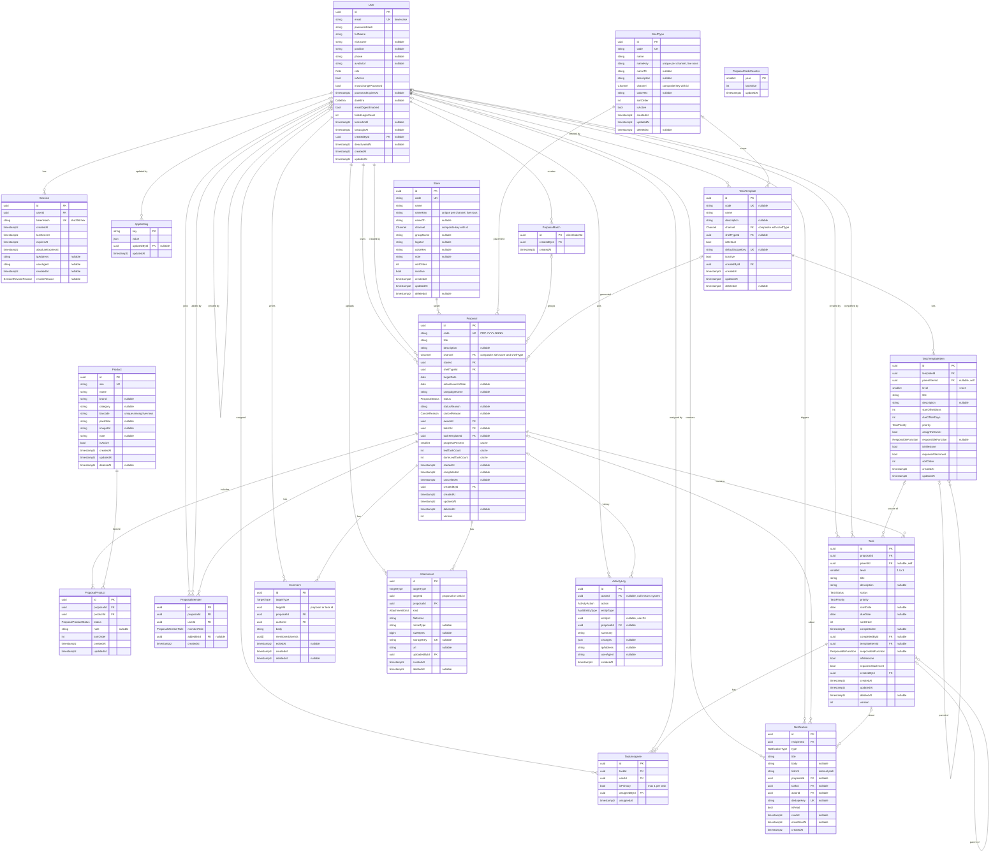
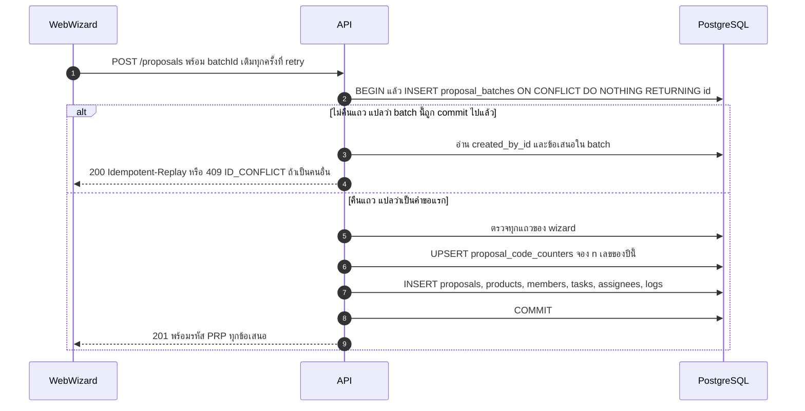

# FlowTrade: Database Design (PostgreSQL 18 · Prisma 7)

> **เวอร์ชัน:** 1.0 (Final หลังรีวิว) · **วันที่:** 1 ต.ค. 2569 (2026-10-01)
> **ไฟล์ schema:** [`schema.prisma`](schema.prisma) (ใช้แทน `apps/api/prisma/schema.prisma` ของ prototype)
> **เอกสารที่เกี่ยวข้อง:** [README.md](README.md) · [01-requirements-flow.md](01-requirements-flow.md) (business rules · glossary อยู่ใน README หัวข้ออภิธานศัพท์) · [02-architecture.md](02-architecture.md) · [04-api.md](04-api.md) · [05-frontend-ux.md](05-frontend-ux.md) · [06-roadmap.md](06-roadmap.md)
> **กติกา:** ชื่อ model, field และ enum ในเอกสารนี้คือชื่อทางการ ถ้าเอกสารอื่นเขียนต่างไป ให้ยึดเอกสารนี้ จุดที่ต้องให้ลูกค้าตัดสินใจทำเครื่องหมาย **(ควรยืนยันกับทีม Trade)** ส่วนเรื่องโครงสร้างพื้นฐานทำเครื่องหมาย **(ควรยืนยันกับทีม IT)**

---

## สารบัญ

0. [สรุปการตัดสินใจ สถานะการตรวจสอบ และสิ่งที่เปลี่ยนจาก draft](#0-สรุปการตัดสินใจ-สถานะการตรวจสอบ-และสิ่งที่เปลี่ยนจาก-draft)
1. [Prisma schema และข้อควรระวังของ Prisma 7](#1-prisma-schema-และข้อควรระวังของ-prisma-7)
2. [ERD](#2-erd)
3. [Data dictionary](#3-data-dictionary)
4. [Enums](#4-enums)
5. [Relations และ onDelete](#5-relations-และ-ondelete)
6. [Constraint ที่ Prisma เขียนไม่ได้ (SQL migration)](#6-constraint-ที่-prisma-เขียนไม่ได้-sql-migration)
7. [กติกาต่อตาราง: DB บังคับอะไร service บังคับอะไร](#7-กติกาต่อตาราง-db-บังคับอะไร-service-บังคับอะไร)
8. [Hierarchy strategy (งาน 3 ระดับ)](#8-hierarchy-strategy-งาน-3-ระดับ)
9. [Ordering strategy (ลากวางและ indent)](#9-ordering-strategy-ลากวางและ-indent)
10. [Progress และ cache](#10-progress-และ-cache)
11. [รหัสข้อเสนอและ idempotency ของ wizard](#11-รหัสข้อเสนอและ-idempotency-ของ-wizard)
12. [Dashboard queries และ index](#12-dashboard-queries-และ-index)
13. [Seed data](#13-seed-data)
14. [Soft delete, cascade และ retention](#14-soft-delete-cascade-และ-retention)
15. [Phase 2: expand migrations ที่เตรียมไว้](#15-phase-2-expand-migrations-ที่เตรียมไว้)
16. [รายการที่ต้องยืนยัน](#16-รายการที่ต้องยืนยัน)

---

## 0. สรุปการตัดสินใจ สถานะการตรวจสอบ และสิ่งที่เปลี่ยนจาก draft

### 0.1 สถานะการตรวจสอบ (ทำจริงแล้ว ณ 1 ต.ค. 2569)

| ขั้น | ผล |
|---|---|
| `prisma@7.10.0 validate` (มี `prisma.config.ts` ขั้นต่ำ) | ผ่าน: *"The schema at schema.prisma is valid"* และ `npx -y prisma@7 validate` ผ่านเช่นกัน |
| `prisma format` | ไม่มีการเปลี่ยนแปลง (ไฟล์ใน repo คือผลที่ format แล้ว) |
| `prisma generate` | สร้าง Prisma Client 7.10.0 ได้ |
| `prisma migrate diff --from-empty --to-schema` | ได้ DDL 670 บรรทัด partial index, GIN trigram และ composite FK ออกมาตามที่ตั้งใจ |
| Apply DDL + SQL migration ใน §6 บน PostgreSQL 16.15 (cluster ทิ้งได้ใน scratchpad) | ผ่านทั้งหมด schema ไม่ใช้ฟีเจอร์เฉพาะ PG18 จึงใช้ผลนี้แทนได้ ส่วน production ใช้ PG18 ตาม [02-architecture.md](02-architecture.md) |
| `prisma migrate diff --from-config-datasource --to-schema` หลัง apply SQL ด้วยมือ | *"This is an empty migration"* แปลว่า CHECK และ trigger ไม่ทำให้เกิด drift |
| Probe constraint/trigger ราว 50 กรณี (§6.4) | ผลตรงตามที่คาดทุกกรณี รวมถึง 6 จุดที่รีวิวพบว่าพังใน draft |
| Concurrency | counter รหัสข้อเสนอ 20 tx พร้อมกัน (เริ่มจากยังไม่มีแถวของปี) ได้เลข 1–20 ไม่ซ้ำ · insert `proposal_batches` id เดียวกันพร้อมกัน: tx แรก commit แล้ว tx ที่สองไม่ได้แถว (replay) และถ้า tx แรก rollback tx ที่สอง insert ได้ |
| Query ทุกตัวใน §7, §9, §10, §11, §12 | รันได้จริงด้วย `PREPARE … EXECUTE` บนข้อมูลทดสอบ |
| Mermaid ทั้ง 2 diagram | parse ผ่านด้วย mermaid 11 และ ERD ตรงกับ schema ครบ 19 model / 37 relation (ตรวจด้วยสคริปต์) |

### 0.2 การตัดสินใจหลัก

| เรื่อง | ตัดสินใจ |
|---|---|
| Primary key | `uuid` v7 ผ่าน `@default(uuid(7)) @db.Uuid` สร้างที่ฝั่ง app จึงรู้ id ก่อน insert (สร้าง task tree จากแม่แบบด้วย `createMany` ทีละระดับได้) และใช้เป็น keyset cursor ได้ **ผลข้างเคียง: คอลัมน์ id ไม่มี DB default ดังนั้น raw `INSERT` ต้องส่ง `id` เสมอ** |
| Role | enum `Role` บน `User` (ไม่มีตาราง Role) mapping permission อยู่ในโค้ด `packages/shared/src/permissions.ts` ตาม [04-api.md](04-api.md) §4.1 |
| Soft delete | `deletedAt` ที่ Store, ShelfType, Product, TaskTemplate, Proposal, Task, Comment, Attachment ส่วน User ไม่ลบ ใช้ `isActive` |
| Task tree | adjacency list (`parentId` + `level` + `sortOrder`) และมี `proposalId` ทุกแถว |
| Progress | cache ระดับ Proposal (3 คอลัมน์) ส่วนระดับงานคำนวณตอนอ่าน |
| ลำดับลากวาง | integer gap 1024 |
| รหัสข้อเสนอ | ตาราง counter ต่อปี `INSERT … ON CONFLICT DO UPDATE … RETURNING` |
| Idempotency ของ wizard | ตาราง `proposal_batches` ที่ใช้ `batchId` จาก client เป็น PK |
| channel ของ Proposal / Store / ShelfType / TaskTemplate | บังคับให้ตรงกันที่ DB ด้วย composite FK `(id, channel)` |
| ผู้ใช้ที่ถูกปิดบัญชี | DB ห้ามมอบหมายงาน เพิ่มเป็นสมาชิก หรือเป็น Owner ของข้อเสนอที่ยังเปิดอยู่ (trigger) |
| วันที่และเวลา | วันที่ใช้ `@db.Date` ส่วน datetime ใช้ `timestamptz(3)` เก็บเป็น UTC ค่า "วันนี้" (Asia/Bangkok) ส่งเป็น parameter เข้า query เสมอ เพื่อให้ test ตรึงเวลาได้ |

### 0.3 สิ่งที่เปลี่ยนจาก draft หลังรีวิว

| # | เปลี่ยน | เหตุผล / ที่มา |
|---|---|---|
| 1 | **เพิ่ม model `ProposalBatch`** (`proposal_batches`) และให้ `Proposal.batchId` เป็น FK | draft ตรวจ batchId ซ้ำนอก transaction และมีแค่ index ที่ไม่ unique ถ้ากดซ้ำพร้อมกันจะได้ข้อเสนอ 2 ชุด (รีวิว consistency #6) |
| 2 | **เพิ่ม `Store.nameKey`, `ShelfType.nameKey`** + trigger `set_name_key` + partial unique `(channel, name_key)` | "big c " เคยซ้ำกับ "Big C" ได้ (รีวิว #14) ใช้ trigger คำนวณค่าแทนให้ app ส่ง เพื่อไม่ให้ JS กับ SQL normalize ต่างกัน |
| 3 | **`Product.barcode`** เปลี่ยนจาก `@unique` เป็น partial unique เฉพาะแถวที่ยังไม่ลบ | barcode ของสินค้าที่ลบแล้วเคยบล็อกสินค้าใหม่ (รีวิว #14) |
| 4 | **เพิ่ม `User.passwordExpiresAt`** + CHECK `users_temp_password_expiry` | อายุรหัสชั่วคราว 72 ชม. บังคับใช้ไม่ได้ถ้าไม่มี field (รีวิว #21) |
| 5 | **เพิ่ม enum value `ActivityAction.EXPORT` และ `AuditEntityType.REPORT`** | การ export Excel ต้องลง audit (รีวิว #19) |
| 6 | แก้ CHECK `activity_logs_entity_id_required` ให้ `entity_id` เป็น null ได้เมื่อ `entity_type IN ('APP_SETTING','REPORT')` | แก้ข้อผิดพลาดของ draft: `AppSetting.key` เป็น string ไม่ใช่ uuid draft จึงบันทึก log การแก้ค่าระบบไม่ได้ |
| 7 | trigger `tasks_tree_guard` ตรวจเฉพาะแถวที่ยังไม่ถูกลบ + เพิ่ม `deleted_at` ในรายการคอลัมน์ที่ trigger ฟัง | outdent งานที่มีลูกหลานถูก soft delete เคย fail ตอน COMMIT (รีวิว #3) ดู §8.3 |
| 8 | **เพิ่ม trigger `assert_user_active`** (task_assignees, proposal_members) และ **`proposals_owner_active`** | ยังมีหลายเส้นทางที่มอบหมายงานหรือตั้ง Owner เป็นผู้ใช้ที่ถูกปิดบัญชีได้ (รีวิว #9) |
| 9 | เพิ่ม CHECK `proposals_completed_has_launch` | การปิดข้อเสนอต้องมี `actualLaunchDate` (รีวิว coverage gap 2) |
| 10 | **ตัด model `StoreShelfType`** และ **ตัด `TaskTemplate.storeId`** ออกจาก migration แรก `defaultScopeKey` เปลี่ยนเป็น `"{channel}:{shelfTypeId\|*}"` | Phase 1 ไม่มี UI/API (รีวิว coverage: over-engineering) ย้ายไป §15 เป็น expand migration |
| 11 | **ตัด model `AuthToken` และ enum `AuthTokenPurpose`** ออกจาก Phase 1 | ลิงก์เชิญ/ตั้งรหัสผ่านทางอีเมลอยู่ใน Phase 2 (รีวิว coverage) DDL พร้อมกติกาความปลอดภัยจากรีวิว #7 อยู่ใน §15 |
| 12 | แม่แบบที่ seed เป็นค่าเริ่มต้น เปลี่ยนเป็นแม่แบบกระชับ 3 ชุด (21 / 27 / 4 รายการ จบไม่เกิน T+7) ส่วนแม่แบบละเอียด A/B/C ไม่ใช่ค่าเริ่มต้นและ seed เมื่อทีม Trade ยืนยัน | แม่แบบ 80+ งานทำให้งานถูกเลื่อนเป็นวันนี้หลายสิบงานและปิดข้อเสนอไม่ได้ 3 เดือน (รีวิว coverage gap 3) |
| 13 | seed แพลตฟอร์มออนไลน์เฉพาะ 3 รายการหลัก ที่เหลือให้ Admin เพิ่มหลัง workshop | ช่องทางออนไลน์ยังเป็นการสันนิษฐาน (รีวิว coverage gap 8) |
| 14 | generator เพิ่ม `importFileExtension = "js"` | ให้ import ของ client ที่ generate ลงท้าย `.js` ตรงกับ NestJS ESM (`nodenext`) และตรงกับ prototype |
| 15 | กติกา service ใหม่: session lookup ต้อง JOIN `users.is_active`, ปิดบัญชีต้อง lock แถว user ก่อน, ลบแม่แบบ default ต้องปลด default ใน tx เดียว, เปิดบัญชีคืนต้องล้าง `deactivatedAt`, cron ใช้ `createMany({ skipDuplicates })` | รีวิว #7, #9, #15, #16 |

### 0.4 ส่วนที่เพิ่ม (ไม่มีใน glossary §8 แต่ไม่ได้เปลี่ยนของเดิม)

| ส่วนที่เพิ่ม | เหตุผล |
|---|---|
| ตาราง `Session` และ enum `SessionRevokeReason` | server-side session ตาม [02-architecture.md](02-architecture.md) |
| ตาราง `ProposalCodeCounter` | ออกรหัส `PRP-YYYY-NNNN` ให้ปลอดภัยเมื่อสร้างพร้อมกัน (§11) |
| ตาราง `ProposalBatch` | idempotency ของ wizard และข้อมูลหน้า batch (§11) |
| `Proposal.actualLaunchDate` (date?) | วันวางขาย/Go-live จริง ใช้กับ health `LATE` และ KPI K6/K8 (§12.4) glossary ฉบับสุดท้ายรับเข้าไปแล้ว |
| `User.passwordExpiresAt` | อายุรหัสชั่วคราว |
| `Store.nameKey`, `ShelfType.nameKey` | กันชื่อซ้ำแบบไม่สนตัวพิมพ์และช่องว่าง (ไม่ส่งออกทาง API) |
| `TaskTemplate.code`, `TaskTemplate.defaultScopeKey` | `code` ใช้ seed แบบ idempotent ส่วน `defaultScopeKey` ให้ DB บังคับ "default 1 แม่แบบต่อ (ช่องทาง, รูปแบบ)" ได้แม้ `shelfTypeId` เป็น null |
| enum `ResponsibleFunction` และ `responsibleFunction`, `isMilestone`, `requiresAttachment` บน `TaskTemplateItem` และ `Task` | เก็บฝ่ายที่แนะนำ, (M) และ (ไฟล์) จาก domain doc Phase 1 ใช้แสดงผลเท่านั้น |
| `createdAt`, `updatedAt` บน `TaskTemplateItem` | audit ตัว editor แม่แบบ |
| `Notification.dedupeKey` (unique) | กัน cron 08:00 หรือ job ที่ retry ส่งแจ้งเตือนซ้ำ |
| enum value `ActivityAction.EXPORT`, `AuditEntityType.REPORT` | audit การ export (ต้องเพิ่มใน glossary §8.3) |

**Deviation จาก glossary (มีจุดเดียว):** glossary กำหนด `ActivityLog.entityId: uuid` (บังคับ) แต่ schema ใช้ `entityId String?` พร้อม CHECK `entity_id IS NOT NULL OR action = 'LOGIN_FAILED' OR entity_type IN ('APP_SETTING','REPORT')`
- `LOGIN_FAILED` ของอีเมลที่ไม่มีในระบบไม่มี user id ให้อ้าง ระบบเก็บ `changes.identifierHash = sha256(lower(btrim(email)))` แทนอีเมลดิบ เพื่อให้ไม่มีข้อมูลส่วนบุคคลค้างในตาราง append-only (PDPA)
- `APP_SETTING` ใช้ key แบบ string จึงเก็บ key ไว้ใน `changes.key`
- `REPORT` (export) ไม่มี entity เดียว เก็บ `changes = { report, filters, rowCount }`

### 0.5 จุดที่เอกสารต้นทางขัดกัน และวิธีที่เลือก

| แหล่ง | เขียนไว้ว่า | ใช้ใน schema |
|---|---|---|
| Architecture (ร่าง) | ตาราง `Role`/`RolePermission`, `User.roleId` | enum `Role` บน User (หน้าแก้ role matrix อยู่ Phase 3 ทำ expand/contract ได้) |
| Architecture (ร่าง) | `depth 0..2`, `assignee_id`, `is_done`, `position text COLLATE "C"` | `level 1..3`, ตาราง `TaskAssignee` (0..n คน คนหลัก 1 คน), `status: TaskStatus`, `sortOrder Int` ไม่ใช้ `fractional-indexing` |
| Architecture (ร่าง) | `ProposalMember.role` มีค่า `OWNER` | `memberRole` มีแค่ `EDITOR`/`VIEWER` Owner ดูจาก `Proposal.ownerId` เท่านั้น |
| Architecture (ร่าง) | ตาราง `files` แยกจาก `attachments` | ตาราง `Attachment` ตารางเดียว |
| Architecture (ร่าง), prototype | `username`, `status = DISABLED` | login ด้วย email อย่างเดียว (Q1) และใช้ `isActive` migration `20261001020000_user_username` ของ prototype ถูกยกเลิก |
| Architecture (ร่าง) | `targetOnShelfDate`, `ProposalItem` | `targetDate`, `ProposalProduct` |
| Architecture (ร่าง) | prune audit 2 ปี, purge task ที่ลบหลัง 30 วัน | ไม่ prune และไม่ purge ตาม NFR (log ≥ 3 ปี และ soft-deleted "ยังเก็บไว้เพื่อ audit") |
| Architecture (ร่าง) | session idle 12 ชม./จดจำฉัน 30 วัน | idle 8 ชม. / absolute 7 วัน ไม่มีจดจำฉัน (NFR) |
| Prototype | รหัส `PRJ-` | `PRP-` ตาม glossary |
| Requirements §6.2.5 กับ domain doc §4 | แม่แบบ T−60 ฉบับย่อ กับ Template A/B/C D−120/150/60 | ค่าเริ่มต้นใช้ฉบับย่อ (§13.4) ส่วน A/B/C เป็นแม่แบบ "(ละเอียด)" ที่ไม่ใช่ค่าเริ่มต้น **(ควรยืนยันกับทีม Trade)** |

### 0.6 สิ่งที่ต้องแก้ใน `packages/shared` และ prototype

| ไฟล์ | ต้องแก้ |
|---|---|
| `apps/api/prisma/schema.prisma`, `migrations/*` | แทนที่ด้วย [`schema.prisma`](schema.prisma) และ 2 migration ใน §6.1 ยังไม่มีข้อมูลจริง จึงลบ migration เดิมทั้งสอง (`…_init`, `…_user_username`) แล้วสร้างใหม่ได้ |
| `package.json` (api) | pin แบบ exact: `"prisma": "7.10.0"`, `"@prisma/client": "7.10.0"`, `"@prisma/adapter-pg": "7.10.0"` ทุก script ใช้ `npm exec prisma` ห้าม `npx prisma` ลอยๆ เพราะ dist-tag `latest` ของ npm ชี้ไปที่ 8.0.0-rc แล้ว Renovate ตั้ง `allowedVersions: "<8"` ให้ `prisma` และ `@prisma/*` |
| `types.ts` | `User.name` → `fullName` (ตัด `department`/`avatarColor`) · `Store.shortName/color/description` → `code/colorHex/note` · `Product.size` → `packSize` · `Proposal.templateId/note/memberIds/productIds` → `taskTemplateId/description` และ relation · `Task.isDone` → `status` · ตัด `TaskPriority.URGENT` · `TaskTemplateItem.parentId/responsible` → `parentItemId/responsibleFunction` · `NotificationType`, `ActivityAction`, `AuditEntityType` ใช้ชุดเต็มใน §4 · ไม่ส่ง `nameKey`, `passwordHash`, `passwordExpiresAt` ออกทาง DTO |
| `task-tree.ts` | `toPercent` ใช้ `Math.floor` (99.5% ต้องไม่แสดงเป็น 100%) · `planFromTemplate` ต้อง **ไม่** clamp วันที่เมื่อ `targetDate < today` (BR-11) · `deriveParentStatus(children, previous)` ตาม §8.4 · `resolveInsertIndex` ตาม §9 |
| `permissions.ts` | แทนทั้งไฟล์ด้วย `PERMISSIONS` / `ROLE_PERMISSIONS` ของ [04-api.md](04-api.md) §4.1 (ชุดเดียวทั้ง guard ฝั่ง web และ API) |
| `labels.ts`, `enums.ts` | label ตาม glossary §8.3 เช่น `COMPLETED` = "สำเร็จ (วางขายแล้ว)" และ level = งาน / งานย่อย / รายการย่อย เพิ่ม `EXPORT`, `REPORT` |

---

## 1. Prisma schema และข้อควรระวังของ Prisma 7

schema ฉบับเต็มอยู่ที่ [`schema.prisma`](schema.prisma) ต้องใช้ Prisma **≥ 7.4** (preview feature `partialIndexes`) และ pin ไว้ที่ **7.10.0** ส่วน connection URL อยู่ใน `apps/api/prisma.config.ts` ตาม [02-architecture.md](02-architecture.md)

```ts
// apps/api/prisma.config.ts (Prisma 7)
import 'dotenv/config';
import { defineConfig, env } from 'prisma/config';
export default defineConfig({
  schema: 'prisma/schema.prisma',
  migrations: { path: 'prisma/migrations', seed: 'node dist/seed/bootstrap.js' },
  datasource: { url: env('DATABASE_URL') },
});
```

**ข้อควรระวัง**
1. **Partial unique** (`stores_channel_name_key_live_key`, `shelf_types_channel_name_key_live_key`, `products_barcode_live_key`, `task_assignees_one_primary_key`): Prisma ยังสร้าง input ของ `findUnique` ให้ แต่ผลทำงานเหมือน `findFirst` ([prisma/orm#29282](https://github.com/prisma/orm/issues/29282)) **ห้ามใช้ `findUnique` หรือ `upsert` กับคีย์เหล่านี้** ให้ใช้ `findFirst({ where: { channel, nameKey, deletedAt: null } })`
2. **`onUpdate` ของ Prisma มีค่าเริ่มต้นเป็น `Cascade`** composite FK ทุกตัวจึงระบุ `onUpdate: Restrict` ชัดเจน ถ้าไม่ระบุ การเปลี่ยน `Store.channel` จะไหลไปเปลี่ยน `proposals.channel`
3. `@updatedAt` ไม่ทำงานกับ raw SQL ทุก `updatedAt` จึงมี `@default(now())` ด้วย และ raw `UPDATE` ต้องตั้ง `updated_at = now()` เอง
4. **ทุก PK เป็น uuid ที่ app สร้าง** raw `INSERT` ต้องส่ง `id` เอง ถ้าเป็นการ insert แบบกันซ้ำให้ใช้ `createMany({ data, skipDuplicates: true })` (Prisma สร้าง uuid v7 และแปลงเป็น `ON CONFLICT DO NOTHING`) ข้อยกเว้นคือ `proposal_batches` ที่ id มาจาก client อยู่แล้ว
5. `@db.Date` อ่าน/เขียนเป็น `Date` เวลา 00:00 UTC ใน mapper ใช้ `d.toISOString().slice(0, 10)` และตอนเขียนใช้ `new Date('YYYY-MM-DD')` (ทั้งสองฝั่งเป็น UTC วันจึงไม่เลื่อน) จำกัดการแปลงไว้ที่ mapper ที่เดียว container ตั้ง `TZ=UTC` และ integration test ต้องรันทั้ง `TZ=UTC` และ `TZ=Asia/Bangkok`
6. `nameKey` มี `@default("")` เพื่อให้ Prisma Client ไม่บังคับส่งค่า trigger `set_name_key` เขียนทับทุกครั้ง และ `create`/`update` ของ Prisma คืนค่าหลัง trigger (RETURNING) ถ้าลืม apply migration ที่ 2 ทุกแถวจะได้ `''` แล้วชน unique ทันที จึงเห็นปัญหาเร็ว
7. **pg_trgm:** migration แรกต้องเริ่มด้วย `CREATE EXTENSION IF NOT EXISTS pg_trgm;` ถ้า DB มี pg_trgm อยู่ใน schema อื่นแล้ว schema นั้นต้องอยู่ใน `search_path` ของ connection ไม่งั้น `gin_trgm_ops` จะหาไม่เจอ

---

## 2. ERD

ERD นี้ตรงกับ [`schema.prisma`](schema.prisma) ทุก model ทุก field และทุก relation (type ใช้ชื่อแบบย่อ: `string` = varchar/text, `timestamptz` = `timestamptz(3)`)



`ProposalCodeCounter` ไม่มี relation (เป็นตัวนับอิสระ) ส่วน `Comment.targetId` และ `Attachment.targetId` เป็น polymorphic reference ที่ตรวจด้วย CHECK และ trigger (§6) ไม่ใช่ FK

---

## 3. Data dictionary

**กติกาการอ่าน**
- ชื่อคอลัมน์ใน DB = snake_case ของ field (เช่น `passwordHash` → `password_hash`) ชื่อตาราง = ค่าใน `@@map`
- `uuid (app)` = uuid v7 ที่ app สร้าง ไม่มี DB default
- `text` = `String` ที่ไม่มี `@db.*` · `timestamptz` = `timestamptz(3)` เก็บ UTC · `date` = วันล้วน ไม่มี timezone · `Json` = `jsonb`
- "Null" ✓ = nullable

### 3.1 `users` (User · ผู้ใช้งาน)

| Field | Type | Null | Default | คำอธิบาย |
|---|---|:-:|---|---|
| `id` | uuid | | uuid (app) | PK |
| `email` | varchar(255) | | — | อีเมลสำหรับ login unique และต้องเป็นตัวพิมพ์เล็ก (CHECK) |
| `passwordHash` | varchar(255) | | — | Argon2id ห้ามส่งออกทาง API |
| `fullName` | varchar(150) | | — | ชื่อ-นามสกุล |
| `nickname` | varchar(50) | ✓ | — | ชื่อเล่น แสดงคู่กับชื่อ เช่น "สมชาย (ต้น)" |
| `position` | varchar(100) | ✓ | — | ตำแหน่ง |
| `phone` | varchar(20) | ✓ | — | เบอร์โทร |
| `avatarUrl` | varchar(500) | ✓ | — | รูปโปรไฟล์ |
| `role` | `Role` | | `USER` | บทบาทระดับระบบ |
| `isActive` | boolean | | `true` | สถานะบัญชี ต้องสอดคล้องกับ `deactivatedAt` (CHECK) |
| `mustChangePassword` | boolean | | `true` | บังคับตั้งรหัสใหม่เมื่อสร้างบัญชีหรือถูกรีเซ็ต |
| `passwordExpiresAt` | timestamptz | ✓ | — | **(เพิ่ม)** วันหมดอายุของรหัสชั่วคราว ตั้ง now()+72 ชม. ตอนสร้าง/รีเซ็ต และล้างเป็น null เมื่อผู้ใช้ตั้งรหัสเอง มีค่าได้เฉพาะเมื่อ `mustChangePassword = true` (CHECK) |
| `dateEra` | `DateEra` | ✓ | — | รูปแบบปีที่ผู้ใช้เลือก null = ใช้ `AppSetting.defaultDateEra` |
| `emailDigestEnabled` | boolean | | `true` | รับอีเมลสรุปประจำวัน (Phase 2) |
| `failedLoginCount` | int | | `0` | จำนวนครั้งที่ใส่รหัสผิดติดกัน ≥ 0 |
| `lockedUntil` | timestamptz | ✓ | — | ล็อกถึงเวลานี้ (ผิด 5 ครั้ง = 15 นาที ไม่มีการล็อกถาวร) |
| `lastLoginAt` | timestamptz | ✓ | — | เข้าระบบล่าสุด |
| `createdById` | uuid | ✓ | — | FK users ผู้สร้างบัญชี (null = seed) |
| `deactivatedAt` | timestamptz | ✓ | — | เวลาปิดบัญชี |
| `createdAt` / `updatedAt` | timestamptz | | `now()` | `updatedAt` อัปเดตโดย Prisma |

Keys: `users_email_key` (unique) · index `(role, is_active)`

### 3.2 `sessions` (Session · session ฝั่ง server)

| Field | Type | Null | Default | คำอธิบาย |
|---|---|:-:|---|---|
| `id` | uuid | | uuid (app) | PK |
| `userId` | uuid | | — | FK users (Cascade) |
| `tokenHash` | char(64) | | — | SHA-256 hex ของ token ใน cookie `__Host-ft_sid` unique |
| `createdAt` | timestamptz | | `now()` | |
| `lastSeenAt` | timestamptz | | `now()` | ต่ออายุแบบ sliding ไม่เกิน 1 ครั้งต่อ 5 นาที |
| `expiresAt` | timestamptz | | — | idle expiry = lastSeen + 8 ชม. ต้อง ≤ `absoluteExpiresAt` (CHECK) |
| `absoluteExpiresAt` | timestamptz | | — | createdAt + 7 วัน |
| `ipAddress` | varchar(45) | ✓ | — | IPv4/IPv6 |
| `userAgent` | varchar(500) | ✓ | — | |
| `revokedAt` | timestamptz | ✓ | — | มาคู่กับ `revokeReason` เสมอ (CHECK) |
| `revokeReason` | `SessionRevokeReason` | ✓ | — | |

Keys: `sessions_token_hash_key` · partial index `sessions_user_live_idx (user_id) WHERE revoked_at IS NULL` · index `(absolute_expires_at)`

### 3.3 `app_settings` (AppSetting · ตั้งค่าระบบ)

| Field | Type | Null | Default | คำอธิบาย |
|---|---|:-:|---|---|
| `key` | varchar(100) | | — | PK เช่น `dueSoonDays` |
| `value` | jsonb | | — | ค่า (validate ด้วย zod รายคีย์ที่ service) |
| `updatedById` | uuid | ✓ | — | FK users |
| `updatedAt` | timestamptz | | `now()` | |

### 3.4 `stores` (Store · ห้าง / แพลตฟอร์ม)

| Field | Type | Null | Default | คำอธิบาย |
|---|---|:-:|---|---|
| `id` | uuid | | uuid (app) | PK |
| `code` | varchar(30) | | — | รหัส UPPER_SNAKE เช่น `BIGC` unique ถาวร (รวมแถวที่ลบแล้ว) |
| `name` | varchar(100) | | — | ชื่อ เช่น "Big C" |
| `nameKey` | varchar(100) | | `''` | **(เพิ่ม)** `normalize_name_key(name)` ตั้งโดย trigger ใช้กันชื่อซ้ำในช่องทาง ไม่ส่งออกทาง API |
| `nameTh` | varchar(100) | ✓ | — | ชื่อภาษาไทย เช่น "บิ๊กซี" |
| `channel` | `Channel` | | — | ช่องทาง เปลี่ยนไม่ได้เมื่อถูกอ้างอิง (composite FK `ON UPDATE RESTRICT`) |
| `groupName` | varchar(100) | ✓ | — | กลุ่มห้างสำหรับรวมรายงานข้ามช่องทาง |
| `logoUrl` | varchar(500) | ✓ | — | โลโก้ (Admin อัปโหลด png/jpg/webp) |
| `colorHex` | char(7) | ✓ | — | `#RRGGBB` (CHECK) |
| `note` | text | ✓ | — | หมายเหตุ เช่น ข้อมูล buyer |
| `sortOrder` | int | | `0` | ลำดับใน wizard (gap 1024) |
| `isActive` | boolean | | `true` | ปิดใช้งาน = หายจาก wizard แต่ข้อเสนอเดิมยังแสดง |
| `createdAt` / `updatedAt` | timestamptz | | `now()` | |
| `deletedAt` | timestamptz | ✓ | — | soft delete (ADMIN และไม่ถูกอ้างอิงเท่านั้น) |

Keys: `stores_code_key` · `stores_id_channel_key (id, channel)` (เป้าหมายของ composite FK) · partial unique `stores_channel_name_key_live_key (channel, name_key) WHERE deleted_at IS NULL` · partial index `stores_picker_idx (channel, sort_order) WHERE deleted_at IS NULL AND is_active`

### 3.5 `shelf_types` (ShelfType · รูปแบบชั้นวาง / ประเภท Listing)

| Field | Type | Null | Default | คำอธิบาย |
|---|---|:-:|---|---|
| `id` | uuid | | uuid (app) | PK |
| `code` | varchar(30) | | — | เช่น `EXCLUSIVE_SHELF` unique ถาวร |
| `name` | varchar(100) | | — | ชื่อ |
| `nameKey` | varchar(100) | | `''` | **(เพิ่ม)** ตั้งโดย trigger กันชื่อซ้ำในช่องทาง |
| `nameTh` | varchar(100) | ✓ | — | ชื่อไทย |
| `description` | text | ✓ | — | คำอธิบายใต้ radio card ใน wizard |
| `channel` | `Channel` | | — | 1 รูปแบบใช้กับ 1 ช่องทาง |
| `colorHex` | char(7) | ✓ | — | สี |
| `sortOrder` | int | | `0` | ลำดับใน wizard |
| `isActive` | boolean | | `true` | |
| `createdAt` / `updatedAt` / `deletedAt` | timestamptz | `deletedAt` ✓ | `now()` | |

Keys: `shelf_types_code_key` · `shelf_types_id_channel_key` · partial unique `shelf_types_channel_name_key_live_key` · partial index `shelf_types_picker_idx`

### 3.6 `products` (Product · สินค้า)

| Field | Type | Null | Default | คำอธิบาย |
|---|---|:-:|---|---|
| `id` | uuid | | uuid (app) | PK |
| `sku` | varchar(50) | | — | รหัสสินค้า unique ถาวร ถ้าชนกับแถวที่ลบแล้วให้กู้คืนแทน |
| `name` | varchar(200) | | — | ชื่อสินค้า (GIN trigram สำหรับค้นภาษาไทย) |
| `brand` | varchar(100) | ✓ | — | แบรนด์ |
| `category` | varchar(100) | ✓ | — | หมวดหมู่ |
| `barcode` | varchar(14) | ✓ | — | EAN-8/UPC-A/EAN-13/GTIN-14 (CHECK ตัวเลข 8 หรือ 12–14 หลัก) unique เฉพาะแถวที่ยังไม่ลบ |
| `packSize` | varchar(50) | ✓ | — | ขนาดบรรจุ เช่น "30 ml" |
| `imageUrl` | varchar(500) | ✓ | — | รูปสินค้า |
| `note` | text | ✓ | — | |
| `isActive` | boolean | | `true` | สินค้าที่ปิดใช้งานยังอยู่ในข้อเสนอเดิมได้ (BR-10) |
| `createdAt` / `updatedAt` / `deletedAt` | timestamptz | `deletedAt` ✓ | `now()` | |

Keys: `products_sku_key` · partial unique `products_barcode_live_key (barcode) WHERE deleted_at IS NULL AND barcode IS NOT NULL` · GIN `products_name_trgm_idx`

### 3.7 `proposal_code_counters` (ProposalCodeCounter · เลขรันรหัสข้อเสนอ)

| Field | Type | Null | Default | คำอธิบาย |
|---|---|:-:|---|---|
| `year` | smallint | | — | PK ปี ค.ศ. ตามเวลาไทยของวันที่สร้าง (2000–2999) |
| `lastValue` | int | | `0` | เลขล่าสุดที่ออกไปแล้ว |
| `updatedAt` | timestamptz | | `now()` | |

### 3.8 `proposal_batches` (ProposalBatch · ชุดข้อเสนอที่สร้างพร้อมกัน) — **(เพิ่ม)**

| Field | Type | Null | Default | คำอธิบาย |
|---|---|:-:|---|---|
| `id` | uuid | | — (client) | PK = `batchId` ที่ wizard สร้างครั้งเดียวต่อ session ของ wizard และส่งค่าเดิมเมื่อ retry |
| `createdById` | uuid | | — | FK users ผู้สร้าง ใช้ตัดสินว่า replay ได้หรือเป็น `ID_CONFLICT` |
| `createdAt` | timestamptz | | `now()` | ใช้แสดงหัวหน้า batch |

### 3.9 `proposals` (Proposal · ข้อเสนอสินค้า)

| Field | Type | Null | Default | คำอธิบาย |
|---|---|:-:|---|---|
| `id` | uuid | | uuid (app) | PK |
| `code` | varchar(20) | | — | `PRP-{ปี ค.ศ.}-{เลขรัน ≥ 4 หลัก}` unique ไม่นำกลับมาใช้ |
| `title` | varchar(200) | | — | ชื่อข้อเสนอ (สร้างอัตโนมัติ แก้ได้) GIN trigram |
| `description` | text | ✓ | — | รายละเอียด |
| `channel` | `Channel` | | — | ต้องเท่ากับ `store.channel` และ `shelfType.channel` (composite FK) |
| `storeId` | uuid | | — | FK stores แก้ได้เฉพาะ DRAFT (service) |
| `shelfTypeId` | uuid | | — | FK shelf_types |
| `targetDate` | date | | — | วันวางขาย / วัน Go-live |
| `actualLaunchDate` | date | ✓ | — | วันวางขาย/Go-live จริง ห้ามมีค่าในสถานะ DRAFT และบังคับเมื่อ COMPLETED (CHECK) |
| `campaignName` | varchar(100) | ✓ | — | ใช้ได้เฉพาะ ONLINE (CHECK) |
| `status` | `ProposalStatus` | | `DRAFT` | |
| `statusReason` | text | ✓ | — | เหตุผลล่าสุดของการพัก ยกเลิก เปิดใหม่ หรือ force complete |
| `cancelReason` | `CancelReason` | ✓ | — | มีค่าก็ต่อเมื่อ CANCELLED (CHECK) |
| `ownerId` | uuid | | — | FK users เจ้าของ (แหล่งความจริงเดียว) ข้อเสนอที่ยังเปิดอยู่ต้องมี Owner ที่ Active (trigger) |
| `batchId` | uuid | ✓ | — | FK proposal_batches ข้อเสนอที่สร้างผ่าน wizard/ทำสำเนามีค่าเสมอ |
| `taskTemplateId` | uuid | ✓ | — | FK task_templates แม่แบบที่ใช้ตอนสร้าง (SetNull) |
| `progressPercent` | smallint | | `0` | cache `floor(done*100/leaf)` 0–100 |
| `leafTaskCount` | int | | `0` | cache จำนวนงาน leaf |
| `doneLeafTaskCount` | int | | `0` | cache จำนวน leaf ที่ DONE (≤ leaf) |
| `startedAt` | timestamptz | ✓ | — | null ก็ต่อเมื่อ DRAFT (CHECK) |
| `completedAt` | timestamptz | ✓ | — | มีค่าก็ต่อเมื่อ COMPLETED |
| `cancelledAt` | timestamptz | ✓ | — | มีค่าก็ต่อเมื่อ CANCELLED |
| `createdById` | uuid | | — | FK users |
| `createdAt` | timestamptz | | `now()` | |
| `updatedAt` | timestamptz | | `now()` | เปลี่ยนทุกครั้งที่มีการแก้อะไรก็ตามในข้อเสนอ (`touchProposal`) ใช้เป็น ETag ของ task tree |
| `deletedAt` | timestamptz | ✓ | — | soft delete (ลบได้เฉพาะ DRAFT) |
| `version` | int | | `1` | optimistic lock ของ header (progress cache และ touch ไม่เพิ่ม) |

Keys: `proposals_code_key` · indexes ดู §12.6

### 3.10 `proposal_products` (ProposalProduct · สินค้าในข้อเสนอ)

| Field | Type | Null | Default | คำอธิบาย |
|---|---|:-:|---|---|
| `id` | uuid | | uuid (app) | PK |
| `proposalId` | uuid | | — | FK proposals (Cascade) |
| `productId` | uuid | | — | FK products (Restrict) unique คู่กับ `proposalId` (BR-24) |
| `status` | `ProposalProductStatus` | | `PENDING` | ผลพิจารณารายสินค้า |
| `note` | text | ✓ | — | เช่น เหตุผลที่ buyer ไม่รับ |
| `sortOrder` | int | | `0` | |
| `createdAt` / `updatedAt` | timestamptz | | `now()` | |

### 3.11 `proposal_members` (ProposalMember · สมาชิกข้อเสนอ)

| Field | Type | Null | Default | คำอธิบาย |
|---|---|:-:|---|---|
| `id` | uuid | | uuid (app) | PK |
| `proposalId` | uuid | | — | FK proposals (Cascade) |
| `userId` | uuid | | — | FK users unique คู่กับ `proposalId` ต้องไม่ใช่ Owner (deferred trigger) และต้อง Active ตอนเพิ่ม (trigger) |
| `memberRole` | `ProposalMemberRole` | | — | EDITOR / VIEWER |
| `addedById` | uuid | ✓ | — | null = ระบบเพิ่มให้อัตโนมัติตอนมอบหมายงาน (BR-14) |
| `createdAt` | timestamptz | | `now()` | |

### 3.12 `tasks` (Task · งาน / งานย่อย / รายการย่อย)

| Field | Type | Null | Default | คำอธิบาย |
|---|---|:-:|---|---|
| `id` | uuid | | uuid (app) | PK |
| `proposalId` | uuid | | — | FK proposals (Cascade) |
| `parentId` | uuid | ✓ | — | FK tasks (self) null = งานระดับ 1 |
| `level` | smallint | | — | 1 งาน · 2 งานย่อย · 3 รายการย่อย (service คำนวณ CHECK + trigger ตรวจ) |
| `title` | varchar(200) | | — | ชื่องาน |
| `description` | text | ✓ | — | |
| `status` | `TaskStatus` | | `TODO` | งานที่มีลูกเก็บค่าที่คำนวณจากลูก (§8.4) |
| `priority` | `TaskPriority` | | `MEDIUM` | |
| `startDate` | date | ✓ | — | |
| `dueDate` | date | ✓ | — | ต้องไม่ก่อน `startDate` (CHECK) `durationDays = due − start + 1` คำนวณใน mapper ไม่เก็บ |
| `sortOrder` | int | | — | ลำดับในกลุ่มพี่น้อง (gap 1024, tie-break ด้วย id) |
| `completedAt` | timestamptz | ✓ | — | มีค่าก็ต่อเมื่อ DONE (CHECK) |
| `completedById` | uuid | ✓ | — | FK users ผู้ทำเครื่องหมายเสร็จ |
| `templateItemId` | uuid | ✓ | — | FK task_template_items ต้นทาง (SetNull) |
| `responsibleFunction` | `ResponsibleFunction` | ✓ | — | ฝ่ายที่แนะนำ (แสดงผลเท่านั้น) |
| `isMilestone` | boolean | | `false` | งานที่เป็นจุดตัดสินใจ (M) |
| `requiresAttachment` | boolean | | `false` | งานที่ควรแนบหลักฐาน Phase 1 แสดงไอคอนเท่านั้น |
| `createdById` | uuid | | — | FK users |
| `createdAt` / `updatedAt` | timestamptz | | `now()` | |
| `deletedAt` | timestamptz | ✓ | — | soft delete ทั้ง subtree ด้วยค่าเดียวกัน |
| `version` | int | | `1` | optimistic lock ของเนื้อหางาน (การเปลี่ยนสถานะ/ผู้รับผิดชอบไม่เพิ่ม) |

### 3.13 `task_assignees` (TaskAssignee · ผู้รับผิดชอบ)

| Field | Type | Null | Default | คำอธิบาย |
|---|---|:-:|---|---|
| `id` | uuid | | uuid (app) | PK |
| `taskId` | uuid | | — | FK tasks (Cascade) |
| `userId` | uuid | | — | FK users unique คู่กับ `taskId` ต้อง Active ตอน insert/เปลี่ยน (trigger) |
| `isPrimary` | boolean | | `false` | ผู้รับผิดชอบหลัก ≤ 1 คนต่องาน (partial unique) |
| `assignedById` | uuid | | — | FK users |
| `assignedAt` | timestamptz | | `now()` | ใช้เลือกคนหลักคนใหม่ (เก่าสุด) เมื่อคนหลักถูกถอด |

### 3.14 `task_templates` (TaskTemplate · แม่แบบงาน)

| Field | Type | Null | Default | คำอธิบาย |
|---|---|:-:|---|---|
| `id` | uuid | | uuid (app) | PK |
| `code` | varchar(50) | ✓ | — | **(เพิ่ม)** คีย์ของแม่แบบที่ seed เช่น `OFFLINE_NORMAL_BASIC` null สำหรับแม่แบบที่ผู้ใช้สร้าง |
| `name` | varchar(150) | | — | ชื่อแม่แบบ |
| `description` | text | ✓ | — | |
| `channel` | `Channel` | | — | ต้องตรงกับ `shelfType.channel` (composite FK) |
| `shelfTypeId` | uuid | ✓ | — | null = ใช้ได้ทุกรูปแบบในช่องทาง |
| `isDefault` | boolean | | `false` | ค่าเริ่มต้นของ scope ต้อง Active และยังไม่ลบ (CHECK) |
| `defaultScopeKey` | varchar(100) | ✓ | — | **(เพิ่ม)** `"{channel}:{shelfTypeId\|*}"` เมื่อ `isDefault` ไม่งั้น null unique → default ได้ 1 แม่แบบต่อ scope |
| `isActive` | boolean | | `true` | |
| `createdById` | uuid | | — | FK users |
| `createdAt` / `updatedAt` / `deletedAt` | timestamptz | `deletedAt` ✓ | `now()` | |

### 3.15 `task_template_items` (TaskTemplateItem · รายการในแม่แบบ)

| Field | Type | Null | Default | คำอธิบาย |
|---|---|:-:|---|---|
| `id` | uuid | | uuid (app) | PK |
| `templateId` | uuid | | — | FK task_templates (Cascade) |
| `parentItemId` | uuid | ✓ | — | FK self (Cascade) |
| `level` | smallint | | — | 1–3 |
| `title` | varchar(200) | | — | |
| `description` | text | ✓ | — | |
| `startOffsetDays` | int | | — | วันเทียบกับ `targetDate` (ลบ = ก่อน) ช่วง ±730 |
| `dueOffsetDays` | int | | — | ≥ `startOffsetDays` |
| `priority` | `TaskPriority` | | `MEDIUM` | |
| `assignToOwner` | boolean | | `true` | มอบหมายให้ Owner ตอนสร้างข้อเสนอ |
| `responsibleFunction` | `ResponsibleFunction` | ✓ | — | ฝ่ายที่แนะนำ |
| `isMilestone` | boolean | | `false` | |
| `requiresAttachment` | boolean | | `false` | |
| `sortOrder` | int | | — | (ลำดับในกลุ่มพี่น้อง + 1) × 1024 |
| `createdAt` / `updatedAt` | timestamptz | | `now()` | |

### 3.16 `comments` (Comment · ความคิดเห็น)

| Field | Type | Null | Default | คำอธิบาย |
|---|---|:-:|---|---|
| `id` | uuid | | uuid (app) | PK |
| `targetType` | `TargetType` | | — | PROPOSAL / TASK |
| `targetId` | uuid | | — | id ของข้อเสนอ (= `proposalId`) หรือของงานในข้อเสนอเดียวกัน (CHECK + trigger) |
| `proposalId` | uuid | | — | FK proposals ใช้กำหนดขอบเขตสิทธิ์และทำ feed |
| `authorId` | uuid | | — | FK users |
| `body` | text | | — | plain text 1–5,000 ตัวอักษร (CHECK) |
| `mentionedUserIds` | uuid[] | | `{}` | (@mention เป็น Phase 2 คอลัมน์พร้อมแล้ว) |
| `editedAt` | timestamptz | ✓ | — | แสดง "(แก้ไขแล้ว)" |
| `createdAt` | timestamptz | | `now()` | |
| `deletedAt` | timestamptz | ✓ | — | soft delete แสดง "ข้อความถูกลบ" |

### 3.17 `attachments` (Attachment · ไฟล์แนบ / ลิงก์)

| Field | Type | Null | Default | คำอธิบาย |
|---|---|:-:|---|---|
| `id` | uuid | | uuid (app) | PK |
| `targetType`, `targetId`, `proposalId` | — | | — | กติกาเดียวกับ comments |
| `kind` | `AttachmentKind` | | — | FILE / LINK |
| `fileName` | varchar(255) | | — | ชื่อไฟล์หรือชื่อแสดงผลของลิงก์ |
| `mimeType` | varchar(100) | ✓ | — | ต้องมีเมื่อเป็น FILE |
| `sizeBytes` | bigint | ✓ | — | > 0 เมื่อเป็น FILE |
| `storageKey` | varchar(500) | ✓ | — | `yyyy/mm/{uuid}` ใน storage unique ต้องมีเมื่อเป็น FILE |
| `url` | varchar(1000) | ✓ | — | ต้องขึ้นต้น `https://` เมื่อเป็น LINK |
| `uploadedById` | uuid | | — | FK users |
| `createdAt` | timestamptz | | `now()` | |
| `deletedAt` | timestamptz | ✓ | — | soft delete |

### 3.18 `activity_logs` (ActivityLog · ประวัติการเปลี่ยนแปลง) — append-only

| Field | Type | Null | Default | คำอธิบาย |
|---|---|:-:|---|---|
| `id` | uuid | | uuid (app) | PK |
| `actorId` | uuid | ✓ | — | FK users null = "ระบบ" (cron, seed, break-glass CLI) |
| `action` | `ActivityAction` | | — | |
| `entityType` | `AuditEntityType` | | — | `EXPORT` ต้องคู่กับ `REPORT` (CHECK) |
| `entityId` | uuid | ✓ | — | null ได้เฉพาะ `LOGIN_FAILED`, `APP_SETTING`, `REPORT` (deviation D1) |
| `proposalId` | uuid | ✓ | — | FK proposals (Restrict) ใช้แสดงแท็บประวัติ |
| `summary` | varchar(500) | | — | ข้อความไทยพร้อมแสดง เก็บชื่อเดิมไว้ (BR-28) |
| `changes` | jsonb | ✓ | — | `{ field: { from, to } }` ไม่เก็บ passwordHash, token หรืออีเมลดิบของ login ที่ล้มเหลว |
| `ipAddress` | varchar(45) | ✓ | — | |
| `userAgent` | varchar(500) | ✓ | — | |
| `createdAt` | timestamptz | | `now()` | |

### 3.19 `notifications` (Notification · การแจ้งเตือน)

| Field | Type | Null | Default | คำอธิบาย |
|---|---|:-:|---|---|
| `id` | uuid | | uuid (app) | PK |
| `recipientId` | uuid | | — | FK users (Cascade) |
| `type` | `NotificationType` | | — | |
| `title` | varchar(200) | | — | |
| `body` | varchar(500) | ✓ | — | |
| `linkUrl` | varchar(500) | | — | path ภายในแอปเท่านั้น (`^/[^/]`) กัน open redirect |
| `proposalId` | uuid | ✓ | — | FK proposals (Cascade) |
| `taskId` | uuid | ✓ | — | FK tasks (Cascade) |
| `actorId` | uuid | ✓ | — | FK users (SetNull) |
| `dedupeKey` | varchar(150) | ✓ | — | **(เพิ่ม)** unique กันแจ้งซ้ำ เช่น `TASK_OVERDUE:{userId}:2026-10-01` |
| `isRead` | boolean | | `false` | สอดคล้องกับ `readAt` (CHECK) |
| `readAt` | timestamptz | ✓ | — | |
| `emailSentAt` | timestamptz | ✓ | — | (อีเมลเป็น Phase 2) |
| `createdAt` | timestamptz | | `now()` | |

---

## 4. Enums

ชื่อใน DB = ค่าใน `@@map` (snake_case) ค่าของ enum เป็น UPPER_SNAKE_CASE ตรงกับ glossary §8.3 label ภาษาไทยอยู่ใน `packages/shared/src/labels.ts`

| Enum (DB type) | ค่า → label | ใช้ที่ |
|---|---|---|
| `Role` (`role`) | `ADMIN` ผู้ดูแลระบบ · `MANAGER` ผู้จัดการ · `USER` ผู้ใช้งาน | `User.role` |
| `Channel` (`channel`) | `OFFLINE` ออฟไลน์ (ห้างร้าน) · `ONLINE` ออนไลน์ (แพลตฟอร์ม) | Store, ShelfType, Proposal, TaskTemplate |
| `ProposalStatus` (`proposal_status`) | `DRAFT` ร่าง · `IN_PROGRESS` กำลังดำเนินการ · `ON_HOLD` พักไว้ · `COMPLETED` สำเร็จ (วางขายแล้ว) · `CANCELLED` ยกเลิก | Proposal.status |
| `CancelReason` (`cancel_reason`) | `BUYER_REJECTED` ห้าง/Buyer ไม่รับ · `INTERNAL_DECISION` บริษัทตัดสินใจยกเลิก · `DUPLICATE` ข้อเสนอซ้ำ · `OTHER` อื่นๆ | Proposal.cancelReason |
| `ProposalProductStatus` (`proposal_product_status`) | `PENDING` รอผล · `ACCEPTED` ผ่าน · `REJECTED` ไม่ผ่าน | ProposalProduct.status |
| `ProposalMemberRole` (`proposal_member_role`) | `EDITOR` ผู้ร่วมแก้ไข · `VIEWER` ผู้ติดตาม | ProposalMember.memberRole |
| `TaskStatus` (`task_status`) | `TODO` ยังไม่เริ่ม · `IN_PROGRESS` กำลังทำ · `DONE` เสร็จแล้ว | Task.status |
| `TaskPriority` (`task_priority`) | `LOW` ต่ำ · `MEDIUM` ปกติ · `HIGH` สูง | Task, TaskTemplateItem |
| `TargetType` (`target_type`) | `PROPOSAL` · `TASK` | Comment, Attachment |
| `AttachmentKind` (`attachment_kind`) | `FILE` ไฟล์ · `LINK` ลิงก์ | Attachment.kind |
| `DateEra` (`date_era`) | `BE` พ.ศ. · `CE` ค.ศ. | User.dateEra (และค่า `defaultDateEra` ใน AppSetting) |
| `NotificationType` (`notification_type`) | `TASK_ASSIGNED` · `TASK_DUE_SOON` · `TASK_OVERDUE` · `TASK_COMPLETED` · `TASK_REOPENED` · `TASK_DATES_SHIFTED` · `COMMENT_MENTION` · `COMMENT_ADDED` · `PROPOSAL_STATUS_CHANGED` · `PROPOSAL_MEMBER_ADDED` · `PROPOSAL_OWNER_CHANGED` · `STORE_REQUEST` | Notification.type (`PRODUCT_REQUEST` เป็น Phase 2 §15) |
| `ActivityAction` (`activity_action`) | `CREATE` · `UPDATE` · `DELETE` · `RESTORE` · `STATUS_CHANGE` · `COMPLETE` · `REOPEN` · `ASSIGN` · `UNASSIGN` · `MOVE` · `DATE_SHIFT` · `TEMPLATE_APPLY` · `MEMBER_ADD` · `MEMBER_REMOVE` · `OWNER_TRANSFER` · `DUPLICATE_OVERRIDE` · `COMMENT_ADD` · `ATTACHMENT_ADD` · `ATTACHMENT_REMOVE` · `LOGIN_SUCCESS` · `LOGIN_FAILED` · `LOGOUT` · `PASSWORD_CHANGE` · `PASSWORD_RESET` · `ROLE_CHANGE` · `USER_DEACTIVATE` · `USER_ACTIVATE` · **`EXPORT`** (เพิ่ม) | ActivityLog.action |
| `AuditEntityType` (`audit_entity_type`) | `USER` · `STORE` · `SHELF_TYPE` · `PRODUCT` · `TASK_TEMPLATE` · `PROPOSAL` · `PROPOSAL_PRODUCT` · `PROPOSAL_MEMBER` · `TASK` · `COMMENT` · `ATTACHMENT` · `APP_SETTING` · **`REPORT`** (เพิ่ม) | ActivityLog.entityType |
| `ResponsibleFunction` (`responsible_function`) (เพิ่ม) | `TRD` Trade/KAM · `MKT` Marketing · `SCM` Supply chain · `QA` QA/Regulatory · `FIN` Finance · `ART` Design/Artwork · `MGR` ผู้อนุมัติ | Task, TaskTemplateItem |
| `SessionRevokeReason` (`session_revoke_reason`) (เพิ่ม) | `LOGOUT` · `PASSWORD_CHANGE` · `PASSWORD_RESET` · `ROLE_CHANGE` · `USER_DEACTIVATE` · `ADMIN_REVOKE` | Session.revokeReason |

ค่าที่คำนวณ (ไม่มีใน DB): `TaskDueState` (`NONE` · `ON_TRACK` · `DUE_SOON` · `DUE_TODAY` · `OVERDUE`) และ `ProposalHealth` (`ON_TRACK` · `AT_RISK` · `LATE`) อยู่ใน `packages/shared` ตาม glossary §8.3

---

## 5. Relations และ onDelete

หลักคิด: **ข้อมูลธุรกิจไม่ถูกลบจริงในการใช้งานปกติ** (ใช้ soft delete / ปิดใช้งาน) FK จึงตั้ง `Restrict` เพื่อให้ DB ปฏิเสธการลบจริงที่ทำให้ประวัติเสีย ส่วน `Cascade` ใช้กับลูกที่ไม่มีความหมายถ้าไม่มีแม่ (เผื่อเครื่องมือ archive ในอนาคต)

| ลูก → แม่ | FK | onDelete | onUpdate | หมายเหตุ |
|---|---|---|---|---|
| User → User (createdBy) | `created_by_id` | Restrict | Cascade (ค่าเริ่มต้น) | |
| Session → User | `user_id` | **Cascade** | Cascade | |
| AppSetting → User | `updated_by_id` | Restrict | Cascade | |
| ProposalBatch → User | `created_by_id` | Restrict | Cascade | |
| Proposal → Store | `(store_id, channel)` → `stores(id, channel)` | Restrict | **Restrict** | channel ของห้างเปลี่ยนไม่ได้เมื่อถูกอ้างอิง |
| Proposal → ShelfType | `(shelf_type_id, channel)` → `shelf_types(id, channel)` | Restrict | **Restrict** | |
| Proposal → User (owner, createdBy) | `owner_id`, `created_by_id` | Restrict | Cascade | |
| Proposal → ProposalBatch | `batch_id` | Restrict | Cascade | |
| Proposal → TaskTemplate | `task_template_id` | **SetNull** | Cascade | แม่แบบถูก soft delete ในทางปฏิบัติ ข้อเสนอจึงยังเห็น "(แม่แบบถูกลบ)" |
| ProposalProduct → Proposal / Product | `proposal_id` / `product_id` | **Cascade** / Restrict | Cascade | สินค้าที่ถูกอ้างอิงลบจริงไม่ได้ |
| ProposalMember → Proposal / User / User (addedBy) | | **Cascade** / Restrict / Restrict | Cascade | |
| Task → Proposal / Task (parent) | `proposal_id` / `parent_id` | **Cascade** / **Cascade** | Cascade | soft delete เป็นหลัก cascade มีผลเฉพาะการลบจริง |
| Task → TaskTemplateItem | `template_item_id` | **SetNull** | Cascade | ลบ item ใน editor แล้วงานเดิมไม่กระทบ (BR-19) |
| Task → User (createdBy, completedBy) | | Restrict | Cascade | |
| TaskAssignee → Task / User / User (assignedBy) | | **Cascade** / Restrict / Restrict | Cascade | |
| TaskTemplate → ShelfType | `(shelf_type_id, channel)` | Restrict | **Restrict** | |
| TaskTemplate → User | `created_by_id` | Restrict | Cascade | |
| TaskTemplateItem → TaskTemplate / parent item | | **Cascade** / **Cascade** | Cascade | |
| Comment / Attachment → Proposal | `proposal_id` | **Cascade** | Cascade | |
| Comment / Attachment → User | `author_id` / `uploaded_by_id` | Restrict | Cascade | |
| ActivityLog → User / Proposal | `actor_id` / `proposal_id` | Restrict / **Restrict** | Cascade | ข้อเสนอที่มี log ลบจริงไม่ได้ (ตั้งใจ) |
| Notification → User (recipient) / Proposal / Task | | **Cascade** | Cascade | |
| Notification → User (actor) | `actor_id` | **SetNull** | Cascade | |

onUpdate ที่เป็น Cascade ไม่มีผลจริงเพราะ PK เป็น uuid ที่ไม่เปลี่ยน ส่วน composite FK ทุกตัวตั้ง `Restrict` เพราะคอลัมน์ `channel` เปลี่ยนได้

---

## 6. Constraint ที่ Prisma เขียนไม่ได้ (SQL migration)

### 6.1 โครง migration

```
apps/api/prisma/migrations/
  20261001000000_init/migration.sql                      ← migrate dev --create-only --name init แล้วเติม CREATE EXTENSION pg_trgm ไว้บรรทัดแรก
  20261001000100_constraints_and_triggers/migration.sql  ← migrate dev --create-only --name constraints_and_triggers แล้ววาง SQL ใน §6.2
```

บรรทัดแรกของ `init` (ต้องรันก่อนสร้าง GIN index):
```sql
CREATE EXTENSION IF NOT EXISTS pg_trgm;
```

Prisma ไม่ diff CHECK, trigger และ function จึงไม่สร้าง `DROP` ให้ใน migration ถัดไป (ตรวจแล้วว่า diff ว่าง) ถ้าต้องแก้ function/trigger ในอนาคตให้เขียน `CREATE OR REPLACE FUNCTION` ใน migration ใหม่ด้วยมือ

### 6.2 SQL migration `20261001000100_constraints_and_triggers` (ทดสอบแล้ว)

```sql
-- ───────── helpers ─────────
-- คีย์ชื่อสำหรับกันซ้ำ: ตัวพิมพ์เล็ก + ยุบช่องว่างหลายตัวเป็นตัวเดียว + ตัดหัวท้าย
CREATE FUNCTION normalize_name_key(p text) RETURNS text
  LANGUAGE sql IMMUTABLE PARALLEL SAFE
  AS $$ SELECT lower(btrim(regexp_replace(p, '[[:space:]]+', ' ', 'g'))) $$;

CREATE FUNCTION set_name_key() RETURNS trigger LANGUAGE plpgsql AS $$
BEGIN
  NEW.name_key := normalize_name_key(NEW.name);
  RETURN NEW;
END $$;

-- ผู้ใช้ที่ถูกอ้างอิงต้อง Active (FOR SHARE กัน race กับการปิดบัญชีที่ lock แถว users FOR UPDATE ก่อน)
CREATE FUNCTION assert_user_active() RETURNS trigger LANGUAGE plpgsql AS $$
DECLARE v_active boolean;
BEGIN
  SELECT is_active INTO v_active FROM users WHERE id = NEW.user_id FOR SHARE;
  IF NOT coalesce(v_active, false) THEN
    RAISE EXCEPTION '%: user % is not active', TG_TABLE_NAME, NEW.user_id
      USING ERRCODE = 'check_violation', CONSTRAINT = TG_TABLE_NAME || '_user_active';
  END IF;
  RETURN NEW;
END $$;

-- ───────── users / sessions ─────────
ALTER TABLE users
  ADD CONSTRAINT users_email_lowercase       CHECK (email = lower(btrim(email)) AND position('@' IN email) > 1),
  ADD CONSTRAINT users_full_name_not_blank   CHECK (btrim(full_name) <> ''),
  ADD CONSTRAINT users_failed_login_nonneg   CHECK (failed_login_count >= 0),
  ADD CONSTRAINT users_active_vs_deactivated CHECK (is_active = (deactivated_at IS NULL)),
  ADD CONSTRAINT users_temp_password_expiry  CHECK (password_expires_at IS NULL OR must_change_password);

ALTER TABLE sessions
  ADD CONSTRAINT sessions_expiry_order CHECK (expires_at <= absolute_expires_at),
  ADD CONSTRAINT sessions_revoke_pair  CHECK ((revoked_at IS NULL) = (revoke_reason IS NULL));

-- ───────── master data ─────────
ALTER TABLE stores
  ADD CONSTRAINT stores_code_format    CHECK (code ~ '^[A-Z0-9]+(_[A-Z0-9]+)*$'),
  ADD CONSTRAINT stores_name_not_blank CHECK (btrim(name) <> ''),
  ADD CONSTRAINT stores_name_key       CHECK (name_key = normalize_name_key(name)),
  ADD CONSTRAINT stores_color_hex      CHECK (color_hex IS NULL OR color_hex ~ '^#[0-9A-Fa-f]{6}$');
CREATE TRIGGER stores_set_name_key BEFORE INSERT OR UPDATE ON stores
  FOR EACH ROW EXECUTE FUNCTION set_name_key();

ALTER TABLE shelf_types
  ADD CONSTRAINT shelf_types_code_format    CHECK (code ~ '^[A-Z0-9]+(_[A-Z0-9]+)*$'),
  ADD CONSTRAINT shelf_types_name_not_blank CHECK (btrim(name) <> ''),
  ADD CONSTRAINT shelf_types_name_key       CHECK (name_key = normalize_name_key(name)),
  ADD CONSTRAINT shelf_types_color_hex      CHECK (color_hex IS NULL OR color_hex ~ '^#[0-9A-Fa-f]{6}$');
CREATE TRIGGER shelf_types_set_name_key BEFORE INSERT OR UPDATE ON shelf_types
  FOR EACH ROW EXECUTE FUNCTION set_name_key();

ALTER TABLE products
  ADD CONSTRAINT products_sku_not_blank  CHECK (btrim(sku) <> ''),
  ADD CONSTRAINT products_name_not_blank CHECK (btrim(name) <> ''),
  ADD CONSTRAINT products_barcode_digits CHECK (barcode IS NULL OR barcode ~ '^([0-9]{8}|[0-9]{12,14})$');

-- ───────── proposals ─────────
ALTER TABLE proposal_code_counters
  ADD CONSTRAINT proposal_code_counters_range CHECK (year BETWEEN 2000 AND 2999 AND last_value >= 0);

ALTER TABLE proposals
  ADD CONSTRAINT proposals_code_format      CHECK (code ~ '^PRP-[0-9]{4}-[0-9]{4,}$'),
  ADD CONSTRAINT proposals_title_not_blank  CHECK (btrim(title) <> ''),
  ADD CONSTRAINT proposals_progress_cache   CHECK (
        progress_percent BETWEEN 0 AND 100
    AND done_leaf_task_count BETWEEN 0 AND leaf_task_count),
  ADD CONSTRAINT proposals_lifecycle_fields CHECK (
        (status = 'DRAFT')     = (started_at IS NULL)
    AND (status = 'COMPLETED') = (completed_at IS NOT NULL)
    AND (status = 'CANCELLED') = (cancelled_at IS NOT NULL)
    AND (status = 'CANCELLED') = (cancel_reason IS NOT NULL)),
  ADD CONSTRAINT proposals_reason_required  CHECK (
        (status <> 'ON_HOLD' OR status_reason IS NOT NULL)
    AND (status <> 'CANCELLED' OR cancel_reason <> 'OTHER' OR status_reason IS NOT NULL)),
  ADD CONSTRAINT proposals_launch_not_draft     CHECK (actual_launch_date IS NULL OR status <> 'DRAFT'),
  ADD CONSTRAINT proposals_completed_has_launch CHECK (status <> 'COMPLETED' OR actual_launch_date IS NOT NULL),
  ADD CONSTRAINT proposals_campaign_online      CHECK (campaign_name IS NULL OR channel = 'ONLINE'),
  ADD CONSTRAINT proposals_version_positive     CHECK (version >= 1);

-- ข้อเสนอที่ยังเปิดอยู่ (DRAFT/IN_PROGRESS/ON_HOLD) ต้องมี Owner ที่ Active (รวมตอน REOPEN)
CREATE FUNCTION proposals_owner_active() RETURNS trigger LANGUAGE plpgsql AS $$
DECLARE v_active boolean;
BEGIN
  IF NEW.deleted_at IS NULL AND NEW.status IN ('DRAFT', 'IN_PROGRESS', 'ON_HOLD') THEN
    SELECT is_active INTO v_active FROM users WHERE id = NEW.owner_id FOR SHARE;
    IF NOT coalesce(v_active, false) THEN
      RAISE EXCEPTION 'proposal %: owner % is not active', NEW.code, NEW.owner_id
        USING ERRCODE = 'check_violation', CONSTRAINT = 'proposal_owner_active';
    END IF;
  END IF;
  RETURN NEW;
END $$;
CREATE TRIGGER proposals_owner_active BEFORE INSERT OR UPDATE OF owner_id, status ON proposals
  FOR EACH ROW EXECUTE FUNCTION proposals_owner_active();

-- Owner ต้องไม่อยู่ใน proposal_members (deferred: โอน Owner ใน transaction เดียวได้)
CREATE FUNCTION proposal_owner_not_member() RETURNS trigger LANGUAGE plpgsql AS $$
DECLARE v_proposal_id uuid;
BEGIN
  IF TG_TABLE_NAME = 'proposals' THEN v_proposal_id := NEW.id; ELSE v_proposal_id := NEW.proposal_id; END IF;
  IF EXISTS (SELECT 1 FROM proposal_members m JOIN proposals p ON p.id = m.proposal_id
             WHERE m.proposal_id = v_proposal_id AND m.user_id = p.owner_id) THEN
    RAISE EXCEPTION 'owner of proposal % must not also be a member', v_proposal_id
      USING ERRCODE = 'check_violation', CONSTRAINT = 'proposal_owner_not_member';
  END IF;
  RETURN NULL;
END $$;
CREATE CONSTRAINT TRIGGER proposal_members_owner_guard
  AFTER INSERT OR UPDATE OF user_id, proposal_id ON proposal_members
  DEFERRABLE INITIALLY DEFERRED FOR EACH ROW EXECUTE FUNCTION proposal_owner_not_member();
CREATE CONSTRAINT TRIGGER proposals_owner_guard
  AFTER UPDATE OF owner_id ON proposals
  DEFERRABLE INITIALLY DEFERRED FOR EACH ROW EXECUTE FUNCTION proposal_owner_not_member();

CREATE TRIGGER proposal_members_user_active BEFORE INSERT OR UPDATE OF user_id ON proposal_members
  FOR EACH ROW EXECUTE FUNCTION assert_user_active();

-- ───────── tasks ─────────
ALTER TABLE tasks
  ADD CONSTRAINT tasks_level_range       CHECK (level BETWEEN 1 AND 3),
  ADD CONSTRAINT tasks_root_is_level_1   CHECK ((parent_id IS NULL) = (level = 1)),
  ADD CONSTRAINT tasks_not_own_parent    CHECK (parent_id IS DISTINCT FROM id),
  ADD CONSTRAINT tasks_title_not_blank   CHECK (btrim(title) <> ''),
  ADD CONSTRAINT tasks_dates_order       CHECK (start_date IS NULL OR due_date IS NULL OR due_date >= start_date),
  ADD CONSTRAINT tasks_done_has_time     CHECK ((status = 'DONE') = (completed_at IS NOT NULL)),
  ADD CONSTRAINT tasks_completed_by_pair CHECK (completed_by_id IS NULL OR completed_at IS NOT NULL),
  ADD CONSTRAINT tasks_version_positive  CHECK (version >= 1);

-- ตรวจตอน COMMIT เฉพาะแถวที่ยังไม่ถูกลบ: parent ต้องยังไม่ถูกลบ อยู่ข้อเสนอเดียวกัน และ level = parent.level + 1
-- แถวที่ถูกลบได้รับยกเว้น (level อาจไม่ตรงหลังงานแม่ถูกย้าย — service ปรับ level ตอนกู้คืน)
-- แต่แถวที่ถูกลบห้ามมีลูกที่ยังไม่ถูกลบ (soft delete ต้องทั้ง subtree)
CREATE FUNCTION tasks_tree_guard() RETURNS trigger LANGUAGE plpgsql AS $$
DECLARE r tasks%ROWTYPE; p tasks%ROWTYPE;
BEGIN
  SELECT * INTO r FROM tasks WHERE id = NEW.id;          -- อ่านค่าล่าสุด (NEW อาจเก่าใน deferred trigger)
  IF NOT FOUND THEN RETURN NULL; END IF;
  IF r.deleted_at IS NOT NULL THEN
    IF EXISTS (SELECT 1 FROM tasks c WHERE c.parent_id = r.id AND c.deleted_at IS NULL) THEN
      RAISE EXCEPTION 'task %: deleted task must not have live children', r.id
        USING ERRCODE = 'check_violation', CONSTRAINT = 'tasks_tree_consistency';
    END IF;
    RETURN NULL;
  END IF;
  IF r.parent_id IS NOT NULL THEN
    SELECT * INTO p FROM tasks WHERE id = r.parent_id;
    IF p.deleted_at IS NOT NULL OR p.proposal_id <> r.proposal_id OR r.level <> p.level + 1 THEN
      RAISE EXCEPTION 'task %: parent must be live, in the same proposal and exactly one level up', r.id
        USING ERRCODE = 'check_violation', CONSTRAINT = 'tasks_tree_consistency';
    END IF;
  END IF;
  IF EXISTS (SELECT 1 FROM tasks c WHERE c.parent_id = r.id AND c.deleted_at IS NULL
             AND (c.level <> r.level + 1 OR c.proposal_id <> r.proposal_id)) THEN
    RAISE EXCEPTION 'task %: live children must be one level down in the same proposal', r.id
      USING ERRCODE = 'check_violation', CONSTRAINT = 'tasks_tree_consistency';
  END IF;
  RETURN NULL;
END $$;

CREATE CONSTRAINT TRIGGER tasks_tree_guard
  AFTER INSERT OR UPDATE OF parent_id, level, proposal_id, deleted_at ON tasks
  DEFERRABLE INITIALLY DEFERRED FOR EACH ROW EXECUTE FUNCTION tasks_tree_guard();

CREATE TRIGGER task_assignees_user_active BEFORE INSERT OR UPDATE OF user_id ON task_assignees
  FOR EACH ROW EXECUTE FUNCTION assert_user_active();

-- ───────── templates ─────────
ALTER TABLE task_templates
  ADD CONSTRAINT task_templates_name_not_blank CHECK (btrim(name) <> ''),
  ADD CONSTRAINT task_templates_default_scope  CHECK (
       (is_default AND is_active AND deleted_at IS NULL
          AND default_scope_key = channel::text || ':' || coalesce(shelf_type_id::text, '*'))
    OR (NOT is_default AND default_scope_key IS NULL));

ALTER TABLE task_template_items
  ADD CONSTRAINT task_template_items_level_range     CHECK (level BETWEEN 1 AND 3),
  ADD CONSTRAINT task_template_items_root_is_level_1 CHECK ((parent_item_id IS NULL) = (level = 1)),
  ADD CONSTRAINT task_template_items_offsets         CHECK (due_offset_days >= start_offset_days
                                                         AND start_offset_days BETWEEN -730 AND 730
                                                         AND due_offset_days BETWEEN -730 AND 730),
  ADD CONSTRAINT task_template_items_title_not_blank CHECK (btrim(title) <> '');

CREATE FUNCTION task_template_items_tree_guard() RETURNS trigger LANGUAGE plpgsql AS $$
DECLARE r task_template_items%ROWTYPE; p task_template_items%ROWTYPE;
BEGIN
  SELECT * INTO r FROM task_template_items WHERE id = NEW.id;
  IF NOT FOUND THEN RETURN NULL; END IF;
  IF r.parent_item_id IS NOT NULL THEN
    SELECT * INTO p FROM task_template_items WHERE id = r.parent_item_id;
    IF p.template_id <> r.template_id OR r.level <> p.level + 1 THEN
      RAISE EXCEPTION 'template item %: invalid parent', r.id
        USING ERRCODE = 'check_violation', CONSTRAINT = 'task_template_items_tree_consistency';
    END IF;
  END IF;
  IF EXISTS (SELECT 1 FROM task_template_items c WHERE c.parent_item_id = r.id
             AND (c.level <> r.level + 1 OR c.template_id <> r.template_id)) THEN
    RAISE EXCEPTION 'template item %: invalid children', r.id
      USING ERRCODE = 'check_violation', CONSTRAINT = 'task_template_items_tree_consistency';
  END IF;
  RETURN NULL;
END $$;

CREATE CONSTRAINT TRIGGER task_template_items_tree_guard
  AFTER INSERT OR UPDATE OF parent_item_id, level, template_id ON task_template_items
  DEFERRABLE INITIALLY DEFERRED FOR EACH ROW EXECUTE FUNCTION task_template_items_tree_guard();

-- ───────── comments / attachments (polymorphic target) ─────────
ALTER TABLE comments
  ADD CONSTRAINT comments_body_length     CHECK (char_length(btrim(body)) BETWEEN 1 AND 5000),
  ADD CONSTRAINT comments_proposal_target CHECK (target_type <> 'PROPOSAL' OR target_id = proposal_id);

ALTER TABLE attachments
  ADD CONSTRAINT attachments_proposal_target CHECK (target_type <> 'PROPOSAL' OR target_id = proposal_id),
  ADD CONSTRAINT attachments_kind_fields CHECK (
       (kind = 'FILE' AND storage_key IS NOT NULL AND mime_type IS NOT NULL AND size_bytes > 0 AND url IS NULL)
    OR (kind = 'LINK' AND url ~ '^https://' AND storage_key IS NULL AND mime_type IS NULL AND size_bytes IS NULL)),
  ADD CONSTRAINT attachments_file_name_not_blank CHECK (btrim(file_name) <> '');

CREATE FUNCTION assert_task_target_in_proposal() RETURNS trigger LANGUAGE plpgsql AS $$
BEGIN
  IF NEW.target_type = 'TASK' AND NOT EXISTS (
       SELECT 1 FROM tasks t WHERE t.id = NEW.target_id AND t.proposal_id = NEW.proposal_id) THEN
    RAISE EXCEPTION '%: task % does not belong to proposal %', TG_TABLE_NAME, NEW.target_id, NEW.proposal_id
      USING ERRCODE = 'foreign_key_violation', CONSTRAINT = TG_TABLE_NAME || '_task_target_in_proposal';
  END IF;
  RETURN NEW;
END $$;

CREATE TRIGGER comments_task_target BEFORE INSERT OR UPDATE OF target_type, target_id, proposal_id ON comments
  FOR EACH ROW EXECUTE FUNCTION assert_task_target_in_proposal();
CREATE TRIGGER attachments_task_target BEFORE INSERT OR UPDATE OF target_type, target_id, proposal_id ON attachments
  FOR EACH ROW EXECUTE FUNCTION assert_task_target_in_proposal();

-- ───────── notifications ─────────
ALTER TABLE notifications
  ADD CONSTRAINT notifications_internal_link CHECK (link_url ~ '^/[^/]'),
  ADD CONSTRAINT notifications_read_pair     CHECK (is_read = (read_at IS NOT NULL));

-- ───────── activity_logs: append-only ─────────
ALTER TABLE activity_logs
  ADD CONSTRAINT activity_logs_entity_id_required CHECK (
       entity_id IS NOT NULL OR action = 'LOGIN_FAILED' OR entity_type IN ('APP_SETTING', 'REPORT')),
  ADD CONSTRAINT activity_logs_export_is_report   CHECK (action <> 'EXPORT' OR entity_type = 'REPORT');

CREATE FUNCTION activity_logs_append_only() RETURNS trigger LANGUAGE plpgsql AS $$
BEGIN
  RAISE EXCEPTION 'activity_logs is append-only (% blocked)', TG_OP USING ERRCODE = 'insufficient_privilege';
END $$;

CREATE TRIGGER activity_logs_no_update_delete BEFORE UPDATE OR DELETE ON activity_logs
  FOR EACH ROW EXECUTE FUNCTION activity_logs_append_only();
CREATE TRIGGER activity_logs_no_truncate BEFORE TRUNCATE ON activity_logs
  FOR EACH STATEMENT EXECUTE FUNCTION activity_logs_append_only();
```

### 6.3 การแปลง error จาก DB เป็น API error

error ของ **deferred trigger ออกมาตอน COMMIT** interactive transaction ของ Prisma จึง throw ที่จุด commit `ProblemDetailsFilter` อ่านชื่อ constraint จาก error (Prisma `P2002.meta.target` หรือ field `constraint` ของ driver error) แล้วแปลงตามตารางนี้ (รายชื่อ code อยู่ใน [04-api.md](04-api.md) §1.5)

| Constraint / ที่มา | HTTP · code |
|---|---|
| `tasks_tree_consistency` | 422 `TASK_TREE_INVALID` |
| `task_template_items_tree_consistency` | 422 `TASK_TREE_INVALID` |
| `proposal_owner_not_member` | 422 `OWNER_IS_MEMBER` |
| `proposal_owner_active` | 422 `OWNER_INACTIVE` |
| `task_assignees_user_active`, `proposal_members_user_active` | 422 `ASSIGNEE_INACTIVE` |
| `comments_task_target_in_proposal`, `attachments_task_target_in_proposal` | 422 `TARGET_NOT_IN_PROPOSAL` |
| `proposals_completed_has_launch` | 422 `LAUNCH_DATE_REQUIRED` |
| `proposals_store_id_channel_fkey`, `proposals_shelf_type_id_channel_fkey`, `task_templates_shelf_type_id_channel_fkey` | 422 `CHANNEL_MISMATCH` |
| `stores_channel_name_key_live_key`, `shelf_types_channel_name_key_live_key` | 409 `NAME_TAKEN` |
| `stores_code_key`, `shelf_types_code_key`, `task_templates_code_key` | 409 `CODE_TAKEN` |
| `products_sku_key` / `products_barcode_live_key` | 409 `SKU_TAKEN` / `BARCODE_TAKEN` |
| `users_email_key` | 409 `EMAIL_TAKEN` |
| `proposal_members_proposal_id_user_id_key` | 409 `ALREADY_MEMBER` |
| FK `…_fkey` ที่เป็น Restrict ตอนลบ | 409 `IN_USE` |
| `*_check` อื่นๆ และ CHECK ที่ตั้งชื่อเอง | 422 `BUSINESS_RULE` (service ควรตรวจก่อนถึง DB เสมอ ถ้าหลุดมาถึงตรงนี้ถือเป็น bug ที่ต้อง log) |
| `activity_logs is append-only` | 500 `INTERNAL` (เป็น bug ของโค้ด) |

### 6.4 ผลการทดสอบ (PostgreSQL 16.15, ข้อมูลทดสอบ)

| กลุ่ม | กรณี | ผล |
|---|---|---|
| ชื่อห้าง | "  big   C " ใน OFFLINE ที่มี "Big C" อยู่แล้ว | ถูกปฏิเสธ (`stores_channel_name_key_live_key`) |
| | "Big C" ใน ONLINE | ผ่าน |
| | app ส่ง `name_key = 'zzz'` | ผ่าน trigger เขียนทับเป็นค่าที่ถูก |
| สินค้า | barcode เดิมของสินค้าที่ soft delete แล้ว | ผ่าน |
| | barcode ซ้ำกับสินค้าที่ยังไม่ลบ | ถูกปฏิเสธ |
| ข้อเสนอ | channel ไม่ตรงกับห้าง | ถูกปฏิเสธด้วย composite FK |
| | DRAFT ที่ Owner ถูกปิดบัญชี / เปลี่ยน Owner เป็นคนที่ปิดบัญชี | ถูกปฏิเสธ (`proposal_owner_active`) |
| | COMPLETED โดยไม่มี `actual_launch_date` | ถูกปฏิเสธ |
| | COMPLETED พร้อม `actual_launch_date` แล้วเปิดใหม่ | ผ่าน |
| | insert batch id ซ้ำด้วย `ON CONFLICT DO NOTHING RETURNING` | ไม่คืนแถว (ตรวจจับ replay ได้) |
| | counter ปี 2026 ถูกจอง 3 ครั้ง ครั้งละ 2 เลข | ได้ 2, 4, 6 |
| งาน | soft delete รายการย่อย แล้ว outdent งานแม่เป็นระดับ 1 | **ผ่าน** (draft เคย fail) |
| | กู้คืนรายการย่อยโดยไม่ปรับ level / ปรับ level แล้ว | ถูกปฏิเสธ / ผ่าน |
| | soft delete งานแม่แต่ไม่ลบลูก | ถูกปฏิเสธตอน COMMIT |
| | soft delete ทั้ง subtree | ผ่าน |
| | เพิ่มลูกใต้งานที่ถูกลบ / กู้คืนลูกขณะงานแม่ยังถูกลบ | ถูกปฏิเสธ |
| | งานระดับ 4 / ลูกที่ level ผิด / indent โดยไม่ปรับ level ลูก | ถูกปฏิเสธ |
| | DONE ไม่มี `completed_at` / due ก่อน start | ถูกปฏิเสธ |
| ผู้รับผิดชอบและสมาชิก | มอบหมายผู้ใช้ที่ปิดบัญชี / เพิ่มเป็นสมาชิก | ถูกปฏิเสธ |
| | ผู้รับผิดชอบหลักคนที่สอง | ถูกปฏิเสธ |
| | Owner เป็นสมาชิกด้วย | ถูกปฏิเสธ |
| | โอน Owner ใน transaction เดียว | ผ่าน |
| แม่แบบ | default ซ้ำ scope / scope key ผิดรูปแบบ / shelfType ต่างช่องทาง | ถูกปฏิเสธ |
| | soft delete แม่แบบ default โดยไม่ปลด / ปลดใน statement เดียวกัน | ถูกปฏิเสธ / ผ่าน |
| คอมเมนต์ | ชี้ไปงานของข้อเสนออื่น | ถูกปฏิเสธ |
| Audit | log `APP_SETTING` ที่ไม่มี entity_id / `EXPORT`+`REPORT` | ผ่าน |
| | `EXPORT` กับ `PROPOSAL` / `UPDATE TASK` ไม่มี entity_id / `UPDATE` แถว log | ถูกปฏิเสธ |
| แจ้งเตือน | insert `dedupe_key` ซ้ำด้วย `ON CONFLICT DO NOTHING` | ได้แถวเดียว |
| | `link_url = //evil.com` | ถูกปฏิเสธ |
| ผู้ใช้ | `password_expires_at` ขณะ `must_change_password = false` | ถูกปฏิเสธ |
| | เปิดบัญชีคืนโดยไม่ล้าง `deactivated_at` / ล้างด้วย | ถูกปฏิเสธ / ผ่าน |

---

## 7. กติกาต่อตาราง: DB บังคับอะไร service บังคับอะไร

| ตาราง | DB บังคับ | Service บังคับ |
|---|---|---|
| `users` | email ตัวพิมพ์เล็ก + unique, `is_active` ⇔ `deactivated_at`, รหัสชั่วคราวมีอายุได้เฉพาะเมื่อ `must_change_password` | normalize email ด้วย `trim().toLowerCase()` ทั้งตอนเขียนและค้นหา · Argon2id (m=19456, t=2, p=1) · รหัสผ่าน 8–128 ตัว มีทั้งตัวอักษรและตัวเลข ไม่อยู่ใน common-password list **(ควรยืนยันกับทีม IT)** · ผิด 5 ครั้งตั้ง `lockedUntil = now + 15 นาที` **ไม่มีการล็อกถาวร** · login ด้วยรหัสชั่วคราวที่ `passwordExpiresAt < now()` ตอบ 401 `TEMP_PASSWORD_EXPIRED` · **ADMIN คนสุดท้าย (BR-18):** ใน tx ให้ `SELECT id FROM users WHERE role='ADMIN' AND is_active FOR UPDATE` แล้วต้องเหลือคนอื่นอย่างน้อย 1 คน และห้ามแก้ตัวเอง · **ปิดบัญชี (BR-02):** คำสั่งแรกของ tx คือ `SELECT … FROM users WHERE id=$1 FOR UPDATE` แล้วโอนข้อเสนอที่ยังเปิด โอน/ถอดงานค้าง ลบ `proposal_members` ตั้ง `isActive=false, deactivatedAt=now()` และ revoke session ทั้งหมด · **เปิดบัญชีคืน:** `isActive=true, deactivatedAt=null, failedLoginCount=0, lockedUntil=null` · break-glass CLI `node dist/cli.js admin:unlock --email <e>` (รันใน container เท่านั้น ไม่มีทาง HTTP) ล้างตัวนับล็อกและบันทึก log ด้วย `actorId = null` |
| `sessions` | idle ≤ absolute, revoke เป็นคู่ | lookup ต้อง JOIN users ที่ active และอ่าน role/mustChangePassword สดทุก request (query ด้านล่าง) · idle 8 ชม. / absolute 7 วันจาก env ไม่มี "จดจำฉัน" · revoke เมื่อ logout, เปลี่ยนรหัส, รีเซ็ตรหัส, เปลี่ยน role, ปิดบัญชี |
| `app_settings` | PK key | validate `value` ด้วย zod รายคีย์ · cache in-memory 60 วินาที · log ด้วย `entityType = APP_SETTING`, `entityId = null`, `changes = { key, value: { from, to } }` |
| `stores`, `shelf_types` | code UPPER_SNAKE unique ถาวร · ชื่อไม่ซ้ำในช่องทาง (ไม่สนตัวพิมพ์/ช่องว่าง) เฉพาะแถวที่ยังไม่ลบ · สี `#RRGGBB` · channel เปลี่ยนไม่ได้เมื่อถูกอ้างอิง | zod `trim()` ชื่อ · ลบได้เฉพาะ ADMIN และเฉพาะเมื่อ `proposals`/`task_templates` ไม่อ้างอิงเลย ถ้าถูกอ้างอิงให้ `isActive=false` พร้อมแจ้งจำนวน (BR-01) · กู้คืนต้องตรวจชื่อชนกับแถวที่มีอยู่ก่อน (409 `NAME_TAKEN`) · `sortOrder` ใหม่ = max + 1024 |
| `products` | sku unique ถาวร · barcode 8/12–14 หลัก unique เฉพาะแถวที่ยังไม่ลบ | ตรวจ check digit ของ GTIN · import upsert ด้วย SKU ถ้า SKU ถูก soft delete ไว้ให้ถามว่าจะกู้คืนหรือไม่ · ค้น barcode ด้วย `findFirst` |
| `proposal_batches` | PK | §11 |
| `proposals` | รหัส, cache, ฟิลด์ lifecycle ตรงกับ status, เหตุผลที่บังคับ, `actualLaunchDate` (ห้ามใน DRAFT, บังคับเมื่อ COMPLETED), `campaignName` เฉพาะ ONLINE, channel ตรงกัน, Owner ของข้อเสนอที่เปิดอยู่ต้อง Active | transition ตามตาราง 4.1 ใน [01-requirements-flow.md](01-requirements-flow.md) · แก้ store ได้เฉพาะ DRAFT (BR-08) · optimistic lock: `updateMany({ where: { id, version }, data: { …, version: { increment: 1 } } })` ถ้า `count === 0` ตอบ 409 · BR-09, BR-22 · REOPEN ข้อเสนอที่ Owner ถูกปิดบัญชีแล้วต้องส่ง `newOwnerId` มาด้วย (ไม่งั้น DB ตอบ `OWNER_INACTIVE`) · ทุก mutation ที่แตะงาน ผู้รับผิดชอบ คอมเมนต์ หรือไฟล์ของข้อเสนอ ต้องเรียก `touchProposal(tx, id)` (`UPDATE proposals SET updated_at = now()` ไม่แตะ version) |
| `proposal_products` | `(proposal, product)` unique · สินค้าที่ถูกอ้างอิงลบจริงไม่ได้ | ห้ามถอดรายการสุดท้าย (BR-05) ตรวจใต้ proposal lock · ≤ 50 รายการ · ตอนปิด `PENDING` → `ACCEPTED` (ถ้าไม่ได้ส่งผล) · ยกเลิกด้วย `BUYER_REJECTED` `PENDING` → `REJECTED` |
| `proposal_members` | unique ต่อคน, Owner ห้ามเป็น member (deferred), ผู้ใช้ต้อง Active | BR-14 เพิ่ม VIEWER อัตโนมัติด้วย `addedById=null` · BR-15 ถอดไม่ได้ถ้ายังมีงานที่ยังไม่เสร็จในข้อเสนอนี้ · BR-16 โอน Owner = ลบแถวของ Owner ใหม่ เพิ่ม Owner เดิมเป็น EDITOR แล้ว update `owner_id` ใน tx เดียว |
| `tasks` | level 1..3, root = level 1, ต้นไม้สอดคล้องเฉพาะแถวที่ยังไม่ลบ (deferred), ลบต้องทั้ง subtree, `due ≥ start`, `DONE` ⇔ `completed_at` | คำนวณ level เอง (parent ระดับ 3 ตอบ 422 ก่อนถึง DB) · กติกา C1–C13 และ §8.4 · C10 สิทธิ์ cascade · BR-13 `version` · ย้ายตาม §8.3 · ช่วงวันของลูกอยู่นอกช่วงแม่ **เตือนเท่านั้น** · `durationDays` คำนวณใน mapper |
| `task_assignees` | `(task,user)` unique, คนหลัก ≤ 1, ผู้ใช้ต้อง Active ตอนเพิ่ม | ถ้ามี ≥ 1 คนต้องมีคนหลัก 1 คน (ถอดคนหลักแล้วเลื่อนคนที่ `assignedAt` เก่าสุดขึ้นแทน) · ตอนสืบทอดผู้รับผิดชอบจากงานแม่ให้ข้ามคนที่ไม่ Active · เพิ่ม VIEWER อัตโนมัติ · ไม่แจ้งเตือนการมอบหมายให้ตัวเอง |
| `task_templates` | default 1 ตัวต่อ scope, default ต้อง Active และยังไม่ลบ, channel ตรงกับ shelfType | ตั้ง default ใหม่ (BR-20): `UPDATE … SET is_default=false, default_scope_key=NULL WHERE default_scope_key=$key` แล้วตั้งตัวใหม่ใน tx เดียว · **ลบหรือปิดใช้งานแม่แบบ default ต้องตั้ง `is_default=false, default_scope_key=NULL` ใน statement เดียวกัน** และตอบ warning `DEFAULT_CLEARED` ให้ wizard fallback ตามกติกาเลือกแม่แบบ |
| `task_template_items` | level, root, `due_offset ≥ start_offset`, ช่วง ±730, tree guard | editor บันทึกทั้งต้นไม้ใน tx เดียว (item ที่ถูกเอาออกถูกลบจริง ทำให้ `tasks.template_item_id` เป็น null) · ช่วงวันของลูกอยู่นอกแม่เตือนเท่านั้น |
| `comments` | ยาว 1–5000, target อยู่ในข้อเสนอเดียวกัน | `mentionedUserIds` ต้องเป็นผู้ใช้ Active ที่เห็นข้อเสนอ · แก้ไขตั้ง `editedAt` · ลบเป็น soft delete · คอมเมนต์ได้แม้ข้อเสนอปิดแล้ว (BR-22) |
| `attachments` | ฟิลด์ตรงกับ `kind`, ลิงก์ต้อง https, `storage_key` unique, target อยู่ในข้อเสนอเดียวกัน | ตรวจ magic bytes · ขนาด ≤ `maxUploadMb` · allowlist ตาม [04-api.md](04-api.md) §7 · ดาวน์โหลดผ่าน API ที่ตรวจสิทธิ์ |
| `activity_logs` | append-only, `entity_id` null ได้เฉพาะกรณีที่กำหนด, `EXPORT` คู่กับ `REPORT` | เขียนใน tx เดียวกับการเปลี่ยนแปลง (ยกเว้น login) · `LOGIN_FAILED` ที่ไม่พบผู้ใช้เก็บ `changes.identifierHash` ไม่เก็บอีเมลดิบ · export เก็บ `{ report, filters, rowCount }` |
| `notifications` | `link_url` เป็น path ภายใน, `is_read` ⇔ `read_at`, `dedupe_key` unique | รวบเป็นรายการเดียวต่อคนต่อการกระทำ · cron ใช้ `createMany({ skipDuplicates: true })` · ไม่แจ้งการกระทำของตัวเองและไม่แจ้งผู้ใช้ที่ไม่ Active · ไม่แจ้งสำหรับข้อเสนอ DRAFT |
| `proposal_code_counters` | ช่วงปีและค่า ≥ 0 | §11 |

**Query ที่ใช้บ่อย** (ทุกตัวรันได้จริงบนข้อมูลทดสอบ)

```sql
-- Session lookup (SessionGuard) — ผู้ใช้ที่ถูกปิดบัญชีจะไม่ผ่านแม้ session ยังไม่ถูก revoke
SELECT s.id, s.user_id, u.role, u.must_change_password, s.expires_at, s.absolute_expires_at, s.last_seen_at
FROM sessions s
JOIN users u ON u.id = s.user_id AND u.is_active
WHERE s.token_hash = $1 AND s.revoked_at IS NULL
  AND s.expires_at > now() AND s.absolute_expires_at > now();

-- ขอบเขตการมองเห็นของ USER (R-AUTH-1); ADMIN/MANAGER ไม่ต้องกรอง
WHERE p.deleted_at IS NULL
  AND (p.owner_id = $me OR EXISTS (SELECT 1 FROM proposal_members m WHERE m.proposal_id = p.id AND m.user_id = $me))
-- Prisma: { deletedAt: null, OR: [{ ownerId: me }, { members: { some: { userId: me } } }] }

-- BR-04 ตรวจข้อเสนอซ้ำ (ใช้ proposal_products(product_id) + proposals PK)
SELECT p.id, p.code, p.status, p.store_id, p.shelf_type_id, p.owner_id, pp.product_id
FROM proposal_products pp
JOIN proposals p ON p.id = pp.proposal_id
WHERE pp.product_id = ANY($1::uuid[]) AND p.store_id = ANY($2::uuid[])
  AND p.status IN ('DRAFT','IN_PROGRESS','ON_HOLD') AND p.deleted_at IS NULL;
-- ระดับ 2 = แถวที่ shelf_type_id ตรงกับค่าที่เลือกของห้างนั้นด้วย

-- เลือกแม่แบบเริ่มต้น (6.2.4): ตรงรูปแบบก่อน → ทั้งช่องทาง → (ไม่พบ) เริ่มจากรายการว่าง
SELECT id, code, name FROM task_templates
WHERE is_default AND is_active AND deleted_at IS NULL AND channel = $1
  AND (shelf_type_id = $2 OR shelf_type_id IS NULL)
ORDER BY (shelf_type_id IS NULL)
LIMIT 1;
```

---

## 8. Hierarchy strategy (งาน 3 ระดับ)

### 8.1 ตัดสินใจ: adjacency list (`parentId` + `level` + `sortOrder`) และมี `proposalId` ในทุกแถว

| ทางเลือก | ข้อดี | ข้อเสียในบริบทนี้ | ผล |
|---|---|---|---|
| **Adjacency list** | ย้ายงาน = update แถวที่ย้ายและลูกหลาน (≤ ~10 แถว), Prisma รองรับเต็มที่, constraint ตรงไปตรงมา | ถ้าลึกไม่จำกัดจะต้องใช้ recursive CTE | **เลือก:** ลึกสูงสุด 3 ชั้นและทุกแถวมี `proposal_id` จึงไม่ต้องใช้ recursion |
| Closure table | ถาม ancestor/descendant เร็วทุกความลึก | ทุก insert ต้องเขียน path เพิ่ม 1–3 แถว ย้ายงานต้องเขียน path ใหม่ทั้ง subtree | ไม่คุ้มเมื่อลึกแค่ 3 |
| `ltree` / materialized path | query subtree ด้วย prefix | Prisma ไม่มี type นี้ (ต้องใช้ `Unsupported`) ย้ายงานต้อง rewrite path | ไม่ใช้ |
| Nested sets | อ่าน subtree เร็ว | insert/move ต้องขยับ left/right ทั้งต้นไม้ ไม่เหมาะกับลากวาง | ไม่ใช้ |

ความลึกที่จำกัดทำให้หา ancestor ได้ด้วย `LEFT JOIN` 2 ครั้ง (query "งานของฉัน" §12.2) และหา subtree ได้จาก skeleton ของข้อเสนอในหน่วยความจำ

### 8.2 โหลดทั้งต้นไม้ของข้อเสนอ (contract: flat list)

`GET /proposals/:id/tasks` คืน **flat `TaskDto[]`** เรียงตาม `(level, sortOrder, id)` แล้ว client ประกอบเป็น tree เองด้วย `buildTaskTree` จาก `packages/shared` (ตามที่รีวิว consistency #1 กำหนด)

```ts
const rows = await prisma.task.findMany({
  where: { proposalId, deletedAt: null },
  orderBy: [{ level: 'asc' }, { sortOrder: 'asc' }, { id: 'asc' }],
  include: { assignees: { select: { userId: true, isPrimary: true }, orderBy: [{ isPrimary: 'desc' }, { assignedAt: 'asc' }] } },
});
// 2 round-trips (tasks + assignees IN …) ใช้ index tasks_tree_idx
// เรียงตาม level จึงเจอ parent ก่อน child เสมอ → buildTaskTree ประกอบด้วย Map ใน O(n)
```
- จำนวนคอมเมนต์และไฟล์ต่องานใช้อีก 1 query: `SELECT target_id, count(*) FROM comments WHERE proposal_id=$1 AND target_type='TASK' AND deleted_at IS NULL GROUP BY target_id`
- mapper คำนวณ `durationDays` และ `TaskDueState` จาก `today` (Asia/Bangkok) กับ `proposal.status` ทุกครั้ง ห้ามเก็บลง DB

### 8.3 ย้ายงาน, soft delete และกู้คืน

| การกระทำ | กติกา |
|---|---|
| **ย้าย / indent / outdent** | service คำนวณ `delta = newLevel − node.level` แล้วปรับ `level` ของ node และ **ลูกหลานที่ยังไม่ถูกลบ** ด้วย delta เดียวกัน ความสูงของ subtree (`heightOf`) นับเฉพาะแถวที่ยังไม่ลบ ถ้า `newLevel + height > 3` ตอบ 422 `TASK_DEPTH_EXCEEDED` ลูกหลานที่ถูกลบไม่ถูกแตะ และ trigger ยกเว้นแถวที่ถูกลบ จึงไม่ fail ตอน COMMIT อีก |
| **Soft delete** | ตั้ง `deleted_at` ค่าเดียวกัน (`$now`) ให้ node และลูกหลานที่ยังไม่ลบทั้งหมดใน statement เดียว trigger ห้ามแถวที่ถูกลบมีลูกที่ยังไม่ลบ |
| **กู้คืน (เลิกทำ 10 วินาที / ADMIN ภายใน 30 วัน)** | ชุดที่กู้ = แถวใน subtree ที่ `deleted_at = $rootDeletedAt` · งานแม่ปัจจุบันต้องยังไม่ถูกลบ (ไม่งั้น 422 `PARENT_DELETED`) · service ตั้ง `level` ของ root ใหม่ = `parent.level + 1` (หรือ 1) และปรับลูกหลานในชุดด้วย delta เดียวกัน ถ้ามีแถวใดเกินระดับ 3 ตอบ 422 `TASK_DEPTH_EXCEEDED` (เกิดได้เมื่องานแม่ถูกย้ายระดับหลังการลบ) · เกินกำหนดเวลาตอบ 422 `UNDO_EXPIRED` · trigger ฟัง `deleted_at` จึงตรวจความสอดคล้องซ้ำตอน COMMIT |
| ห้ามย้ายข้ามข้อเสนอ | `parentId` ปลายทางต้องอยู่ในข้อเสนอเดียวกัน (service + trigger) |

### 8.4 สถานะของงานแม่ (C3, C4, C6, C8, C9)

ใช้ฟังก์ชันเดียวใน `packages/shared/src/task-tree.ts` ทั้ง server และ optimistic UI:

```ts
/** previous = สถานะเดิมของงานแม่ก่อนการเปลี่ยนแปลงนี้ */
export function deriveParentStatus(children: TaskStatus[], previous: TaskStatus): TaskStatus {
  if (children.length === 0) return previous;                 // กลายเป็น leaf → คงสถานะเดิม (ไม่ตั้ง DONE เอง)
  if (children.every((s) => s === 'DONE')) return 'DONE';    // C3, C4
  if (children.some((s) => s !== 'TODO') || previous === 'DONE') return 'IN_PROGRESS'; // C3, C8
  return 'TODO';
}
```
- ลบหรือย้ายลูกตัวเดียวออกจากงานแม่: งานแม่กลายเป็น leaf และคงสถานะเดิม (draft เดิมได้ `DONE` ผิดๆ จาก `[].every()`)
- เพิ่มลูก `TODO` ใต้งานที่ `DONE`: ได้ `IN_PROGRESS` ตาม C8
- เมื่อได้ `DONE` จาก roll-up ให้ตั้ง `completedAt = now()`, `completedById = actor` เมื่อออกจาก `DONE` ให้ล้างทั้งสองค่า
- ไล่คำนวณขึ้นทีละระดับ (สูงสุด 2 ระดับ) จนกว่าค่าจะไม่เปลี่ยน

---

## 9. Ordering strategy (ลากวางและ indent)

**ตัดสินใจ: integer gap ใช้ `STEP = 1024`** เรียงด้วย `ORDER BY sort_order, id` ตั้งใจไม่ใส่ unique บน `(proposal_id, parent_id, sort_order)`

| การกระทำ | วิธีคำนวณ |
|---|---|
| ต่อท้าย หรือสร้างจากแม่แบบ | `max(sibling) + 1024` หรือ `(index + 1) × 1024` |
| วางระหว่าง a กับ b | ถ้า `b − a ≥ 2` ใช้ `floor((a + b) / 2)` ไม่งั้น renumber พี่น้องกลุ่มนั้นก่อนแล้วคำนวณใหม่ |
| วางบนสุด | ถ้า `first ≥ 2` ใช้ `floor(first / 2)` ไม่งั้น renumber |
| เปลี่ยน parent | คำนวณ `sortOrder` ในกลุ่มพี่น้องใหม่ แล้วปรับ level ตาม §8.3 |

**การตีความตำแหน่งที่ client ส่งมา** (`resolveInsertIndex(siblings, afterId, beforeId)` ใน shared ใช้ทั้ง move, create และ optimistic UI):

| ส่งมา | ผล |
|---|---|
| ไม่มีทั้งคู่ | ต่อท้าย |
| `afterId` อย่างเดียว | วางถัดจาก afterId (`ib = ia + 1`) |
| `beforeId` อย่างเดียว | วางก่อน beforeId (`ia = ib − 1`) |
| ทั้งคู่ | ต้องติดกันจริง ณ ตอนนี้ ไม่งั้น 409 `POSITION_STALE` |
| id ที่ไม่ใช่พี่น้องในกลุ่มปลายทาง | 409 `POSITION_STALE` |

draft เดิมตอบ `POSITION_STALE` เมื่อส่งฝั่งเดียว ทำให้ outdent (Shift+Tab) ที่ส่งแค่ `afterId` ใช้ไม่ได้

```sql
-- renumber กลุ่มพี่น้อง (root ใช้ parent_id IS NULL) — แตะเฉพาะแถวที่เปลี่ยนจริง ไม่เพิ่ม version
UPDATE tasks t SET sort_order = r.rn * 1024, updated_at = now()
FROM (SELECT id, row_number() OVER (ORDER BY sort_order, id) AS rn
      FROM tasks WHERE proposal_id = $1 AND parent_id IS NOT DISTINCT FROM $2 AND deleted_at IS NULL) r
WHERE t.id = r.id AND t.sort_order <> r.rn * 1024
RETURNING t.id, t.sort_order;
```

**เหตุผลที่ไม่ใช้ fractional/lexorank string:** glossary กำหนด `sortOrder` เป็น int · string key ต้องเรียงแบบ byte-wise (`COLLATE "C"`) ซึ่ง Prisma ประกาศ collation ระดับคอลัมน์ไม่ได้ · key ยาวขึ้นเรื่อยๆ และ debug ยาก · ข้อดีเรื่อง "update แถวเดียว" มีค่าน้อยเพราะการเขียนในข้อเสนอเดียวกันถูก serialize ด้วย proposal lock อยู่แล้ว

---

## 10. Progress และ cache

| ระดับ | วิธี | เหตุผล |
|---|---|---|
| Proposal (`progressPercent`, `leafTaskCount`, `doneLeafTaskCount`) | **cache** คำนวณใหม่ทั้งหมดด้วย aggregate ตอนท้ายทุก tx ที่แก้งาน (ไม่ใช้ +1/−1) | หน้ารายการและ Dashboard ต้องเรียงและกรองตาม progress ของข้อเสนอนับพัน นับใหม่จาก ≤ 500 แถวผ่าน index ใช้เวลาไม่กี่ ms และไม่เพี้ยนสะสม |
| งานแม่ ("3/4") | **คำนวณตอนอ่าน** ใน `buildTaskTree` | แสดงเฉพาะในหน้าข้อเสนอที่โหลดทั้งต้นไม้อยู่แล้ว |
| `Task.status` ของงานแม่ | **เก็บจริง** (ค่าจาก §8.4) อัปเดตใน tx เดียวกัน | "งานของฉัน" และ W5 กรอง `status <> 'DONE'` ด้วย SQL ได้ตรง |

สูตร: progress = leaf ที่ DONE ÷ leaf ทั้งหมด × 100 **ปัดลง** (99.5% ต้องไม่แสดงเป็น 100%) ถ้าไม่มีงานเลยได้ 0

**Pipeline ของทุก mutation ของงาน** (ติ๊ก, เพิ่ม, แก้, ลบ, ย้าย, กู้คืน, มอบหมาย):
```sql
BEGIN;
-- 1) mutex ต่อข้อเสนอ + ตรวจ BR-22 (NO KEY UPDATE ไม่บล็อก FK KEY SHARE ของ insert comment/notification)
SELECT status FROM proposals WHERE id = $1 AND deleted_at IS NULL FOR NO KEY UPDATE;
-- 2) skeleton: SELECT id, parent_id, level, status, created_by_id FROM tasks WHERE proposal_id = $1 AND deleted_at IS NULL;
-- 3) คำนวณการเปลี่ยนด้วย pure function ชุดเดียวกับ optimistic UI แล้ว UPDATE
-- 4) recompute cache + touch (updated_at ใช้เป็น ETag ของ task tree):
WITH leaves AS (
  SELECT t.status FROM tasks t
  WHERE t.proposal_id = $1 AND t.deleted_at IS NULL
    AND NOT EXISTS (SELECT 1 FROM tasks c WHERE c.parent_id = t.id AND c.deleted_at IS NULL)
), agg AS (
  SELECT count(*)::int AS total, (count(*) FILTER (WHERE status = 'DONE'))::int AS done FROM leaves
)
UPDATE proposals p
SET leaf_task_count = agg.total, done_leaf_task_count = agg.done,
    progress_percent = CASE WHEN agg.total = 0 THEN 0 ELSE (agg.done * 100) / agg.total END,  -- integer division = ปัดลง
    updated_at = now()                                                                       -- ไม่แตะ version
FROM agg WHERE p.id = $1
RETURNING p.progress_percent, p.leaf_task_count, p.done_leaf_task_count;
-- 5) INSERT activity_logs / notifications
COMMIT;   -- deferred tree guard ทำงานที่นี่; enqueue งานพื้นหลัง (pg-boss) หลัง commit
```
lock ในขั้น 1 ทำให้การเขียนในข้อเสนอเดียวกันเกิดทีละ tx จึงไม่มี race ทั้งตอน roll-up สถานะและตอนคำนวณ cache mutation ที่ไม่เปลี่ยนจำนวน leaf (แก้ชื่อ วันที่ ผู้รับผิดชอบ คอมเมนต์ ไฟล์) ข้ามขั้น 4 ได้แต่ต้อง `touchProposal` เพื่อให้ ETag เปลี่ยน

---

## 11. รหัสข้อเสนอและ idempotency ของ wizard



**ขั้นที่ 1: กันสร้างซ้ำ** (คำสั่งแรกใน `prisma.$transaction`)
```ts
const inserted = await tx.$queryRaw<{ id: string }[]>`
  INSERT INTO proposal_batches (id, created_by_id, created_at) VALUES (${batchId}::uuid, ${actor.id}::uuid, now())
  ON CONFLICT (id) DO NOTHING RETURNING id`;
if (inserted.length === 0) throw new BatchReplay(batchId);   // rollback แล้วโหลด batch เดิมนอก tx
```
- ถ้าอีกคำขอที่ใช้ batchId เดียวกันกำลังทำงานอยู่ PostgreSQL จะรอให้ tx นั้นจบก่อน ถ้า tx นั้น commit คำสั่งนี้ไม่คืนแถว (replay) ถ้า rollback คำสั่งนี้ insert ได้ตามปกติ จึงไม่มีทางได้ข้อเสนอสองชุด
- ถ้า validation ไม่ผ่าน (BR-21) แถว batch rollback ไปด้วย ผู้ใช้แก้แล้วส่ง batchId เดิมได้
- ทำสำเนาข้อเสนอ (US-U19) ก็สร้าง batch ใหม่ด้วยวิธีเดียวกัน

**ขั้นที่ 2: ออกรหัส** (ใน tx เดียวกัน รองรับ batch n ≤ 20)
```ts
const year = Number(todayBangkok().slice(0, 4));            // ปี ค.ศ. ตามเวลาไทย (BR-26/27)
const [{ last_value }] = await tx.$queryRaw<{ last_value: number }[]>`
  INSERT INTO proposal_code_counters (year, last_value, updated_at) VALUES (${year}::smallint, ${n}, now())
  ON CONFLICT (year) DO UPDATE
    SET last_value = proposal_code_counters.last_value + EXCLUDED.last_value, updated_at = now()
  RETURNING last_value`;
const codes = Array.from({ length: n }, (_, i) =>
  `PRP-${year}-${String(last_value - n + 1 + i).padStart(4, '0')}`);
```
- **ปลอดภัยเมื่อสร้างพร้อมกัน:** แถวของปีนั้นถูก lock ตั้งแต่ upsert จนถึง COMMIT ผู้สร้างพร้อมกันจึงต่อคิวกัน (ทดสอบ 20 tx พร้อมกันได้เลข 1–20 ไม่ซ้ำ) แถวแรกของปีใหม่ `ON CONFLICT` จัดการ race ให้แล้ว
- **ไม่มีเลขหาย:** ถ้า tx rollback ค่า counter rollback ตาม DRAFT ที่ถูกลบเป็น soft delete จึงถือรหัสเดิมไว้ ไม่มีการ reuse (BR-27) ข้อแลกคือรหัสในปีเดียวกันออกได้ทีละ tx จึงต้องให้ tx สร้างข้อเสนอสั้น (ปกติราวร้อยกว่า ms แม้สร้าง 20 ข้อเสนอด้วย `createMany` ทีละระดับ)
- **จัดรูปแบบเลขใน JS ด้วย `padStart`** อย่าใช้ SQL เพราะ `lpad('10000',4,'0')` ได้ `'1000'` (ตัดทิ้ง) และ `to_char(10000,'FM0000')` ได้ `'####'` เกิน 9,999 รหัสจะยาว 5 หลักซึ่ง CHECK `[0-9]{4,}` และ `varchar(20)` รองรับ
- ทางเลือกที่ไม่ใช้: `MAX(code)+1` (race) และ sequence ต่อปี (ต้องรัน DDL ทุกปีและ sequence ไม่ rollback ตาม tx)

---

## 12. Dashboard queries และ index

ทุก query รับ `$today::date` จาก `todayBangkok()` เป็น parameter (BR-26) และต่อ filter เสริม (ช่องทาง, ห้าง, รูปแบบ, Owner) ด้วย `Prisma.sql` / `Prisma.empty` ใน `dashboard.queries.ts`

### 12.1 งานเกินกำหนด (K4) และงานที่ไม่มีผู้รับผิดชอบ (K5) — นับเฉพาะ leaf

```sql
SELECT t.id, t.title, t.due_date, ($1::date - t.due_date) AS days_overdue,
       p.id AS proposal_id, p.code, p.store_id, p.owner_id
FROM tasks t
JOIN proposals p ON p.id = t.proposal_id
WHERE t.deleted_at IS NULL AND t.status <> 'DONE' AND t.due_date < $1::date      -- tasks_open_due_idx
  AND p.status = 'IN_PROGRESS' AND p.deleted_at IS NULL                          -- BR-23: ไม่นับ ON_HOLD
  AND NOT EXISTS (SELECT 1 FROM tasks c WHERE c.parent_id = t.id AND c.deleted_at IS NULL)  -- tasks(parent_id)
ORDER BY t.due_date, p.target_date;
```
K5 ใช้โครงเดียวกัน ตัดเงื่อนไข `due_date` และเพิ่ม:
```sql
  AND NOT EXISTS (SELECT 1 FROM task_assignees a JOIN users u ON u.id = a.user_id AND u.is_active
                  WHERE a.task_id = t.id)   -- ผู้รับผิดชอบที่ถูกปิดบัญชีไม่นับ
```

**หน้า `/admin/tasks` (drill-down ของ K4, K5 และ W5):** ใช้ query เดียวที่รับ `due (OVERDUE|THIS_WEEK)`, `unassigned`, `assigneeId`, `storeId` และ **นับเฉพาะ leaf เมื่อ `due = OVERDUE` หรือ `unassigned = true`** เพื่อให้ตัวเลขตรงกับ K4/K5 ส่วนกรณีอื่นนับทุกระดับให้ตรงกับ W5 (ชื่อ endpoint ดู [04-api.md](04-api.md) §2.13)

### 12.2 งานของฉัน: เกินกำหนด / วันนี้ / สัปดาห์นี้ (จันทร์–อาทิตย์) / ภายหลัง / ไม่มีกำหนด / พักไว้

```sql
WITH b AS (SELECT $2::date AS today, date_trunc('week', $2::date)::date + 6 AS week_end)
SELECT t.id, t.title, t.level, t.due_date, p.id AS proposal_id, p.store_id, a.is_primary,
       concat_ws(' › ', p.code, t0.title, t1.title) AS path,
       CASE WHEN p.status = 'ON_HOLD'     THEN 'ON_HOLD'
            WHEN t.due_date IS NULL       THEN 'NO_DUE'
            WHEN t.due_date <  b.today    THEN 'OVERDUE'
            WHEN t.due_date =  b.today    THEN 'TODAY'
            WHEN t.due_date <= b.week_end THEN 'THIS_WEEK'
            ELSE 'LATER' END AS bucket
FROM task_assignees a                                                   -- task_assignees(user_id)
JOIN tasks t     ON t.id = a.task_id AND t.deleted_at IS NULL AND t.status <> 'DONE'
JOIN proposals p ON p.id = t.proposal_id AND p.deleted_at IS NULL AND p.status IN ('IN_PROGRESS','ON_HOLD')
LEFT JOIN tasks t1 ON t1.id = t.parent_id                               -- ลึกสูงสุด 3 → 2 joins พอ
LEFT JOIN tasks t0 ON t0.id = t1.parent_id
CROSS JOIN b
WHERE a.user_id = $1
ORDER BY t.due_date NULLS LAST, p.target_date, t.level;
```
งานในข้อเสนอที่ `ON_HOLD` อยู่กลุ่ม "พักไว้" แยกท้ายรายการ (ยุบไว้) และไม่ระบายสีเกินกำหนด (BR-23)

### 12.3 ข้อเสนอตามสถานะ × ห้าง (W2)

```sql
SELECT s.id AS store_id, s.name, s.color_hex, p.status, count(*)::int AS n
FROM proposals p JOIN stores s ON s.id = p.store_id
WHERE p.deleted_at IS NULL
  AND p.target_date BETWEEN $1::date AND $2::date          -- ตัวกรองช่วงเวลา = ช่วงวันวางขาย
GROUP BY s.id, s.name, s.color_hex, s.sort_order, p.status
ORDER BY s.sort_order, p.status;
```

### 12.4 สุขภาพของข้อเสนอ (K1–K3, W3, W4)

```sql
WITH cfg AS (
  SELECT coalesce(max((value #>> '{}')::int) FILTER (WHERE key = 'atRiskDaysBeforeTarget'), 7)   AS risk_days,
         coalesce(max((value #>> '{}')::int) FILTER (WHERE key = 'atRiskProgressThreshold'), 80) AS risk_pct
  FROM app_settings WHERE key IN ('atRiskDaysBeforeTarget','atRiskProgressThreshold')
)
SELECT p.id, p.code, p.store_id, p.shelf_type_id, p.target_date, p.target_date - $1::date AS days_left,
       p.progress_percent, p.owner_id, od.overdue_leaf_count,
       CASE WHEN $1::date > p.target_date AND p.actual_launch_date IS NULL THEN 'LATE'
            WHEN od.overdue_leaf_count > 0
              OR (p.actual_launch_date IS NULL AND p.target_date - $1::date <= cfg.risk_days
                  AND p.progress_percent < cfg.risk_pct) THEN 'AT_RISK'
            ELSE 'ON_TRACK' END AS health
FROM proposals p CROSS JOIN cfg
CROSS JOIN LATERAL (
  SELECT count(*)::int AS overdue_leaf_count FROM tasks t
  WHERE t.proposal_id = p.id AND t.deleted_at IS NULL AND t.status <> 'DONE' AND t.due_date < $1::date
    AND NOT EXISTS (SELECT 1 FROM tasks c WHERE c.parent_id = t.id AND c.deleted_at IS NULL)) od
WHERE p.status = 'IN_PROGRESS' AND p.deleted_at IS NULL                  -- proposals_status_target_live_idx
  -- W3: AND p.target_date BETWEEN $1::date AND $1::date + 90 ; K2: + 30 ; W4: WHERE health <> 'ON_TRACK'
ORDER BY p.target_date;
```

**ทำไม health ใช้ `actualLaunchDate`** แม่แบบมีงานหลังวันวางขาย (ถึง T+7 ในแม่แบบกระชับ และนานกว่านั้นในแม่แบบติดตามผล) ถ้าใช้สูตรเดิม `LATE = วันนี้ > targetDate AND progress < 100` ข้อเสนอที่วางขายตรงเวลาจะขึ้น "ล่าช้า" ตั้งแต่วันถัดไปจนงานหลังวางขายเสร็จ Owner จึงกด "ยืนยันวางขายแล้ว" เพื่อบันทึก `actualLaunchDate` (ค่าเริ่มต้น = วันนี้) และ dialog ปิดข้อเสนอต้องมีค่านี้เสมอ (CHECK `proposals_completed_has_launch`) glossary ฉบับสุดท้ายรับฟิลด์นี้แล้ว **(ควรยืนยันกับทีม Trade)**

### 12.5 ภาระงานรายบุคคล (W5) และผลลัพธ์ (K6–K9)

```sql
WITH open_assignments AS (
  SELECT a.user_id, t.due_date, p.status AS proposal_status
  FROM task_assignees a
  JOIN tasks t     ON t.id = a.task_id AND t.deleted_at IS NULL AND t.status <> 'DONE'
  JOIN proposals p ON p.id = t.proposal_id AND p.deleted_at IS NULL AND p.status IN ('IN_PROGRESS','ON_HOLD')
)
SELECT u.id, u.full_name, u.nickname,
       count(oa.user_id)::int AS open_tasks,
       (count(*) FILTER (WHERE oa.proposal_status = 'IN_PROGRESS' AND oa.due_date < $1::date))::int AS overdue,
       (count(*) FILTER (WHERE oa.proposal_status = 'IN_PROGRESS'
          AND oa.due_date BETWEEN $1::date AND date_trunc('week', $1::date)::date + 6))::int AS due_this_week
FROM users u LEFT JOIN open_assignments oa ON oa.user_id = u.id
WHERE u.is_active
GROUP BY u.id, u.full_name, u.nickname
ORDER BY overdue DESC, open_tasks DESC, u.full_name;
```
W5 นับงานทุกระดับ เป็นชุดเดียวกับหน้า "งานของฉัน" คลิกแล้วรายการจึงตรงกัน ส่วน K4/K5 นับเฉพาะ leaf ตาม spec **(ควรยืนยันกับทีม Trade)**

```sql
-- K6 วางขายตรงเวลา, K7 สินค้าผ่าน, K8 lead time เฉลี่ย ในช่วง [$1, $2] ตามเวลาไทย
WITH closed AS (
  SELECT p.* FROM proposals p
  WHERE p.deleted_at IS NULL AND p.status = 'COMPLETED'
    AND p.completed_at >= ($1::timestamp AT TIME ZONE 'Asia/Bangkok')
    AND p.completed_at <  (($2 + 1)::timestamp AT TIME ZONE 'Asia/Bangkok')   -- proposals_completed_live_idx
)
SELECT count(*)::int AS completed,
       (count(*) FILTER (WHERE coalesce(actual_launch_date, (completed_at AT TIME ZONE 'Asia/Bangkok')::date) <= target_date))::int AS on_time,
       round(avg(coalesce(actual_launch_date, (completed_at AT TIME ZONE 'Asia/Bangkok')::date)
                 - (started_at AT TIME ZONE 'Asia/Bangkok')::date), 1) AS avg_lead_days,
       (SELECT count(*) FILTER (WHERE pp.status = 'ACCEPTED') FROM proposal_products pp JOIN closed c ON c.id = pp.proposal_id)::int AS accepted,
       (SELECT count(*) FILTER (WHERE pp.status = 'REJECTED') FROM proposal_products pp JOIN closed c ON c.id = pp.proposal_id)::int AS rejected
FROM closed;
-- K9: SELECT cancel_reason, count(*) FROM proposals WHERE status='CANCELLED' AND cancelled_at ช่วงเดียวกัน GROUP BY cancel_reason
```
ตาม [06-roadmap.md](06-roadmap.md) Phase 1 แสดง K1–K5, W2, W4, W5 ส่วน K6–K9, W3, W6, W7 อยู่ Phase 2 query เตรียมไว้แล้วโดยไม่ต้องแก้ schema

### 12.6 แผนที่ index

| การใช้งาน | Index |
|---|---|
| โหลด task tree, หาพี่น้องตอนเรียง | `tasks_tree_idx (proposal_id, parent_id, sort_order)` |
| ตรวจ leaf, cascade, FK | `tasks (parent_id)` |
| K4, AT_RISK, cron 08:00 | `tasks_open_due_idx (due_date) WHERE deleted_at IS NULL AND status <> 'DONE'` |
| งานของฉัน, W5 | `task_assignees (user_id)` ตามด้วย PK ของ tasks และ proposals |
| K5 (anti-join) | `task_assignees (task_id, user_id)` unique |
| K1–K3, W3, W4 | `proposals_status_target_live_idx (status, target_date) WHERE deleted_at IS NULL` |
| W2, ตรวจ FK ตอนลบห้าง | `proposals (store_id, status)` |
| รายการ "ของฉัน" | `proposals (owner_id, status)` และ `proposal_members (user_id, proposal_id)` |
| K6–K8 | `proposals_completed_live_idx (completed_at) WHERE status = 'COMPLETED' AND deleted_at IS NULL` |
| หน้า batch | `proposals_batch_idx (batch_id) WHERE batch_id IS NOT NULL` |
| BR-04 ตรวจข้อเสนอซ้ำ | `proposal_products (product_id)` |
| ค้นหาข้อความ (ไทยใช้ได้) | `products_name_trgm_idx`, `proposals_title_trgm_idx` (GIN `gin_trgm_ops`) |
| กันชื่อห้าง/รูปแบบ/barcode ซ้ำ | `stores_channel_name_key_live_key`, `shelf_types_channel_name_key_live_key`, `products_barcode_live_key` |
| กระดิ่ง | `notifications_unread_idx`, `notifications (recipient_id, created_at)` |
| แท็บประวัติ, W7, หน้า Audit | `activity_logs_proposal_idx`, `activity_logs (created_at)`, `(entity_type, entity_id, created_at)`, `(actor_id, created_at)` |
| wizard picker | `stores_picker_idx`, `shelf_types_picker_idx`, `task_templates_picker_idx` |
| session | `sessions_token_hash_key`, `sessions_user_live_idx` |

- ปริมาณตาม assumption: 3,000 ข้อเสนอและ 150,000 งานต่อปี หลัง 5 ปีราว 750k งาน ทุก query ข้างบนวิ่งผ่าน index จึงอยู่ในงบ "Dashboard ≤ 2 วินาที"
- trigram ภาษาไทยทำงานเมื่อ DB ใช้ locale UTF-8 ซึ่งเป็นค่าเริ่มต้นของ image `postgres:18` **ห้าม initdb ด้วย locale `C`** (ใช้ `C.UTF-8` ได้)
- เรียงชื่อตาม `th-TH` ใช้ `Intl.Collator('th')` สำหรับรายการเล็ก หรือ `ORDER BY name COLLATE "th-TH-x-icu"` ใน raw query

---

## 13. Seed data

ไฟล์ `apps/api/src/seed/bootstrap.ts` (path ของ prototype ตาม [02-architecture.md](02-architecture.md) §4) รันทุก deploy ผ่าน container `migrate` ต้อง **idempotent** และ **ไม่เขียนทับสิ่งที่ Admin แก้ไว้แล้ว**

| ลำดับ | ข้อมูล | กติกา idempotent |
|---|---|---|
| 1 | `app_settings` | `createMany({ skipDuplicates: true })` อิงจาก key |
| 2 | `stores` และ `shelf_types` | `createMany({ skipDuplicates: true })` อิงจาก `code` (unique ถาวร) ถ้า Admin ลบหรือแก้แล้วจะไม่ถูกปลุกกลับ ไม่ต้องส่ง `nameKey` |
| 3 | ADMIN คนแรก | สร้างเฉพาะเมื่อยังไม่มี `role='ADMIN' AND is_active` |
| 4 | แม่แบบงาน | สร้างเฉพาะเมื่อยังไม่มี `task_templates.code` นั้น ถ้ามีแล้วข้ามทั้งชุด `createdById` = ADMIN ที่ Active และเก่าสุด |

### 13.1 AppSetting

| key | value | ความหมาย |
|---|---|---|
| `defaultDateEra` | `"BE"` | แสดงปี พ.ศ. เป็นค่าเริ่มต้น |
| `dueSoonDays` | `3` | เกณฑ์ "ใกล้ครบกำหนด" |
| `atRiskDaysBeforeTarget` | `7` | เกณฑ์ AT_RISK (วัน) |
| `atRiskProgressThreshold` | `80` | เกณฑ์ AT_RISK (%) |
| `digestTime` | `"08:00"` | เวลา cron แจ้งเตือนรายวัน (Asia/Bangkok) |
| `maxUploadMb` | `20` | ขนาดไฟล์สูงสุด |

### 13.2 Stores (`colorHex` และ `logoUrl` เป็น null ให้ Admin อัปโหลดโลโก้ที่ได้รับอนุญาตเอง)

| code | name | nameTh | channel | groupName | sortOrder | seed |
|---|---|---|---|---|---|---|
| BIGC | Big C | บิ๊กซี | OFFLINE | Big C | 1024 | ✓ |
| WATSONS | Watsons | วัตสัน | OFFLINE | Watsons | 2048 | ✓ |
| SEVEN_ELEVEN | 7-Eleven | เซเว่น อีเลฟเว่น | OFFLINE | 7-Eleven | 3072 | ✓ |
| LOTUSS | Lotus's | โลตัส | OFFLINE | Lotus's | 4096 | ✓ |
| CJ | CJ (CJ More / CJ Express) | ซีเจ | OFFLINE | CJ | 5120 | ✓ |
| EVEANDBOY | Eve and Boy | อีฟแอนด์บอย | OFFLINE | Eve and Boy | 6144 | ✓ |
| SHOPEE | Shopee | ช้อปปี้ | ONLINE | — | 1024 | ✓ **(ควรยืนยันกับทีม Trade)** |
| LAZADA | Lazada | ลาซาด้า | ONLINE | — | 2048 | ✓ **(ควรยืนยันกับทีม Trade)** |
| TIKTOK_SHOP | TikTok Shop | ติ๊กต็อก ช็อป | ONLINE | — | 3072 | ✓ **(ควรยืนยันกับทีม Trade)** |

แพลตฟอร์มที่เป็น **ตัวเลือก ไม่ seed** จนกว่า workshop กับทีม Trade จะยืนยัน (Q6): `SHOPPING24` 24Shopping · `LOTUSS_ONLINE` Lotus's Online · `BIGC_ONLINE` Big C Online · `WATSONS_ONLINE` Watsons Online · `KONVY` Konvy · `BRAND_SITE` เว็บไซต์แบรนด์ ไฟล์ seed เก็บรายการนี้พร้อม flag `confirmed: false` เมื่อยืนยันแล้วเปลี่ยนเป็น `true` หรือให้ Admin เพิ่มจากหน้า Admin เลย ร้านอื่นๆ ฝั่งออฟไลน์ (Tops, Makro, Boots ฯลฯ) ให้ Admin เพิ่มเองเช่นกัน

### 13.3 ShelfTypes

| code | channel | name | nameTh | sortOrder |
|---|---|---|---|---|
| EXCLUSIVE_SHELF | OFFLINE | Exclusive shelf | ชั้นวางเฉพาะแบรนด์ | 1024 |
| NORMAL_SHELF | OFFLINE | Normal shelf | ชั้นวางปกติ | 2048 |
| MALL_LISTING | ONLINE | Mall / Official store listing | ร้าน Mall / Official | 1024 |
| NORMAL_LISTING | ONLINE | Normal listing | Listing ปกติ | 2048 |
| CAMPAIGN | ONLINE | Campaign slot | ช่องแคมเปญ (เช่น 11.11) | 3072 |

ประเภท Listing ออนไลน์ 3 ค่าเป็นค่าเริ่มต้นตาม Q7 **(ควรยืนยันกับทีม Trade)**

### 13.4 แม่แบบงาน

**ชุดที่ seed เสมอ (ค่าเริ่มต้นของ wizard)**

| code | name | channel | shelfType | isDefault | `defaultScopeKey` | รายการ (leaf) | Lead time |
|---|---|---|---|---|---|---|---|
| `OFFLINE_NORMAL_BASIC` | Offline · มาตรฐาน (Normal shelf และรูปแบบอื่น) | OFFLINE | null | ✓ | `OFFLINE:*` | 21 (15) | T−60 → T+7 |
| `OFFLINE_EXCLUSIVE_BASIC` | Offline · Exclusive shelf | OFFLINE | EXCLUSIVE_SHELF | ✓ | `OFFLINE:{id ของ EXCLUSIVE_SHELF}` | 27 (20) | T−60 → T+7 |
| `ONLINE_BASIC` | Online · มาตรฐาน | ONLINE | null | ✓ | `ONLINE:*` | 4 (4) | T−30 → T+7 |

- `OFFLINE_NORMAL_BASIC` ใช้ scope ทั้งช่องทาง Normal shelf จึงได้แม่แบบนี้ผ่านกติกา fallback และรูปแบบที่ Admin เพิ่มภายหลัง (End cap, Floor display ฯลฯ) ก็ได้แม่แบบนี้อัตโนมัติ
- **ทุก item ตั้ง `assignToOwner = true`** ทุกงานจึงมีคนรับผิดชอบตั้งแต่สร้าง ส่วน `responsibleFunction` แสดงเป็นคำแนะนำ "แนะนำฝ่าย MKT" เพื่อให้ Owner มอบหมายต่อ **(ควรยืนยันกับทีม Trade)**
- milestone (M) ได้ `isMilestone = true` และ `priority = HIGH` นอกนั้น `MEDIUM` · (ไฟล์) ได้ `requiresAttachment = true` (Phase 1 แสดงไอคอนเท่านั้น)

**`OFFLINE_NORMAL_BASIC`** (ตาม Requirements §6.2.5 · T = วันวางขาย)

| # | ระดับ | รายการ | เริ่ม → ครบ | ฝ่ายที่แนะนำ | ธง |
|---|---|---|---|---|---|
| 1 | 1 | เตรียมเอกสารนำเสนอ (Listing kit) | T−60 → T−46 | TRD | |
| 2 | 2 | จัดทำ Product presentation | T−60 → T−53 | MKT | |
| 3 | 3 | รวบรวมรูปสินค้าและจุดขาย | T−60 → T−56 | ART | |
| 4 | 3 | สรุปราคาทุน, RSP และ margin | T−58 → T−53 | FIN | |
| 5 | 2 | กรอก New item / Listing form ของห้าง | T−55 → T−48 | TRD | ไฟล์ |
| 6 | 2 | เตรียมตัวอย่างสินค้า (Sample) | T−52 → T−46 | SCM | |
| 7 | 1 | นำเสนอและเจรจากับ Buyer | T−45 → T−31 | TRD | |
| 8 | 2 | นัดประชุม Buyer | T−45 → T−40 | TRD | |
| 9 | 2 | เจรจาเงื่อนไข (ค่าแรกเข้า, GP, โปรเปิดตัว) | T−40 → T−33 | TRD | |
| 10 | 2 | ได้รับผลอนุมัติ | T−33 → T−31 | TRD | M, ไฟล์ |
| 11 | 1 | ตั้งรหัสสินค้าในระบบห้าง | T−30 → T−22 | TRD | |
| 12 | 2 | ได้รับรหัสสินค้าห้าง (Article code) | T−30 → T−25 | TRD | M |
| 13 | 2 | ตรวจราคาและข้อมูลในระบบห้าง | T−25 → T−22 | TRD | |
| 14 | 1 | ผลิตและส่งสินค้าเข้า DC | T−21 → T−5 | SCM | |
| 15 | 2 | รับ PO แรก | T−21 → T−18 | TRD | M |
| 16 | 2 | วางแผนผลิต/จัดสรรสต็อก | T−18 → T−10 | SCM | |
| 17 | 2 | ส่งสินค้าเข้า DC ตามนัด | T−9 → T−5 | SCM | |
| 18 | 1 | วางขายและติดตามหน้าร้าน | T−4 → T+7 | TRD | |
| 19 | 2 | เตรียมสื่อ ณ จุดขาย (POP) / Planogram | T−4 → T−1 | MKT | |
| 20 | 2 | สินค้าวางขาย (On-shelf) | T0 → T0 | TRD | M |
| 21 | 2 | ตรวจหน้าร้านและถ่ายรูปยืนยัน | T+1 → T+7 | TRD | ไฟล์ |

**`OFFLINE_EXCLUSIVE_BASIC`** = ทั้ง 21 รายการข้างบน และแทรกงานระดับ 1 ลำดับที่ 3 (หลัง "นำเสนอและเจรจากับ Buyer"):

| ระดับ | รายการ | เริ่ม → ครบ | ฝ่ายที่แนะนำ | ธง |
|---|---|---|---|---|
| 1 | ออกแบบและติดตั้ง Shelf/Fixture | T−45 → T−2 | MKT | |
| 2 | ออกแบบ shelf ร่วมกับห้าง | T−45 → T−36 | ART | |
| 2 | อนุมัติแบบและค่าเช่าพื้นที่ | T−35 → T−31 | MGR | M, ไฟล์ |
| 2 | คัดเลือกสาขา | T−35 → T−31 | TRD | |
| 2 | ผลิต fixture | T−30 → T−8 | MKT | |
| 2 | ติดตั้ง fixture | T−7 → T−2 | MKT | |

**`ONLINE_BASIC`** (4 งานระดับ 1 ตาม §6.2.5): เตรียม content (T−30 → T−15, MKT) · สร้าง listing ใน Seller Center หรือสมัครแคมเปญ (T−14 → T−7, TRD) · เตรียมสต็อก/ส่งเข้าคลัง fulfilment (T−14 → T−3, SCM) · Go-live และติดตามยอดสัปดาห์แรก (T0 → T+7, TRD, M)

**ชุดละเอียด (ไม่ใช่ค่าเริ่มต้น seed เมื่อทีม Trade ยืนยันเนื้อหา ด้วย env `SEED_DETAILED_TEMPLATES=true`)**

| code | name | channel | shelfType | ที่มา (domain doc §4) | รายการ |
|---|---|---|---|---|---|
| `OFFLINE_STANDARD_DETAILED` | Offline · มาตรฐาน (ละเอียด) | OFFLINE | null | Template A (83) ตัด A9.4 และกลุ่ม A10 | 75 |
| `OFFLINE_EXCLUSIVE_DETAILED` | Offline · Exclusive shelf (ละเอียด) | OFFLINE | EXCLUSIVE_SHELF | Template B (80 ไม่รวม B10.4) ตัด B6.4 และกลุ่ม B10 | 72 |
| `ONLINE_MARKETPLACE_DETAILED` | Online · Marketplace (ละเอียด) | ONLINE | null | Template C (51) ตัด C6.5.4 และกลุ่ม C8 | 45 |
| `ONLINE_RETAILER_ECOM` | Online · เว็บ/แอปของห้าง | ONLINE | null | Template C-R ตัด CR4 | 5 |
| `OFFLINE_POST_LAUNCH` | ติดตามผลหลังวางขาย (ออฟไลน์) | OFFLINE | null | A10 + A9.4 | 8 |
| `OFFLINE_EXCLUSIVE_POST_LAUNCH` | ติดตามผลและดูแลพื้นที่ Exclusive | OFFLINE | EXCLUSIVE_SHELF | B10 (ไม่มี B10.4) + B6.4 | 8 |
| `ONLINE_POST_LAUNCH` | ติดตามผลหลัง go-live (ออนไลน์) | ONLINE | null | C8 + C6.5.4 + CR4 | 7 |

แม่แบบ "ติดตามผล" ใช้ผ่าน `POST /proposals/:id/apply-template` หลังวางขาย ข้อเสนอจึงปิดได้ภายใน T+7 ถึง T+14 ไม่ต้องค้างไว้ 3 เดือน

**กฎแปลงตาราง domain doc เป็น `task_template_items`** (seed validator ทำให้อัตโนมัติและมี unit test ตรวจจำนวน)
- **level** = จำนวนส่วนของรหัส (`A1` = 1, `A1.1` = 2, `A1.1.1` = 3) parent = รหัสที่ตัดส่วนสุดท้ายออก
- `startOffsetDays` / `dueOffsetDays` = เลขของ D (D−120 → −120, D+7 → 7)
- **ตัด item ที่เริ่มตั้งแต่วันวางขาย (`startOffsetDays ≥ 0`) และครบกำหนดหลัง T+14 (`dueOffsetDays > 14`)** พร้อมลูกหลาน ไปไว้ในแม่แบบติดตามผล แล้วปรับ `dueOffsetDays` ของงานแม่ที่เหลือเป็น max ของลูก (เช่น A9 → D−25, B6 → D−20, C6.5 → D−3, C6 → D−1)
- `sortOrder` = (ลำดับในกลุ่มพี่น้อง + 1) × 1024 · `assignToOwner = true` ทุก item
- `title` ตัด "(M)", "(ไฟล์)" และหมายเหตุ "(ควรยืนยัน…)" ออก ส่วน "(เนื้อหาเดียวกับ A2.1–A2.2)" ย้ายไป `description`
- B1 = deep copy ของ subtree A1 (14 item) เลื่อน offset −30 วัน · B10.4 (anchor = วันสิ้นสุดสัญญา) และ C0 (สมัคร Official store) ไม่ seed (Phase 3)
- validator ตรวจ CHECK เดียวกับ DB และรายงาน **warning** เมื่อช่วงวันของลูกอยู่นอกช่วงแม่

```ts
// apps/api/src/seed/data/offline-normal-basic.ts
export const OFFLINE_NORMAL_BASIC: SeedTemplate = {
  code: 'OFFLINE_NORMAL_BASIC', name: 'Offline · มาตรฐาน (Normal shelf และรูปแบบอื่น)',
  channel: 'OFFLINE', shelfTypeCode: null, isDefault: true, seed: 'always',
  items: [
    { title: 'เตรียมเอกสารนำเสนอ (Listing kit)', s: -60, d: -46, fn: 'TRD', children: [
      { title: 'จัดทำ Product presentation', s: -60, d: -53, fn: 'MKT', children: [
        { title: 'รวบรวมรูปสินค้าและจุดขาย', s: -60, d: -56, fn: 'ART' },
        { title: 'สรุปราคาทุน, RSP และ margin', s: -58, d: -53, fn: 'FIN' },
      ]},
      { title: 'กรอก New item / Listing form ของห้าง', s: -55, d: -48, fn: 'TRD', file: true },
      { title: 'เตรียมตัวอย่างสินค้า (Sample)', s: -52, d: -46, fn: 'SCM' },
    ]},
    /* … ตามตารางด้านบน */
  ],
};
```

### 13.5 ADMIN คนแรก

- **env:** `SEED_ADMIN_EMAIL` (seed แปลงเป็นตัวพิมพ์เล็ก), `SEED_ADMIN_PASSWORD`, `SEED_ADMIN_FULL_NAME` (ค่าเริ่มต้น "ผู้ดูแลระบบ") ไม่มี `SEED_ADMIN_USERNAME` เพราะระบบ login ด้วยอีเมลอย่างเดียว
- **ค่าที่ตั้ง:** `role=ADMIN`, `mustChangePassword=true`, `passwordExpiresAt=null` (รหัสจาก env ไม่ใช่รหัสชั่วคราวที่ส่งให้ผู้ใช้)
- ถ้ารหัสผ่านไม่ผ่านนโยบาย seed **หยุดทันที**
- บันทึก `ActivityLog(CREATE, USER, actorId=null, summary="ระบบสร้างผู้ดูแลระบบคนแรก")`
- **ให้มี ADMIN ที่ Active อย่างน้อย 2 คนตั้งแต่ go-live** เพื่อไม่ให้ระบบไม่มีคนปลดล็อก ถ้าเกิดเหตุจริงใช้ break-glass CLI (§7) **(ควรยืนยันกับทีม Trade)**

---

## 14. Soft delete, cascade และ retention

| Entity | สิ่งที่เกิดขึ้นเมื่อผู้ใช้กด "ลบ" | การป้องกันที่ DB | Retention |
|---|---|---|---|
| User | ลบไม่ได้ ใช้ปิดบัญชี (`isActive=false`, `deactivatedAt`) พร้อม revoke session, ถอดสมาชิกภาพ และโอนงาน (BR-02) | FK ที่อ้าง user เป็น Restrict ทั้งหมด ยกเว้น Session และ Notification (Cascade) | เก็บถาวร ถ้ามีคำขอตาม PDPA ให้ **anonymize** (`fullName` = "ผู้ใช้ที่ถูกลบ", `email` = `deleted+{id}@invalid`, ล้าง nickname/phone/avatar) แทนการลบแถว ประวัติจึงไม่เสีย |
| Store / ShelfType / Product | ถูกอ้างอิง → ปิดใช้งานเท่านั้น (BR-01) ไม่ถูกอ้างอิง → ADMIN soft delete | FK Restrict กันการลบจริง | soft-deleted ยังอยู่ กู้คืนได้ (UI ถังขยะเป็น Phase 2) `code`/`sku` ไม่ reuse |
| TaskTemplate | soft delete ได้แม้ถูกใช้แล้ว เพราะงานเป็นสำเนา (BR-19) ถ้าเป็น default ต้องปลด default ใน statement เดียวกัน | CHECK `task_templates_default_scope` | เก็บถาวร |
| Proposal | ลบได้เฉพาะ DRAFT (soft delete) รหัสถูกจองถาวร สถานะอื่นใช้ "ยกเลิก" | ลูกเป็น Cascade เผื่อเครื่องมือ archive แต่ `activity_logs.proposal_id` Restrict ข้อเสนอที่มี log จึงลบจริงไม่ได้ | เก็บถาวร ลูกไม่ถูกแตะตอน soft delete (ซ่อนด้วยการกรองที่ parent) |
| ProposalBatch | ไม่มีการลบ | FK Restrict | เก็บถาวร |
| Task | soft delete ทั้ง subtree ด้วยค่า `deletedAt` เดียวกัน (BR-06) คำนวณสถานะ parent และ progress ใหม่ คอมเมนต์และไฟล์ของงานถูกซ่อนด้วยการ join | trigger ห้ามลบไม่ครบ subtree | **ไม่ purge** เลิกทำ 10 วินาที / ADMIN กู้คืน 30 วัน (§8.3) |
| TaskAssignee / ProposalMember / ProposalProduct | ลบจริง และบันทึก `UNASSIGN` / `MEMBER_REMOVE` / `DELETE` ใน ActivityLog | Cascade จาก task/proposal | ประวัติอยู่ใน ActivityLog |
| TaskTemplateItem | ลบจริงใน editor | งานที่สร้างจาก item ใช้ `SET NULL` | — |
| Comment | soft delete แสดง "ข้อความถูกลบ" | Cascade จาก proposal | เก็บถาวร |
| Attachment | soft delete ไฟล์ใน storage ยังเก็บ | Cascade จาก proposal | ถาวรตาม retention ของข้อเสนอ ถ้าพื้นที่จำกัดให้ตกลงเรื่องลบ object หลัง N วัน **(ควรยืนยันกับทีม IT)** |
| ActivityLog | แก้หรือลบไม่ได้ (trigger) | ทุก FK Restrict | เก็บ ≥ 3 ปี ไม่ prune ใน Phase 1 (ประมาณไม่ถึง 1 GB ต่อปี) ถ้าเกินราว 10 ล้านแถวให้ partition รายปี |
| Notification | ผู้ใช้กด "อ่านแล้ว" เท่านั้น | Cascade จาก recipient, proposal, task | job รายวันลบแถว `is_read AND read_at < now() - 180 days` (`notifications_read_cleanup_idx`) |
| Session | revoke หรือหมดอายุ | Cascade จาก user | job ลบแถวที่หมดอายุหรือ revoke เกิน 30 วัน |
| ProposalCodeCounter | — | — | เก็บถาวร |

---

## 15. Phase 2: expand migrations ที่เตรียมไว้

ส่วนเหล่านี้ถูกตัดออกจาก migration แรก (ไม่มี UI/API ใน Phase 1) และเพิ่มได้แบบ expand โดยไม่กระทบข้อมูลเดิม

| ฟีเจอร์ | การเปลี่ยน schema | กติกาที่ต้องมีตอนเพิ่ม |
|---|---|---|
| ลิงก์เชิญ / ตั้งรหัสผ่านทางอีเมล | model `AuthToken { id, userId, purpose AuthTokenPurpose (ACCOUNT_SETUP, PASSWORD_RESET), tokenHash Char(64) @unique, expiresAt, usedAt?, createdById?, createdAt }` และ enum `AuthTokenPurpose` | ใช้ token แบบ atomic และตรวจผู้ใช้ Active: `UPDATE auth_tokens t SET used_at = now() FROM users u WHERE t.token_hash = $1 AND t.used_at IS NULL AND t.expires_at > now() AND u.id = t.user_id AND u.is_active RETURNING t.user_id` · ปิดบัญชี, รีเซ็ตรหัส, เปลี่ยน role และออกคำเชิญใหม่ ต้องรัน `UPDATE auth_tokens SET used_at = now() WHERE user_id = $1 AND used_at IS NULL` ใน tx เดียวกัน (รีวิว #7) |
| จำกัดรูปแบบชั้นวางรายห้าง (Q8) | model `StoreShelfType { storeId, shelfTypeId, channel, createdAt }` PK `(storeId, shelfTypeId)` composite FK `(store_id, channel)` และ `(shelf_type_id, channel)` | ห้างที่ไม่มีแถว = ใช้ได้ทุกรูปแบบ wizard picker ใช้ `NOT EXISTS … OR EXISTS …` |
| แม่แบบรายห้าง (เช่น 7-Eleven D−180) | `TaskTemplate.storeId String?` + composite FK `(store_id, channel)` · `defaultScopeKey` เปลี่ยนเป็น `"{channel}:{storeId\|*}:{shelfTypeId\|*}"` (backfill แถว default เดิมเป็น `…:*:…` แล้วแก้ CHECK) | ลำดับเลือก default: ห้าง+รูปแบบ → ห้าง → รูปแบบ → ทั้งช่องทาง **(ควรยืนยันกับทีม Trade)** |
| แจ้งขอเพิ่มสินค้า | enum value `NotificationType.PRODUCT_REQUEST` | — |
| @mention / อีเมลทันที / digest | ไม่ต้องแก้ schema (`mentionedUserIds`, `emailSentAt`, `emailDigestEnabled` มีแล้ว) | — |
| ทีมของ MANAGER (Q4) | model `Team` + `User.teamId?` + `Proposal.teamId?` | permission `proposal.read.team` |
| Anchor date / สัญญาเช่า (Phase 3) | `TaskTemplateItem.anchor` + `Proposal.contractEndDate?` | — |

---

## 16. รายการที่ต้องยืนยัน

**ควรยืนยันกับทีม Trade**
1. ใช้ `actualLaunchDate` ("ยืนยันวางขายแล้ว") เป็นตัวตัดสิน LATE, K6 และ K8 และบังคับกรอกตอนปิดข้อเสนอ
2. แม่แบบเริ่มต้นใช้ฉบับกระชับ 21/27/4 รายการ (T−60/T−60/T−30 → T+7) และ seed แม่แบบละเอียด A/B/C + แม่แบบติดตามผลหลังยืนยันเนื้อหา
3. ทุกงานจากแม่แบบมอบหมายให้ Owner ก่อน (`assignToOwner = true`) แล้ว Owner มอบต่อตามฝ่ายที่แนะนำ
4. `requiresAttachment` ใน Phase 1 แค่แสดงไอคอน ยังไม่บล็อกการติ๊กเสร็จ
5. แพลตฟอร์มออนไลน์ที่ seed (Shopee, Lazada, TikTok Shop) และประเภท Listing 3 แบบ (นัด workshop ก่อน sprint wizard)
6. งานในข้อเสนอที่ `ON_HOLD` แสดงเป็นกลุ่ม "พักไว้" แยกในหน้างานของฉัน
7. W5 นับงานทุกระดับ ขณะที่ K4/K5 นับเฉพาะ leaf
8. มี ADMIN ที่ Active อย่างน้อย 2 คนตั้งแต่ go-live
9. จำกัดรูปแบบชั้นวางรายห้าง และแม่แบบรายห้าง เลื่อนไป Phase 2

**ควรยืนยันกับทีม IT**
1. นโยบายรหัสผ่าน (8–128 ตัว มีตัวอักษรและตัวเลข) และอายุรหัสชั่วคราว 72 ชม.
2. Retention ของไฟล์แนบใน object storage
3. schema ของแอปใน PostgreSQL (`public` หรือชื่อเฉพาะตาม `DB_SCHEMA` ของ prototype) และตำแหน่งติดตั้ง `pg_trgm`
