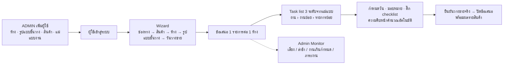

# FlowTrade — เอกสารออกแบบระบบ

> [!IMPORTANT]
> **เอกสารชุดนี้คือ "แบบเป้าหมาย" (target design)** ที่ออกแบบและรีวิวไว้ครบถ้วน — ระบบที่ **ทำงานอยู่จริงตอนนี้** เป็นเวอร์ชันแรกที่ยังไม่ได้ทำทุกข้อในเอกสาร
> แหล่งข้อมูลที่ตรงกับโค้ดจริงคือ:
> - ฐานข้อมูลจริง: [`apps/api/prisma/schema.prisma`](../apps/api/prisma/schema.prisma) + migrations ใน `apps/api/prisma/migrations/` (schema `flowtrade`)
> - API จริง: [`apps/api/ENDPOINTS.md`](../apps/api/ENDPOINTS.md)
> - ผลตรวจการบันทึกข้อมูล: [`audits/2026-10-01-data-persistence.md`](audits/2026-10-01-data-persistence.md)
>
> ความต่างหลักระหว่างระบบจริงกับเอกสารนี้ (ณ 1 ต.ค. 2569):
> - ยังไม่มี soft delete / trigger / ProposalBatch / AuthToken / ผลรายสินค้าตอนปิดข้อเสนอ ตามที่ `schema.prisma` ในโฟลเดอร์นี้ออกแบบไว้ (ระบบจริงมี 16 ตาราง)
> - เข้าสู่ระบบด้วย **ชื่อผู้ใช้หรืออีเมล** — อีเมลไม่บังคับ
> - Wizard มี **ปฏิทินจองวันวางขาย** และ **ไทม์ไลน์ที่พิมพ์เพิ่ม/แก้วัน/ระยะเวลาได้เอง** (ส่ง `plan` ไปตอนสร้าง)
> - ไม่มีข้อมูลตัวอย่าง (mock) ในแอป — ใช้ `npm run db:bootstrap` / `db:reset-empty`
> - ฝั่งเว็บใช้ React Router 7 และ npm workspaces (เอกสารเสนอ TanStack Router และ pnpm)
> - การเชื่อมต่อฐานข้อมูลตั้ง session timezone เป็น UTC (เซิร์ฟเวอร์ตั้งเป็น Asia/Bangkok)

> **เวอร์ชัน:** 1.1 (ฉบับรวมหลัง review ด้าน coverage และ consistency/security) · **วันที่:** 1 ต.ค. 2569 (2026-10-01)

**FlowTrade** เป็นเว็บแอปภายในของฝ่าย Trade สำหรับวางแผนและติดตามการนำเสนอสินค้าเข้าห้าง ทั้งห้าง modern trade (ออฟไลน์ เช่น Big C, Watsons, 7-Eleven, Lotus's, CJ, Eve and Boy) และแพลตฟอร์มออนไลน์ (เช่น Shopee, Lazada, TikTok Shop) เฉพาะคนที่ ADMIN เพิ่มรายชื่อไว้เท่านั้นจึงเข้าระบบได้ ผู้ใช้สร้าง "ข้อเสนอสินค้า" ผ่าน wizard ทีละขั้น (ช่องทาง → สินค้า → ห้าง → รูปแบบชั้นวาง Exclusive/Normal/แบบที่เพิ่มเอง → วันวางขาย) แล้วระบบสร้าง task list 3 ระดับ (งาน → งานย่อย → รายการย่อย) จากแม่แบบพร้อมวันที่ที่คำนวณถอยหลังจากวันวางขาย ทุกระดับกำหนดช่วงเวลาและผู้รับผิดชอบได้ และติ๊ก checklist เพื่อดูว่าอะไรเสร็จแล้ว ส่วน Admin Monitor ให้ ADMIN และ MANAGER เห็นข้อเสนอที่เสี่ยงหรือล่าช้า ภาระงานของแต่ละคน และจัดการห้าง รูปแบบชั้นวาง สินค้า แม่แบบงาน ผู้ใช้ และสิทธิ์ (ADMIN / MANAGER / USER) ระบบออกแบบเป็น full stack: React SPA + NestJS REST API + PostgreSQL ใน monorepo เดียว deploy ด้วย Docker บน VM ของบริษัท

## Flow ในภาพเดียว

## สารบัญเอกสาร

| ไฟล์ | เนื้อหา | ผู้อ่านหลัก |
|---|---|---|
| [01-requirements-flow.md](01-requirements-flow.md) | สรุปความเข้าใจ บทบาทและสิทธิ์ flow ออฟไลน์/ออนไลน์ lifecycle ของข้อเสนอ กติกางาน 3 ระดับ (วันที่ ผู้รับผิดชอบ checklist progress) Admin Monitor และสูตร KPI user stories business rules NFR และ **แม่แบบงานตั้งต้น 3 ชุด** | ทีม Trade, ทีม dev, QA |
| [02-architecture.md](02-architecture.md) | ทางเลือกสถาปัตยกรรมและเหตุผล tech stack แผนภาพระบบ โครงสร้าง monorepo การยืนยันตัวตน ภาพรวมสิทธิ์ งานเบื้องหลัง deploy backup CI/CD observability security checklist และสิ่งที่ต้องปรับจาก prototype | ทีม dev, ทีม IT |
| [03-database.md](03-database.md) | data model, ERD, constraint และ trigger, กลยุทธ์ task tree และการเรียงลำดับ, query ของ dashboard, seed data | ทีม dev |
| [schema.prisma](schema.prisma) | Prisma schema ฉบับเต็ม | ทีม dev |
| [04-api.md](04-api.md) | REST API: convention, endpoint catalog, ตัวอย่าง JSON, **permission matrix ฉบับทางการ**, pseudo-code ของ business logic, shared zod schema | ทีม dev |
| [05-frontend-ux.md](05-frontend-ux.md) | หลักการออกแบบ design token sitemap/route wizard task tree dashboard หน้าจอ admin wireframe responsive และโครงสร้างโค้ดฝั่งเว็บ | ทีม dev, ทีม Trade (wireframe) |
| [06-roadmap.md](06-roadmap.md) | ขอบเขต MVP / Phase 2 / Phase 3 แผน sprint และ milestone ประมาณการ ความเสี่ยง **คำถามที่ต้องยืนยันพร้อมค่าเริ่มต้น** และ go-live checklist | ทีม Trade, ผู้จัดการโครงการ |

**แนะนำลำดับการอ่าน:** ทีม Trade อ่าน README → 01 (หัวข้อ 1, 3, 4, 6.2.5) → 06 (หัวข้อ 2 และ 5) · ทีม dev อ่านครบทุกไฟล์ตามลำดับเลข

### เมื่อเอกสารขัดกัน ให้ยึดตามนี้

| เรื่อง | แหล่งความจริง |
|---|---|
| ชื่อ entity / field / enum, constraint, seed | [03-database.md](03-database.md) + [schema.prisma](schema.prisma) |
| Endpoint, DTO, error code, permission key | [04-api.md](04-api.md) |
| หน้าจอ, route, พฤติกรรม UI | [05-frontend-ux.md](05-frontend-ux.md) |
| กติกาธุรกิจ, สูตร KPI, เนื้อหาแม่แบบงาน | [01-requirements-flow.md](01-requirements-flow.md) |
| เทคโนโลยี, infra, ความปลอดภัยระดับระบบ | [02-architecture.md](02-architecture.md) |
| ขอบเขตและลำดับงาน | [06-roadmap.md](06-roadmap.md) |

ข้อความ **(ควรยืนยันกับทีม Trade)** / **(ควรยืนยันกับทีม IT)** คือจุดที่ทีมออกแบบตัดสินใจไว้ก่อน รายการทั้งหมดพร้อมค่าเริ่มต้นอยู่ใน [06-roadmap.md §5](06-roadmap.md)

## Stack โดยย่อ

| ส่วน | เทคโนโลยี |
|---|---|
| Frontend | React 19 + Vite 8 + TypeScript 6 · react-router 7 · TanStack Query 5 · Tailwind CSS 4 + shadcn/ui · react-hook-form + zod 4 · dayjs (ปี พ.ศ.) · Recharts 3 |
| Backend | NestJS 12 (ESM) · Prisma 7.10 (pin) + `@prisma/adapter-pg` · argon2id · server-side session · pg-boss 12 (งานตามเวลา) |
| Database | PostgreSQL 18 (`pg_trgm` สำหรับค้นหาภาษาไทย) |
| Shared | `packages/shared`: type, zod schema, permission matrix, กติกา task tree ที่ใช้ทั้งเว็บและ API |
| Monorepo | npm workspaces: `apps/web`, `apps/api`, `packages/shared` |
| Infra | Docker Compose บน VM เดียว · Caddy 2 (HTTPS อัตโนมัติ) · pg_dump + restic backup |
| CI/CD | GitHub Actions + GHCR (ปรับเป็น GitLab ได้) · staging อัตโนมัติ production ต้อง approve |
| Testing | Vitest · Testing Library + MSW · Testcontainers + supertest · Playwright + axe |

## การตัดสินใจหลัก

| # | ตัดสินใจ | เหตุผล |
|---|---|---|
| 1 | 1 ข้อเสนอ = 1 ห้าง × 1 รูปแบบชั้นวาง × 1 วันวางขาย × สินค้าหลาย SKU | แต่ละห้างมี buyer และไทม์ไลน์ของตัวเอง task list จึงต้องแยกตามห้าง |
| 2 | Wizard เลือกได้หลายห้างและสร้าง 1 ข้อเสนอต่อห้าง แบบ all-or-nothing ด้วย `batchId` เดียว | ปล่อยสินค้าเข้าหลายห้างพร้อมกันได้โดยไม่กรอกซ้ำ และกดซ้ำไม่เกิดข้อเสนอซ้ำ |
| 3 | ลำดับ wizard: สินค้า → ห้าง | ตรงกับวิธีคิด "เสนอสินค้าเข้าห้าง" และเตือนข้อเสนอซ้ำได้ทันที |
| 4 | ออนไลน์ใช้ flow และข้อมูลชุดเดียวกับออฟไลน์ | ลูกค้ายังไม่ให้รายละเอียดออนไลน์ แนวนี้ขยายได้โดยไม่ต้องรื้อ |
| 5 | งาน 3 ระดับตายตัว เก็บแบบ adjacency list | ตรงกับความต้องการ query ง่าย และ DB บังคับความลึกได้ |
| 6 | สถานะงานแม่คำนวณจากงานลูก ติ๊กงานแม่ที่ยังมีลูกค้างต้องยืนยันใน dialog | checklist สอดคล้องกันทั้งต้นไม้ และไม่มีงานแม่ "เสร็จ" ทั้งที่ลูกยังค้าง |
| 7 | Progress นับจากงานล่างสุด (leaf) และปัดลง | ไม่นับซ้ำ และแสดง 100% เฉพาะเมื่อเสร็จทุกข้อจริง |
| 8 | ผู้รับผิดชอบหลายคนต่องาน มีคนหลัก 1 คน | งาน Trade ทำร่วมกันบ่อย แต่ต้องชัดว่าใครเป็นคนตอบ |
| 9 | แยก "วันวางขายจริง" ออกจาก "วันปิดข้อเสนอ" | ข้อเสนอที่วางขายตรงเวลาแต่ยังมีงานติดตามหลังวางขายจะไม่ถูกนับว่า "ล่าช้า" |
| 10 | แม่แบบงานตั้งต้นแบบกระชับ 3 ชุด (lead time 60/60/30 วัน) แม่แบบละเอียดเป็น Phase 2 | task list แรกไม่แน่นเกินไป และงานไม่ขึ้นสีแดงตั้งแต่วันแรก |
| 11 | ข้อเสนอไม่ปิดเองเมื่องานครบ 100% | "สินค้าขึ้นชั้นจริง" ต้องมีคนยืนยัน |
| 12 | ห้าง/รูปแบบชั้นวาง/สินค้าที่ถูกใช้แล้วลบไม่ได้ ใช้ "ปิดใช้งาน" | ข้อเสนอเก่ายังแสดงข้อมูลครบ |
| 13 | Server-side session ใน PostgreSQL ไม่ใช้ JWT | ปิดบัญชีหรือเปลี่ยนบทบาทแล้วมีผลทันที |
| 14 | Permission matrix ชุดเดียวใน `packages/shared` ตาม 04-api.md และ UI อ่านสิทธิ์จาก `can` ที่ server ส่งมา | guard ฝั่งเว็บกับ API ไม่มีทางคลาดกัน |
| 15 | React SPA + NestJS + Prisma + PostgreSQL ต่อยอดจาก prototype ใน repo | งานหลักคือ task tree ที่โต้ตอบเยอะ และไม่ต้องเริ่มใหม่ |
| 16 | งานตามเวลาใช้ pg-boss บน PostgreSQL ตัวเดิม | ไม่ต้องดูแล Redis เพิ่ม |
| 17 | Deploy ด้วย Docker Compose บน VM เดียว + Caddy | ทีมเล็กดูแลได้ ค่าใช้จ่ายต่ำ |
| 18 | "วันนี้" คำนวณตาม Asia/Bangkok เก็บวันที่แบบไม่มีเวลา แสดงปี พ.ศ. เป็นค่าเริ่มต้น | กันวันเลื่อนช่วงเที่ยงคืน และตรงกับความคุ้นเคยของผู้ใช้ |
| 19 | ประวัติการเปลี่ยนแปลงเป็นแบบเขียนต่อท้ายอย่างเดียว | ตรวจสอบย้อนหลังได้ และไม่มีใครแก้ประวัติได้ |
| 20 | MVP แจ้งเตือนในแอป อีเมลเป็น Phase 2 | go-live ได้โดยไม่ต้องรอ SMTP |

## อภิธานศัพท์ (ไทย ↔ English)

ตารางนี้คือ glossary ทางการ เอกสารอื่นและคอมเมนต์ใน `schema.prisma` ที่อ้างถึง "glossary §8" หรือ "glossary §8.3" (ค่า enum และ label ภาษาไทย) หมายถึงหัวข้อนี้

| ไทย (บน UI) | English / identifier | ความหมาย |
|---|---|---|
| ข้อเสนอสินค้า | Proposal | การนำเสนอสินค้า 1..n SKU เข้าห้างหนึ่งแห่ง ในรูปแบบชั้นวางเดียว และวันวางขายเดียว |
| รหัสข้อเสนอ | `Proposal.code` | รูปแบบ `PRP-2026-0001` เลขรันใหม่ทุกปี ค.ศ. |
| ช่องทาง: ออฟไลน์ / ออนไลน์ | `Channel`: `OFFLINE` / `ONLINE` | ห้างร้าน หรือ แพลตฟอร์มออนไลน์ |
| ห้าง / แพลตฟอร์ม | Store | ปลายทางที่เสนอสินค้า (label เปลี่ยนตามช่องทาง) |
| รูปแบบชั้นวาง / ประเภท Listing | ShelfType | เช่น Exclusive shelf, Normal shelf, Mall listing |
| ชั้นวางเฉพาะแบรนด์ | Exclusive shelf (`EXCLUSIVE_SHELF`) | พื้นที่หรือ gondola เฉพาะแบรนด์ ต้องออกแบบและติดตั้ง fixture |
| ชั้นวางปกติ | Normal shelf (`NORMAL_SHELF`) | ช่องในชั้นปกติตาม planogram ของห้าง |
| สินค้า | Product (SKU) | สินค้าของบริษัท |
| ผลพิจารณา: รอผล / ผ่าน / ไม่ผ่าน | `ProposalProductStatus`: `PENDING` / `ACCEPTED` / `REJECTED` | ผลรายสินค้าในข้อเสนอ |
| วันวางขาย / วัน Go-live | `targetDate` (D0) | วันที่ตั้งเป้าให้สินค้าขึ้นชั้นหรือเปิดขาย |
| วันวางขายจริง | `actualLaunchDate` | วันที่สินค้าวางขายจริง Owner บันทึกด้วยปุ่ม "ยืนยันวางขายแล้ว" |
| งาน / งานย่อย / รายการย่อย | Task `level` 1 / 2 / 3 (Task / Sub-task / Mini-task) | task list 3 ระดับ |
| งานล่างสุด | leaf task | งานที่ไม่มีงานลูก ใช้นับความคืบหน้า |
| ผู้รับผิดชอบ / ผู้รับผิดชอบหลัก | TaskAssignee / `isPrimary` | คนที่ทำงานนั้น มีได้หลายคน คนหลัก 1 คน |
| ระยะเวลา | `durationDays` | วันครบกำหนด − วันเริ่ม + 1 (วันปฏิทิน) |
| ความคืบหน้า | `progressPercent` | งานล่างสุดที่เสร็จ ÷ งานล่างสุดทั้งหมด ปัดลง |
| สถานะงาน: ยังไม่เริ่ม / กำลังทำ / เสร็จแล้ว | `TaskStatus`: `TODO` / `IN_PROGRESS` / `DONE` | |
| สถานะกำหนดส่ง: เกินกำหนด / ครบกำหนดวันนี้ / ใกล้ครบกำหนด / ตามแผน / (ไม่แสดง) | `TaskDueState`: `OVERDUE` / `DUE_TODAY` / `DUE_SOON` / `ON_TRACK` / `NONE` | คำนวณจากวันนี้ (เวลาไทย) · `NONE` เมื่อไม่มี `dueDate` งานเสร็จแล้ว หรือข้อเสนอไม่ได้ `IN_PROGRESS` |
| สถานะข้อเสนอ: ร่าง / กำลังดำเนินการ / พักไว้ / สำเร็จ (วางขายแล้ว) / ยกเลิก | `ProposalStatus`: `DRAFT` / `IN_PROGRESS` / `ON_HOLD` / `COMPLETED` / `CANCELLED` | |
| สุขภาพข้อเสนอ: ตามแผน / เสี่ยง / ล่าช้า | `ProposalHealth`: `ON_TRACK` / `AT_RISK` / `LATE` | คำนวณเฉพาะข้อเสนอที่กำลังดำเนินการ |
| ปิดแบบไม่ครบ | force complete | MANAGER/ADMIN ปิดข้อเสนอทั้งที่งานยังไม่ครบ ต้องระบุเหตุผล |
| แม่แบบงาน / รายการในแม่แบบ | TaskTemplate / TaskTemplateItem | ชุดงานตั้งต้นที่สร้างให้อัตโนมัติ |
| D−60 (บนหน้าจอ T−60) | `startOffsetDays` / `dueOffsetDays` | จำนวนวันเทียบกับวันวางขาย ค่าลบคือก่อนวันวางขาย |
| ฝ่ายที่แนะนำ | `responsibleFunction` (TRD, MKT, SCM, QA, FIN, ART, MGR) | คำแนะนำว่างานนี้ควรเป็นของฝ่ายใด |
| เจ้าของข้อเสนอ | Owner (`ownerId`) | คนที่รับผิดชอบข้อเสนอทั้งชุด |
| ผู้ร่วมแก้ไข / ผู้ติดตาม | ProposalMember `EDITOR` / `VIEWER` | สมาชิกของข้อเสนอ |
| ชุดที่สร้างพร้อมกัน | `batchId` | ข้อเสนอที่สร้างจาก wizard ครั้งเดียวกัน |
| ผู้ดูแลระบบ / ผู้จัดการ / ผู้ใช้งาน | `Role`: `ADMIN` / `MANAGER` / `USER` | บทบาทระดับระบบ |
| ประวัติการเปลี่ยนแปลง | ActivityLog | audit log แบบเขียนต่อท้ายอย่างเดียว |
| การแจ้งเตือน | Notification | กระดิ่งในแอป |
| ตั้งค่าระบบ | AppSetting | ค่าที่ ADMIN ปรับได้ เช่น จำนวนวัน "ใกล้ครบกำหนด" |
| ข้อมูลหลัก | master data | ห้าง รูปแบบชั้นวาง สินค้า แม่แบบงาน |
| Admin Monitor | — | ส่วนของ ADMIN/MANAGER: ภาพรวม งานทั้งฝ่าย ข้อมูลหลัก ผู้ใช้ ประวัติ |

**คำศัพท์ธุรกิจที่ใช้ในเอกสาร**

| คำ | ความหมาย |
|---|---|
| Buyer / Category Manager | ผู้พิจารณารับสินค้าเข้าห้าง |
| KAM | Key Account Manager ผู้ดูแลลูกค้าห้าง |
| Listing / New item form | แบบฟอร์มลงทะเบียนสินค้าใหม่ของห้าง |
| Article code | รหัสสินค้าในระบบของห้าง |
| Listing fee (ค่าแรกเข้า), GP | ค่าธรรมเนียมนำสินค้าเข้า และส่วนต่างกำไรของห้าง |
| RSP | ราคาขายปลีกที่แนะนำ |
| DC, PO | ศูนย์กระจายสินค้าของห้าง และใบสั่งซื้อ |
| Planogram, POP/POSM | แผนผังการวางสินค้าบนชั้น และสื่อ ณ จุดขาย |
| Fixture | ชั้นหรือโครงสร้างวางสินค้าที่แบรนด์ผลิตเอง (ใช้กับ Exclusive shelf) |
| Seller Center, Fulfilment | ระบบจัดการร้านของแพลตฟอร์มออนไลน์ และคลังที่แพ็กส่งสินค้า |
| Price parity | การคุมราคาออนไลน์ไม่ให้ต่างจากหน้าร้านจนกระทบห้าง |
| Lead time | จำนวนวันที่ต้องเริ่มงานก่อนวันวางขาย |
